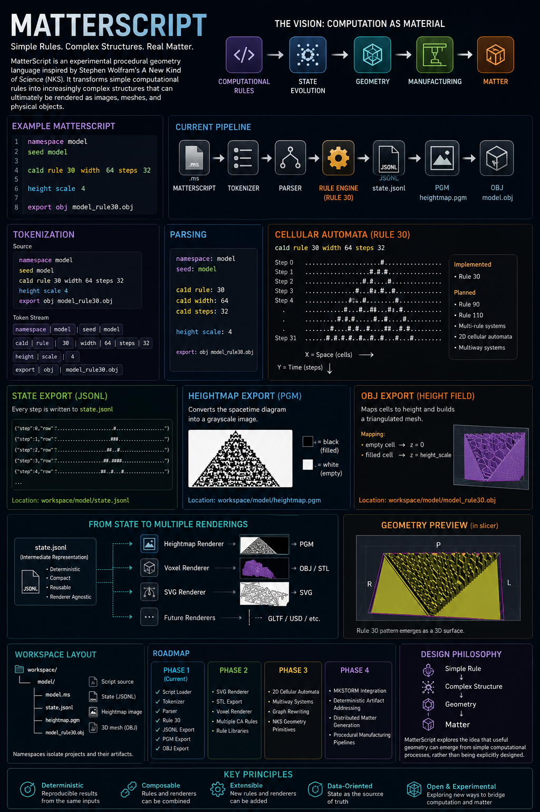
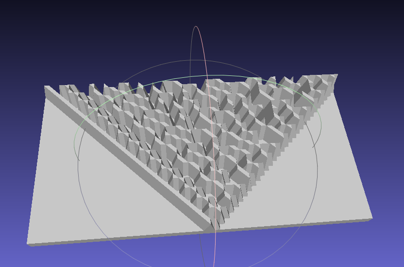

# MatterScript


MatterScript is an experimental procedural geometry language inspired by Stephen Wolfram's *A New Kind of Science (NKS)*.

See associated blog post :
https://earthchronicles.substack.com/p/geometry-is-computation

The goal of MatterScript is to transform simple computational rules into increasingly complex structures that can ultimately be rendered as images, meshes, and physical objects.

```text
MatterScript
      ↓
Computational Rules
      ↓
State Evolution
      ↓
Geometry
      ↓
Matter
```

---

# Current Status

Implemented:

- Script loading
- Tokenizer
- Parser
- Rule 30 Cellular Automata
- State generation
- JSONL export
- PGM image export
- OBJ mesh export
- Namespace-based workspace organization

Current pipeline:

```text
MatterScript
      ↓
Tokenizer
      ↓
Parser
      ↓
Rule Engine
      ↓
state.jsonl
      ↓
heightmap.pgm
      ↓
model.obj
```

---

# Example Script

```text
namespace model

seed model

ca1d rule 30 width 64 steps 32

height scale 4

export obj model_rule30.obj
```

---

# Tokenization

MatterScript currently tokenizes source files into a simple stream of words.

Source:

```text
namespace model
seed model
ca1d rule 30 width 64 steps 32
height scale 4
export obj model_rule30.obj
```

Token Stream:

```text
namespace | model
seed | model
ca1d | rule | 30 | width | 64 | steps | 32
height | scale | 4
export | obj | model_rule30.obj
```

---

# Parsing

The parser currently produces a simple program structure.

Example:

```text
namespace: model
seed: model

ca1d rule: 30
ca1d width: 64
ca1d steps: 32

height scale: 4

export: obj model_rule30.obj
```

---

# Cellular Automata

The first MatterScript primitive is a one-dimensional cellular automaton.

Example:

```text
ca1d rule 30 width 64 steps 32
```

Which produces:

```text
................................#...............................
...............................###..............................
..............................##..#.............................
.............................##.####............................
............................##..#...#...........................
...
```

MatterScript currently implements:

- Rule 30

Planned:

- Rule 90
- Rule 110
- Multi-rule systems
- 2D cellular automata
- Multiway systems

---

# State Export

Every generated state is exported to JSONL.

Example:

```json
{"step":0,"row":"................................#..............................."}
{"step":1,"row":"...............................###.............................."}
{"step":2,"row":"..............................##..#............................."}
```

Location:

```text
workspace/<namespace>/state.jsonl
```

Example:

```text
workspace/model/state.jsonl
```

---

# Heightmap Export

MatterScript converts cellular automata into grayscale images.

Location:

```text
workspace/model/heightmap.pgm
```

Example:

```text
Rule 30
      ↓
Spacetime Diagram
      ↓
PGM Image
```

Where:

```text
# = black pixel
. = white pixel
```

The resulting image represents:

```text
X = Space
Y = Time
```

---

# OBJ Export

MatterScript currently converts the generated state into a triangulated height field.

Mapping:

```text
empty cell  → z = 0
filled cell → z = height_scale
```

Example:

```text
ca1d rule 30 width 64 steps 32

height scale 4
```

Produces:

```text
workspace/model/model_rule30.obj
```

The OBJ mesh can be loaded directly into:

- Blender
- PrusaSlicer
- Cura
- 3D Slicer
- MeshLab
- OpenSCAD (import)

---

# Workspace Layout

MatterScript organizes generated artifacts by namespace.

Example:

```text
workspace/

└── model/
    ├── model.ms
    ├── state.jsonl
    ├── heightmap.pgm
    └── model_rule30.obj
```

This separation allows multiple renderers to operate on the same generated state.

```text
state.jsonl
      ↓
heightmap renderer
      ↓
OBJ renderer
      ↓
STL renderer
      ↓
SVG renderer
```

---

# Design Philosophy

MatterScript is heavily influenced by:

- A New Kind of Science (NKS)
- Cellular Automata
- Multiway Systems
- Computational Irreducibility
- Generative Geometry
- Deterministic Computation

The central idea is:

```text
Simple Rule
      ↓
Complex Structure
      ↓
Geometry
      ↓
Matter
```

Rather than explicitly designing objects, MatterScript explores the possibility that useful geometry can emerge from simple computational processes.

---

# Roadmap

## Phase 1 (Current)

- [x] Script Loader
- [x] Tokenizer
- [x] Parser
- [x] Rule 30
- [x] JSONL Export
- [x] PGM Export
- [x] OBJ Export

## Phase 2

- [ ] SVG Renderer
- [ ] STL Export
- [ ] Voxel Renderer
- [ ] Multiple CA Rules
- [ ] Rule Libraries

## Phase 3

- [ ] 2D Cellular Automata
- [ ] Multiway Systems
- [ ] Graph Rewriting
- [ ] NKS Geometry Primitives

## Phase 4

- [ ] MKSTORM Integration
- [ ] Deterministic Artifact Addressing
- [ ] Distributed Matter Generation
- [ ] Procedural Manufacturing Pipelines

---

# Vision

MatterScript is an experiment in treating computation itself as a material.

```text
MatterScript
      ↓
State Evolution
      ↓
Geometry
      ↓
Manufacturing
      ↓
Matter
```

The long-term goal is to create a deterministic computational pipeline capable of generating reproducible physical structures from simple symbolic rules.

## Milestone: First Watertight Solid

MatterScript successfully generated a closed, manifold 3D mesh from a one-dimensional cellular automaton.

Validation was performed using MeshLab.

Topology Results:

* Vertices: 4096
* Edges: 12282
* Faces: 8188
* Boundary Edges: 0
* Connected Components: 1
* Two-Manifold: Yes
* Holes: 0
* Genus: 0

These results confirm that the generated OBJ is a watertight solid suitable for downstream manufacturing workflows such as slicing, STL conversion, and 3D printing.

This represents the first complete MatterScript pipeline:

MatterScript Source → Cellular Automaton → State Field → Heightmap → Closed Solid Mesh → Manufacturing Artifact


