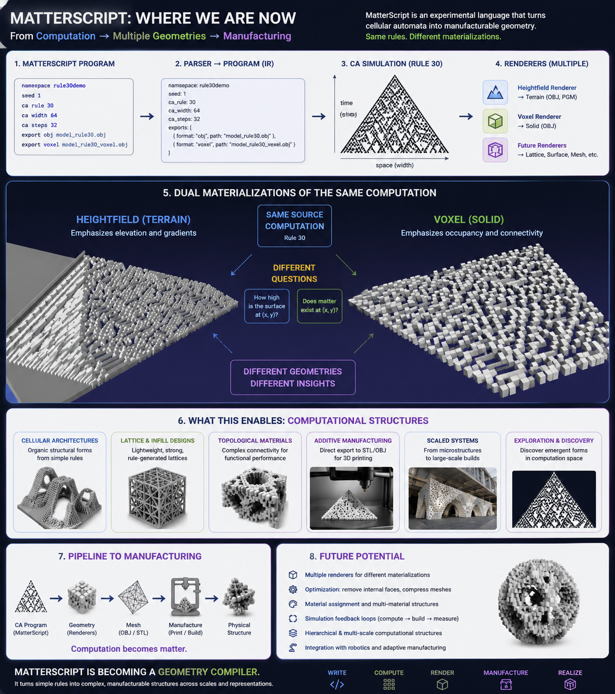

# MatterScript


MatterScript is an experimental procedural geometry language inspired by Stephen Wolfram's *A New Kind of Science (NKS)*.

See associated blog post :
https://earthchronicles.substack.com/p/geometry-is-computation

The goal of MatterScript is to transform simple computational rules into increasingly complex structures that can ultimately be rendered as images, meshes, and physical objects.

```text
MatterScript
      ↓
Computational Rules
      ↓
State Evolution
      ↓
Geometry
      ↓
Matter
```

---

# Current Status

Implemented:

- Script loading
- Tokenizer
- Parser
- Rule 30 Cellular Automata
- State generation
- JSONL export
- PGM image export
- OBJ mesh export
- Namespace-based workspace organization

Current pipeline:

```text
MatterScript
      ↓
Tokenizer
      ↓
Parser
      ↓
Rule Engine
      ↓
state.jsonl
      ↓
heightmap.pgm
      ↓
model.obj
```

---

# Example Script

```text
namespace model

seed model

ca1d rule 30 width 64 steps 32

height scale 4

export obj model_rule30.obj
```

---

# Tokenization

MatterScript currently tokenizes source files into a simple stream of words.

Source:

```text
namespace model
seed model
ca1d rule 30 width 64 steps 32
height scale 4
export obj model_rule30.obj
```

Token Stream:

```text
namespace | model
seed | model
ca1d | rule | 30 | width | 64 | steps | 32
height | scale | 4
export | obj | model_rule30.obj
```

---

# Parsing

The parser currently produces a simple program structure.

Example:

```text
namespace: model
seed: model

ca1d rule: 30
ca1d width: 64
ca1d steps: 32

height scale: 4

export: obj model_rule30.obj
```

---

# Cellular Automata

The first MatterScript primitive is a one-dimensional cellular automaton.

Example:

```text
ca1d rule 30 width 64 steps 32
```

Which produces:

```text
................................#...............................
...............................###..............................
..............................##..#.............................
.............................##.####............................
............................##..#...#...........................
...
```

MatterScript currently implements:

- Rule 30

Planned:

- Rule 90
- Rule 110
- Multi-rule systems
- 2D cellular automata
- Multiway systems

---

# State Export

Every generated state is exported to JSONL.

Example:

```json
{"step":0,"row":"................................#..............................."}
{"step":1,"row":"...............................###.............................."}
{"step":2,"row":"..............................##..#............................."}
```

Location:

```text
workspace/<namespace>/state.jsonl
```

Example:

```text
workspace/model/state.jsonl
```

---

# Heightmap Export

MatterScript converts cellular automata into grayscale images.

Location:

```text
workspace/model/heightmap.pgm
```

Example:

```text
Rule 30
      ↓
Spacetime Diagram
      ↓
PGM Image
```

Where:

```text
# = black pixel
. = white pixel
```

The resulting image represents:

```text
X = Space
Y = Time
```

---

# OBJ Export

MatterScript currently converts the generated state into a triangulated height field.

Mapping:

```text
empty cell  → z = 0
filled cell → z = height_scale
```

Example:

```text
ca1d rule 30 width 64 steps 32

height scale 4
```

Produces:

```text
workspace/model/model_rule30.obj
```

The OBJ mesh can be loaded directly into:

- Blender
- PrusaSlicer
- Cura
- 3D Slicer
- MeshLab
- OpenSCAD (import)

---

# Workspace Layout

MatterScript organizes generated artifacts by namespace.

Example:

```text
workspace/

└── model/
    ├── model.ms
    ├── state.jsonl
    ├── heightmap.pgm
    └── model_rule30.obj
```

This separation allows multiple renderers to operate on the same generated state.

```text
state.jsonl
      ↓
heightmap renderer
      ↓
OBJ renderer
      ↓
STL renderer
      ↓
SVG renderer
```

---

# Design Philosophy

MatterScript is heavily influenced by:

- A New Kind of Science (NKS)
- Cellular Automata
- Multiway Systems
- Computational Irreducibility
- Generative Geometry
- Deterministic Computation

The central idea is:

```text
Simple Rule
      ↓
Complex Structure
      ↓
Geometry
      ↓
Matter
```

Rather than explicitly designing objects, MatterScript explores the possibility that useful geometry can emerge from simple computational processes.

---

# Roadmap: From Computational State Space to Manufacturing

MatterScript began as a simple experiment: can computational processes be interpreted as geometry?

The first milestone answered that question.

A one-dimensional Rule 30 cellular automaton was transformed into a height field, converted into a solid mesh, validated as a watertight manifold, and successfully imported into manufacturing software.

The result demonstrates a complete pipeline from computation to fabrication.

---

## Current Architecture

```text
MatterScript Source

        ↓

Cellular Automata

        ↓

State Fields

        ↓

Height Fields

        ↓

Solid Meshes

        ↓

Topology Validation

        ↓

Manufacturing
```

Current capabilities:

* MatterScript parser
* Rule 30 simulation
* JSONL state export
* Heightmap generation
* OBJ mesh export
* Solidify pass
* Watertight manifold validation
* MeshLab integration
* Manufacturing-ready geometry

Recent MeshLab validation:

```text
Vertices: 4096
Edges: 12282
Faces: 8188

Boundary Edges: 0
Connected Components: 1
Two-Manifold: Yes
Holes: 0
Genus: 0
```

These measurements confirm that MatterScript successfully generated a closed, watertight solid suitable for downstream manufacturing workflows.

---

## Computational Geometry Philosophy

Traditional geometry systems begin with primitives:

```text
Cube
Sphere
Cylinder
Extrusion
Boolean Operations
```

MatterScript begins with computational primitives:

```text
Rule
State
Transition
Event
Chain
Neighborhood
```

Geometry is not explicitly designed.

Geometry emerges from computation.

This approach is inspired by the principles of A New Kind of Science (NKS), where simple computational rules can generate unexpectedly rich structures.

---

## Relationship to MKSTORM

MKSTORM provides persistent computational state.

MatterScript provides geometric interpretation of that state.

```text
MKRAND
    ↓

MKSTORM
    ↓

MatterScript
    ↓

Geometry
    ↓

Topology
    ↓

Manufacturing
```

In this model, the blockchain is no longer viewed as a ledger.

It becomes a coordinate system for computation.

---

## Future Direction: Persistent Geometry

Today:

```text
MatterScript
    ↓
Rule 30
    ↓
Height Field
    ↓
Solid Mesh
```

Future:

```text
MKSTORM
    ↓
Persistent State Space
    ↓
MatterScript
    ↓
Voxel Fields
    ↓
Topology
    ↓
Fabrication
```

Geometry becomes a projection of computational state.

---

## MeshLab as a Geometry Laboratory

MeshLab has become an important part of the development workflow.

It currently provides:

* Mesh visualization
* Topological analysis
* Manifold validation
* Hole detection
* Connected-component analysis
* Geometry repair

Example validation output:

```text
Boundary Edges = 0
Connected Components = 1
Two-Manifold
Holes = 0
Genus = 0
```

These measurements serve as mathematical certification that generated structures are valid solids.

Long term, these capabilities may be reimplemented directly in Zig, allowing MatterScript to perform topology analysis natively.

---

## Roadmap

### Phase 1 — Computational Geometry Foundation

Completed:

* MatterScript parser
* Cellular automata simulation
* Heightmap generation
* OBJ export
* Solidify pass
* MeshLab validation

---

### Phase 2 — Volumetric Geometry

Planned:

* Voxel fields
* Multiple CA layers
* Boolean operations
* Distance fields
* Morphological operations
* Native STL export

---

### Phase 3 — Persistent Computational Matter

Planned:

* MKSTORM-backed geometry
* Persistent state spaces
* Cross-chain geometry
* Distributed geometric computation
* Temporal geometry

---

### Phase 4 — Native Topology Engine

Planned:

* Connected-component analysis
* Hole detection
* Manifold validation
* Euler characteristic
* Genus computation
* Automatic repair passes

Implemented directly in Zig.

---

### Phase 5 — Geometry-Aware Silicon

Long-term vision:

```text
MKRAND
    ↓

MKSTORM
    ↓

MatterScript
    ↓

Topology Engine
    ↓

Fabrication
```

Possible hardware acceleration targets:

* Cellular automata evaluation
* Voxel operations
* Topology analysis
* Geometry synthesis
* Fabrication pipelines

The goal is not simply faster geometry.

The goal is a computational substrate that understands geometric structure as a first-class concept.

---

## Long-Term Vision

Most CAD systems begin with geometry and add computation.

MatterScript begins with computation and discovers geometry.

```text
Computation
      ↓

Geometry
      ↓

Topology
      ↓

Manufacturing
```

The objective is to create a programmable framework where physical artifacts emerge naturally from computational processes.

Not drawing objects.

Mining structures from computational state space.


