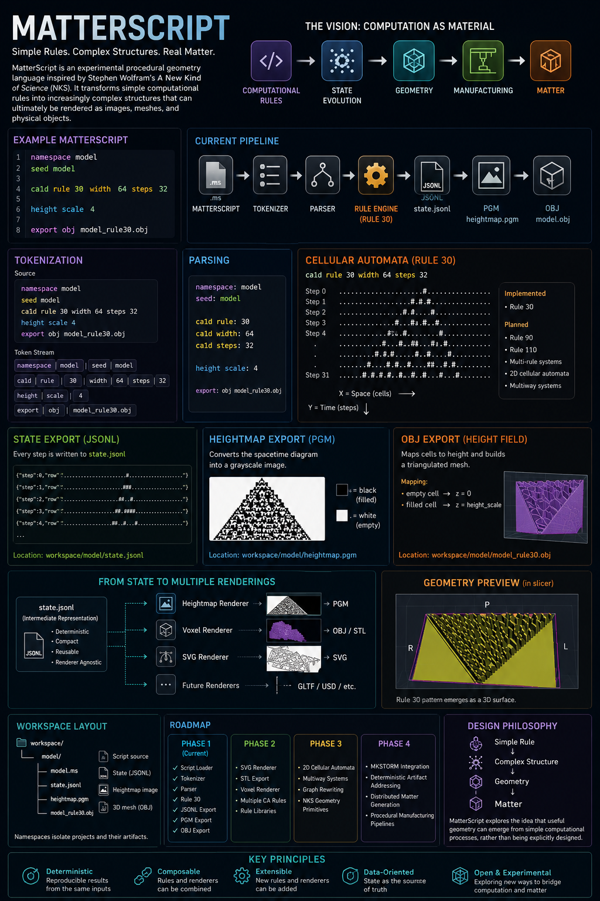
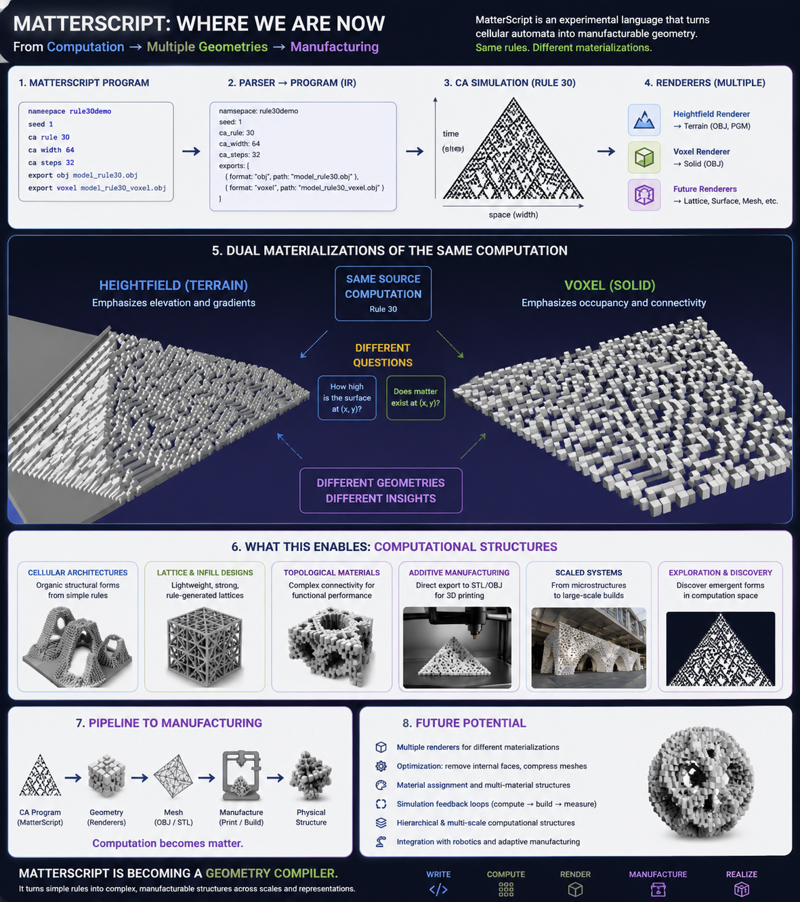
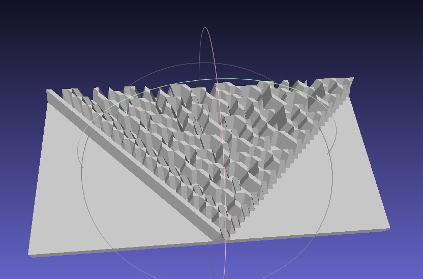
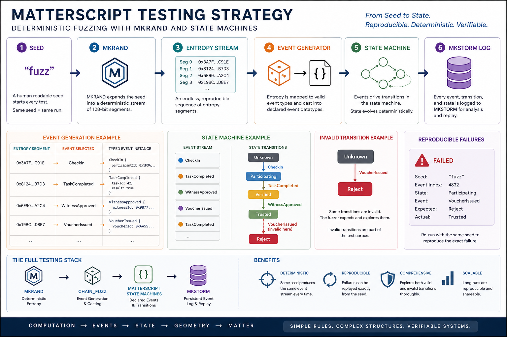
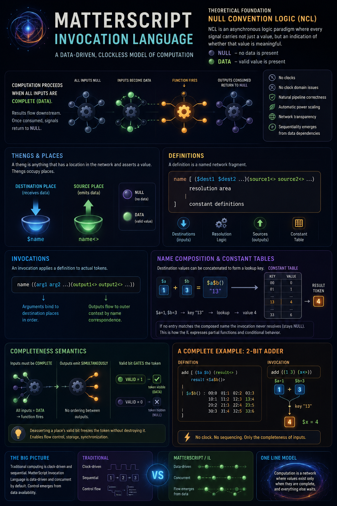

# MatterScript


MatterScript is an experimental procedural geometry language inspired by Stephen Wolfram's *A New Kind of Science (NKS)*.

See associated blog post :
https://earthchronicles.substack.com/p/geometry-is-computation

The goal of MatterScript is to transform simple computational rules into increasingly complex structures that can ultimately be rendered as images, meshes, and physical objects.

```text
MatterScript
      ↓
Computational Rules
      ↓
State Evolution
      ↓
Geometry
      ↓
Matter
```

---
[Linear Documentation](docs/generated/linear/index.md)

# Current Status

Implemented:

- Script loading
- Tokenizer
- Parser
- Rule 30 Cellular Automata
- State generation
- JSONL export
- PGM image export
- OBJ mesh export
- Namespace-based workspace organization

Current pipeline:

```text
MatterScript
      ↓
Tokenizer
      ↓
Parser
      ↓
Rule Engine
      ↓
state.jsonl
      ↓
heightmap.pgm
      ↓
model.obj
```

---

# Example Script

```text
namespace model

seed model

ca1d rule 30 width 64 steps 32

height scale 4

export obj model_rule30.obj
```

---

# Tokenization

MatterScript currently tokenizes source files into a simple stream of words.

Source:

```text
namespace model
seed model
ca1d rule 30 width 64 steps 32
height scale 4
export obj model_rule30.obj
```

Token Stream:

```text
namespace | model
seed | model
ca1d | rule | 30 | width | 64 | steps | 32
height | scale | 4
export | obj | model_rule30.obj
```

---

# Parsing

The parser currently produces a simple program structure.

Example:

```text
namespace: model
seed: model

ca1d rule: 30
ca1d width: 64
ca1d steps: 32

height scale: 4

export: obj model_rule30.obj
```

---

# Cellular Automata

The first MatterScript primitive is a one-dimensional cellular automaton.

Example:

```text
ca1d rule 30 width 64 steps 32
```

Which produces:

```text
................................#...............................
...............................###..............................
..............................##..#.............................
.............................##.####............................
............................##..#...#...........................
...
```

MatterScript currently implements:

- Rule 30

Planned:

- Rule 90
- Rule 110
- Multi-rule systems
- 2D cellular automata
- Multiway systems

---

# State Export

Every generated state is exported to JSONL.

Example:

```json
{"step":0,"row":"................................#..............................."}
{"step":1,"row":"...............................###.............................."}
{"step":2,"row":"..............................##..#............................."}
```

Location:

```text
workspace/<namespace>/state.jsonl
```

Example:

```text
workspace/model/state.jsonl
```

---

# Heightmap Export

MatterScript converts cellular automata into grayscale images.

Location:

```text
workspace/model/heightmap.pgm
```

Example:

```text
Rule 30
      ↓
Spacetime Diagram
      ↓
PGM Image
```

Where:

```text
# = black pixel
. = white pixel
```

The resulting image represents:

```text
X = Space
Y = Time
```

---

# OBJ Export

MatterScript currently converts the generated state into a triangulated height field.

Mapping:

```text
empty cell  → z = 0
filled cell → z = height_scale
```

Example:

```text
ca1d rule 30 width 64 steps 32

height scale 4
```

Produces:

```text
workspace/model/model_rule30.obj
```

The OBJ mesh can be loaded directly into:

- Blender
- PrusaSlicer
- Cura
- 3D Slicer
- MeshLab
- OpenSCAD (import)

---

# Workspace Layout

MatterScript organizes generated artifacts by namespace.

Example:

```text
workspace/

└── model/
    ├── model.ms
    ├── state.jsonl
    ├── heightmap.pgm
    └── model_rule30.obj
```

This separation allows multiple renderers to operate on the same generated state.

```text
state.jsonl
      ↓
heightmap renderer
      ↓
OBJ renderer
      ↓
STL renderer
      ↓
SVG renderer
```

---

# Design Philosophy

MatterScript is heavily influenced by:

- A New Kind of Science (NKS)
- Cellular Automata
- Multiway Systems
- Computational Irreducibility
- Generative Geometry
- Deterministic Computation

The central idea is:

```text
Simple Rule
      ↓
Complex Structure
      ↓
Geometry
      ↓
Matter
```

Rather than explicitly designing objects, MatterScript explores the possibility that useful geometry can emerge from simple computational processes.

---

# Roadmap: From Computational State Space to Manufacturing

MatterScript began as a simple experiment: can computational processes be interpreted as geometry?

The first milestone answered that question.

A one-dimensional Rule 30 cellular automaton was transformed into a height field, converted into a solid mesh, validated as a watertight manifold, and successfully imported into manufacturing software.

The result demonstrates a complete pipeline from computation to fabrication.

---

## Current Architecture

```text
MatterScript Source

        ↓

Cellular Automata

        ↓

State Fields

        ↓

Height Fields

        ↓

Solid Meshes

        ↓

Topology Validation

        ↓

Manufacturing
```

Current capabilities:

* MatterScript parser
* Rule 30 simulation
* JSONL state export
* Heightmap generation
* OBJ mesh export
* Solidify pass
* Watertight manifold validation
* MeshLab integration
* Manufacturing-ready geometry

Recent MeshLab validation:

```text
Vertices: 4096
Edges: 12282
Faces: 8188

Boundary Edges: 0
Connected Components: 1
Two-Manifold: Yes
Holes: 0
Genus: 0
```

These measurements confirm that MatterScript successfully generated a closed, watertight solid suitable for downstream manufacturing workflows.

---

## Computational Geometry Philosophy

Traditional geometry systems begin with primitives:

```text
Cube
Sphere
Cylinder
Extrusion
Boolean Operations
```

MatterScript begins with computational primitives:

```text
Rule
State
Transition
Event
Chain
Neighborhood
```

Geometry is not explicitly designed.

Geometry emerges from computation.

This approach is inspired by the principles of A New Kind of Science (NKS), where simple computational rules can generate unexpectedly rich structures.

---

## Relationship to MKSTORM

MKSTORM provides persistent computational state.

MatterScript provides geometric interpretation of that state.

```text
MKRAND
    ↓

MKSTORM
    ↓

MatterScript
    ↓

Geometry
    ↓

Topology
    ↓

Manufacturing
```

In this model, the blockchain is no longer viewed as a ledger.

It becomes a coordinate system for computation.

---

## Future Direction: Persistent Geometry

Today:

```text
MatterScript
    ↓
Rule 30
    ↓
Height Field
    ↓
Solid Mesh
```

Future:

```text
MKSTORM
    ↓
Persistent State Space
    ↓
MatterScript
    ↓
Voxel Fields
    ↓
Topology
    ↓
Fabrication
```

Geometry becomes a projection of computational state.

---

## MeshLab as a Geometry Laboratory

MeshLab has become an important part of the development workflow.

It currently provides:

* Mesh visualization
* Topological analysis
* Manifold validation
* Hole detection
* Connected-component analysis
* Geometry repair

Example validation output:

```text
Boundary Edges = 0
Connected Components = 1
Two-Manifold
Holes = 0
Genus = 0
```

These measurements serve as mathematical certification that generated structures are valid solids.

Long term, these capabilities may be reimplemented directly in Zig, allowing MatterScript to perform topology analysis natively.

---

## Roadmap

### Phase 1 — Computational Geometry Foundation

Completed:

* MatterScript parser
* Cellular automata simulation
* Heightmap generation
* OBJ export
* Solidify pass
* MeshLab validation

---

### Phase 2 — Volumetric Geometry

Planned:

* Voxel fields
* Multiple CA layers
* Boolean operations
* Distance fields
* Morphological operations
* Native STL export

---

### Phase 3 — Persistent Computational Matter

Planned:

* MKSTORM-backed geometry
* Persistent state spaces
* Cross-chain geometry
* Distributed geometric computation
* Temporal geometry

---

### Phase 4 — Native Topology Engine

Planned:

* Connected-component analysis
* Hole detection
* Manifold validation
* Euler characteristic
* Genus computation
* Automatic repair passes

Implemented directly in Zig.

---

### Phase 5 — Geometry-Aware Silicon

Long-term vision:

```text
MKRAND
    ↓

MKSTORM
    ↓

MatterScript
    ↓

Topology Engine
    ↓

Fabrication
```

Possible hardware acceleration targets:

* Cellular automata evaluation
* Voxel operations
* Topology analysis
* Geometry synthesis
* Fabrication pipelines

The goal is not simply faster geometry.

The goal is a computational substrate that understands geometric structure as a first-class concept.

---

## Long-Term Vision

Most CAD systems begin with geometry and add computation.

MatterScript begins with computation and discovers geometry.

```text
Computation
      ↓

Geometry
      ↓

Topology
      ↓

Manufacturing
```

The objective is to create a programmable framework where physical artifacts emerge naturally from computational processes.

Not drawing objects.

Mining structures from computational state space.



---

# Testing Strategy

MatterScript is designed around deterministic computation.

This property allows every generated artifact, state machine, and event stream to be reproduced exactly from the same seed.

Rather than relying on nondeterministic fuzzing, MatterScript uses MKRAND as a deterministic entropy source.

```text
Seed
    ↓

MKRAND
    ↓

Entropy Stream
    ↓

Event Generator
    ↓

State Machine
    ↓

MKSTORM Log
```

## Deterministic Fuzzing

Every test begins with a known seed.

Example:

```text
"fuzz"
```

The seed is expanded into a deterministic sequence of 128-bit values using MKRAND.

```text
Seed
    ↓

MKRAND

    ↓

Seg 0
Seg 1
Seg 2
Seg 3
...
```

Because MKRAND is deterministic, every generated event stream can be reproduced exactly.

This allows test failures to be replayed and analyzed.

---

## Event Generation

MatterScript state machines declare their event types.

Example:

```text
machine ProofOfWorth {

    event CheckIn
    event TaskCompleted
    event WitnessApproved
    event VoucherIssued

}
```

The fuzzer uses the declared event schema to transform MKRAND output into valid event instances.

```text
MKRAND
    ↓

Raw Entropy
    ↓

Event Selection
    ↓

Typed Event
```

Example:

```text
Seg
    ↓

CheckIn

Seg
    ↓

TaskCompleted

Seg
    ↓

WitnessApproved
```

The generated events are cast into the declared event datatypes of the machine under test.

---

## State Machine Validation

Generated events are replayed against the state machine.

```text
Event Stream
      ↓

Transition Engine
      ↓

State Evolution
      ↓

Invariant Checks
```

Example:

```text
Unknown
      ↓ CheckIn

Participating
      ↓ TaskCompleted

Verified
      ↓ WitnessApproved

Trusted
```

Invalid transitions are expected and form part of the test corpus.

```text
Unknown
      ↓ VoucherIssued

Reject
```

---

## Reproducible Failures

Every test run can be reproduced using the original seed.

Example:

```text
FAILED

Seed: "fuzz"

Event Index: 4832

State: Participating

Event: VoucherIssued

Expected: Reject

Actual: Trusted
```

Re-running the test with the same seed produces the identical event sequence and failure.

---

## Future Direction

As MatterScript evolves beyond cellular automata into event-driven systems, the same testing infrastructure will be used across the ecosystem.

```text
MKRAND
    ↓

MatterScript
    ↓

MKULTRA
    ↓

MKSTORM
    ↓

State Machines
    ↓

Deterministic Fuzz Testing
```

The goal is to provide a unified framework where computational structures, event-driven systems, persistent state spaces, and generated geometry can all be validated using the same deterministic testing methodology.




## MatterScript Invocation Language

### Theoretical Foundation: Null Convention Logic

Null Convention Logic (NCL) is a asynchronous logic paradigm developed by Karl Fant. Traditional synchronous digital logic uses a clock signal to coordinate when data is valid and when computations should proceed. NCL eliminates the clock entirely, replacing it with a data completeness protocol built into the signals themselves.

In NCL every signal carries not just a value but an indication of whether that value is meaningful. A signal in the NULL state indicates no data is present. A signal in the DATA state carries a valid value. Computation proceeds not when a clock edge arrives but when all inputs to a function have transitioned from NULL to DATA — this is called *completeness*. Once a function has produced its DATA outputs they flow downstream, and once the downstream has consumed them the signals return to NULL, creating a self-timed wave of NULL and DATA that ripples through the network without any central coordination.

This has profound consequences:

- **No clock domain crossing problems** — since there is no clock, there are no domain boundaries to cross
- **Natural pipeline correctness** — a stage cannot fire until its inputs are complete, so pipeline hazards are structurally impossible
- **Automatic power scaling** — logic only switches when it has work to do, never driven by a clock it doesn't need
- **Network transparency** — the same completeness handshake works whether logic is on the same chip, across a bus, or across a network, because the protocol is in the data itself
- **Sequentiality as a degenerate case** — sequential behavior emerges naturally from data dependencies rather than being imposed by execution order or clock edges

Karl Fant's broader framework, described in *Computer Science Reconsidered*, argues that all computation is inherently concurrent and that sequentiality is simply what happens when data dependencies form a chain. The Invocation Language is his formalism for expressing computation in these terms.

---

### The Invocation Language

The Invocation Language describes computation as a network of *definitions* and *invocations*. There are no statements, no assignments, no control flow. There is only the flow of tokens through places, governed by completeness.

#### Thengs and Places

The fundamental concept is the *theng* — something that has a location in the network and asserts a value. A wire is a theng. A memory cell is a theng. A token in flight is a theng. Thengs occupy *places*, which are named locations in the network.

Places come in two kinds:

- **Destination place** — written `$name`. Receives a token from the outer context. The `$` prefix indicates the place is a sink — data flows into it.
- **Source place** — written `name<>`. Emits a token to the outer context once it has been filled. The `<>` suffix indicates the place is a source — data flows out of it.

A place in the NULL state has no token. A place in the DATA state holds a token. The transition from NULL to DATA is called *completeness*. Nothing downstream of a source place can proceed until that place is complete.

#### Definitions

A definition is a named network fragment with a set of destination places (inputs), source places (outputs), a resolution area, and an optional constant table:

```
name[($dest1 $dest2 ...)(source1<> source2<> ...)
  resolution area
|
  constant definitions
]
```

The destination list declares what tokens the definition expects from the outer context. The source list declares what tokens it will produce. The resolution area describes how tokens flow from destinations to sources through the network. The constant table defines lookup tables used in the resolution area.

Definitions are *flat* — they do not nest. All definitions live at the top level of a network and reference each other by name. This is not a limitation but a reflection of the underlying model: the network is a graph of places and connections, not a tree of scopes.

#### Invocations

An invocation applies a definition to actual tokens:

```
name((arg1 arg2 ...)(output1<> output2<> ...))
```

The argument list provides the actual token values or place references that will be bound to the definition's destination places in order. The output list declares source places in the outer context that will receive the definition's outputs by name correspondence.

Name correspondence is the scoping mechanism of the IL. When a definition fills `result<$c>` and the invocation declares `(x<>)`, the value flows from `result` inside the definition to `x` in the outer context. Inside the definition it is `$result`. Outside it is `$x`. The names differ but the token is the same.

#### Name Composition and Constant Tables

The IL's most distinctive feature is name composition. Destination place values can be concatenated to form a lookup key:

```
$a$b()
```

When `$a` holds the value `1` and `$b` holds the value `3`, the composition `$a$b()` forms the name `13` and looks it up in the associated constant table. The constant table is defined after the `|` separator:

```
$a$b() : 00:0 01:1 02:2 03:3
          10:1 11:2 12:3 13:4
          20:2 21:3 22:4 23:5
          30:3 31:4 32:5 33:6
```

Each entry is a `key:value` pair. The key is the composed name string. The value is the token that flows back to the invocation site. If no entry matches the composed name the invocation never resolves — it remains NULL indefinitely. This is not an error. It is how the IL expresses partial functions and conditional behavior without any conditional syntax.

The constant table is simultaneously a lookup table, a truth table, and a ROM. In hardware it synthesizes directly to a combinational case statement or a block RAM.

#### Completeness Semantics

A source fill `result<$expr>` pushes the value of `$expr` into the source place `result<>`. The source place transitions from NULL to DATA. Anything in the outer context that depends on `$result` can now proceed.

An entire definition is complete when all of its source places have been filled. The definition's outputs flow to the outer context simultaneously — there is no ordering between them.

A composition `$a$b()` is complete only when all contributing destinations are in the DATA state. If any destination is NULL the composition does not fire. This is the fundamental completeness gate — the logical AND of all input validities, built into the syntax itself.

Deasserting a place's valid bit freezes the token without destroying it. The token value is preserved but the place returns to NULL from the perspective of downstream logic. This is how tokens are held, gated, and released without requiring explicit storage or control signals.

#### A Complete Example

```
// 2-bit integer adder
add[($a $b)(result<>)
  result<$a$b()>
|
  $a$b() : 00:0 01:1 02:2 03:3
            10:1 11:2 12:3 13:4
            20:2 21:3 22:4 23:5
            30:3 31:4 32:5 33:6
]

// add 1 + 3, result flows into x
add((1 3)(x<>))
```

When invoked, `$a` is bound to `1` and `$b` to `3`. The composition `$a$b()` forms the key `13`, looks it up in the table, and finds `4`. The value `4` flows into `result<>`, which flows out as `x<>` in the outer context. `$x` now holds `4`. The entire computation required no clock, no sequencing, and no control flow — only the completeness of the inputs.

---


