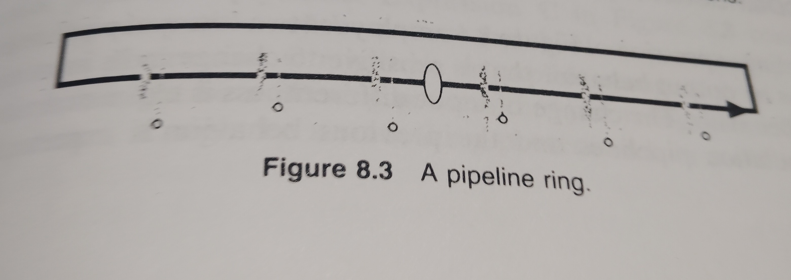
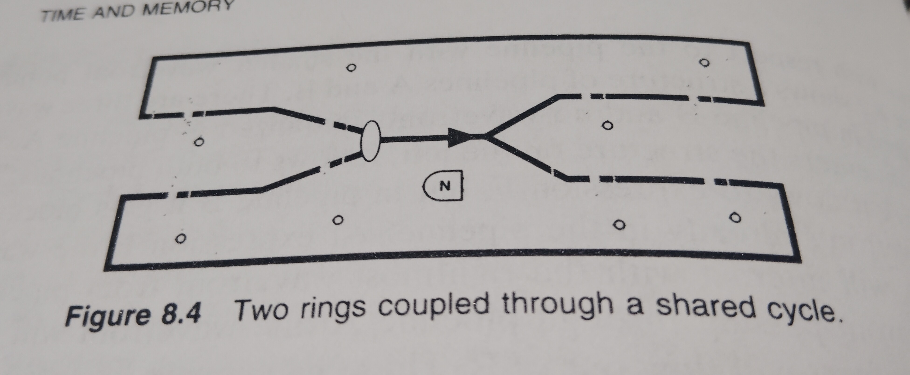
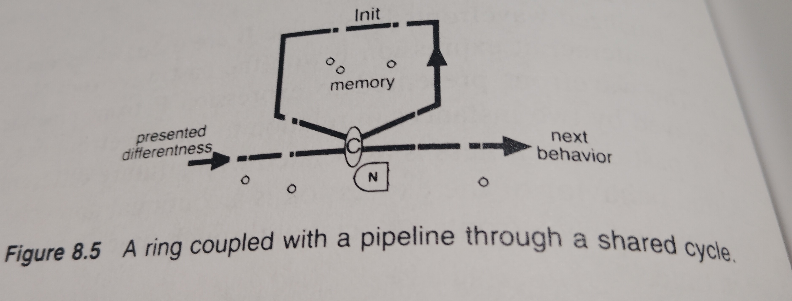

<!-- generated by weave from Linear issue TAG-166 — do not hand-edit -->

### TAG-166: 8.2.3 The Feedback Ring

**Status:** ⬜ Not started

## Software Notes

_(not yet written)_

## Reference

Feedback is an explicit association path from later in a resolution flow of an association structure to earlier in a resolution flow of an association structure, forming a ring structure. A ring, shown in Figure 8.3, is a pipeline that feeds back on itself. Structures of rings can be composed by sharing cycles. Figure 8.4 shows two rings coupled through a shared cycle.

A ring can be coupled to a pipeline through a shared cycle, as shown in Figure 8.5. A part of each appreciation of expression C is remembered in the ring and will combine with the next presented differentness, influencing the next appreciation. The ring might feedback the carry value for a serial adder or the current state of a state machine.

While the input and output content of an expression must be understood by other expressions, how ring content is asserted, presented, and how it influences the appreciation behavior can be unique and local to an expression. No other expression has to appreciate the content of the ring around expression C.
