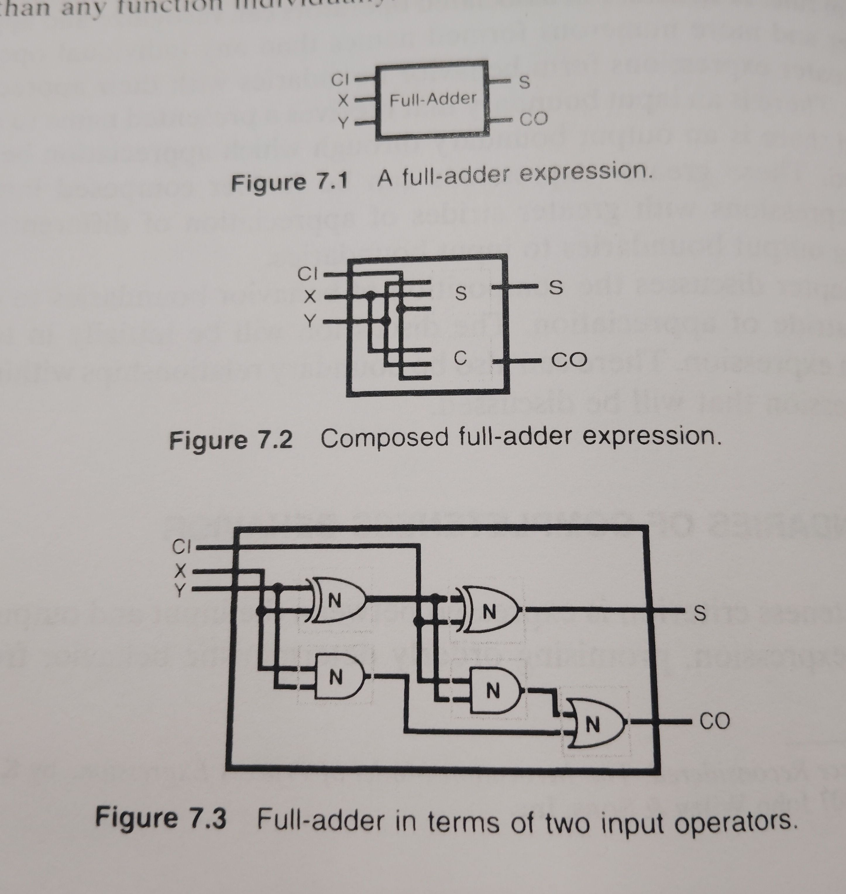

<!-- generated by weave from Linear issue TAG-168 — do not hand-edit -->

### TAG-168: 7.1.1 Association Boundaries

**Status:** ⬜ Not started

## Software Notes

_(not yet written)_

## Reference

Consider the binary full-adder of Figure 7.1 that takes three binary inputs and asserts two binary outputs. The full-adder is bounded by inputs CI, X, and Y and outputs S and CO.

Consider that the full-adder is composed of two three input expressions, S and C as in Figure 7.2. S outputs the sum and C outputs the carry. Each expression has its own input and output boundary. If S and C express the completeness criterion, then their boundaries compose to express the completeness criterion for the full-adder.

Consider that three input expressions are not available but only two input expressions are available. Figure 7.3 shows the full-adder in terms of two input NULL convention Boolean functions. Each function is bounded and expresses the completeness criterion. Again, the completeness relations of the boundaries of the functions accumulate so that the full-adder input and output boundaries are completeness boundaries. The boundary of the full-adder encompasses the boundaries of the functions and appreciates a greater range of differentness than any function individually. 

Consider that the XOR is not available and only AND, OR, and NOT are available; the expression might look like Figure 7.4. Again, the completeness boundaries of the functions accumulate so that the boundaries of the full-adder are completeness boundaries.

In Figure 7.4 the full-adder is expressed in terms of two half-adders. The boundaries of the half-adders shown in Figure 7.5 added as internal boundaries are completeness boundaries also. The boundaries of any subnetwork will be completeness boundaries. While all boundaries defined within the greater network of primitive operators are arbitrary, some might seem less arbitrary than others. Internal boundaries are usually defined for convenience of expression.

Consider that only two-value NULL Convention Logic operators are available. The 2NCL pure association expression corresponding to the full-adder of Figure 7.5 is shown in Figure 7.6. The two expressions have the same boundary structure.
