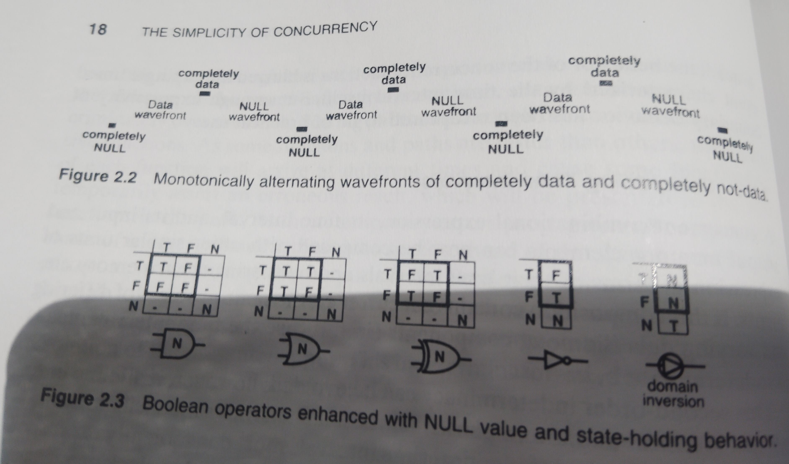

<!-- generated by weave from Linear issue TAG-176 — do not hand-edit -->

### TAG-176: 2.4.2 Logically Recognizing Data Flow Boundaries

**Status:** ⬜ Not started

## Software Notes

_(not yet written)_

## Reference

A logical function can be enhanced to respond only to completeness relationships at its inputs:

- If input is “completely data,” then transition output to the “data” resolution of input.  

- If input is “completely NULL,” then transition output to “NULL”.  

- If input is neither “completely data” nor “completely NULL,” do not transition output.

The transition of the output implies the completeness of presentation of the input, the completeness of its resolution and that the asserted output is the correct resolution of the presented input. This is called the **completeness criterion**.

Enhanced Boolean logic operators, shown in Figure 2.3, are no longer mathematical functions. They now include a state-holding or hysteresis behavior. A dash means that there is no transition. The domain inversion will be explained later. A logic using the NULL value and state-holding behavior will be called a **NULL Convention Logic**. The logic described here is a 3 value NULL Convention Logic (3NCL). While this discussion will continue in terms of 3NCL, there is also a practical 2 value NULL Convention Logic (2NCL) suitable for electronic implementation.

.
