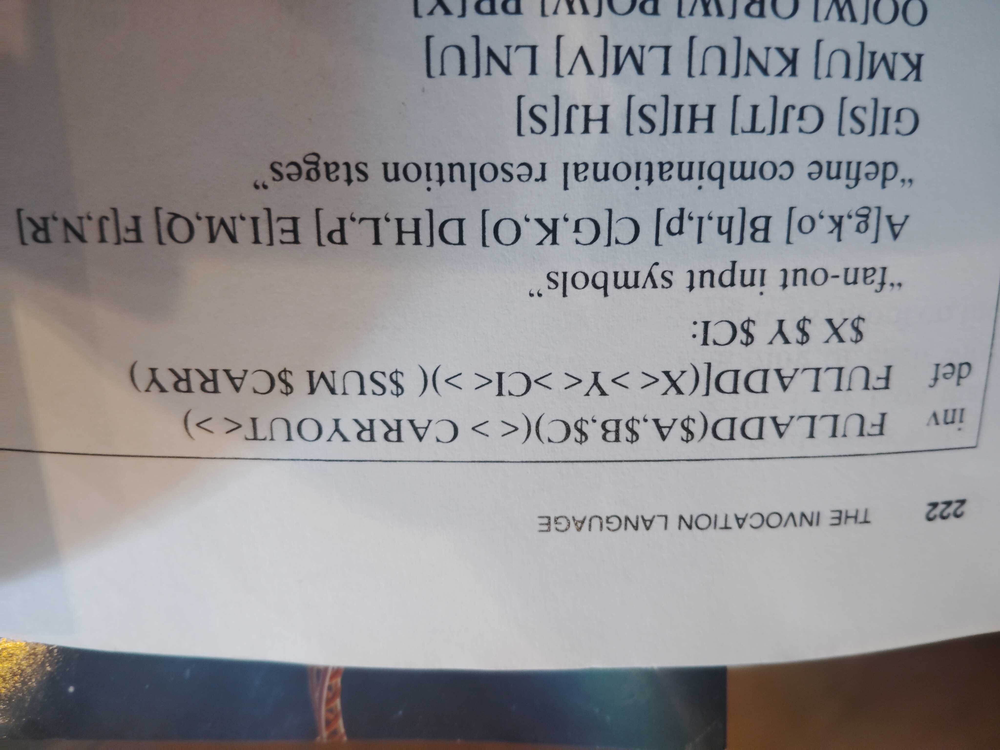
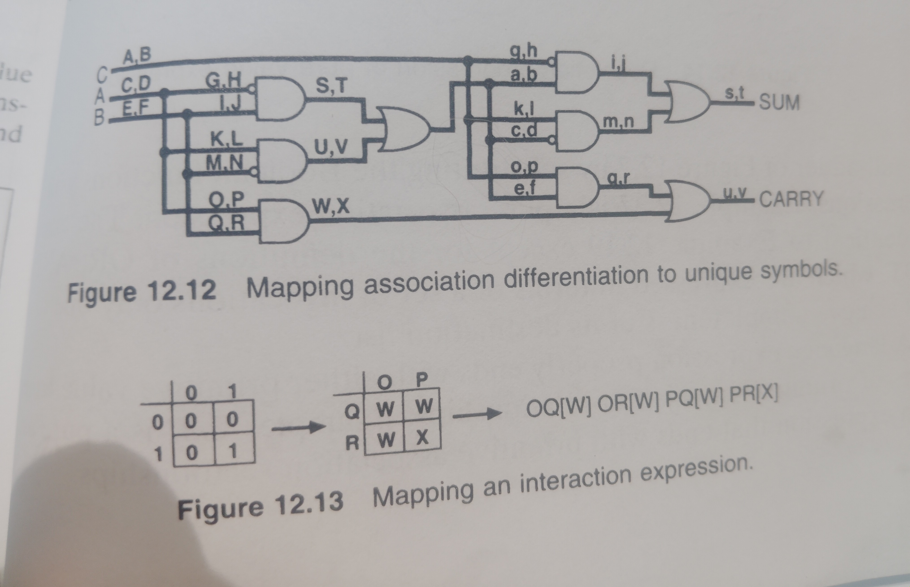
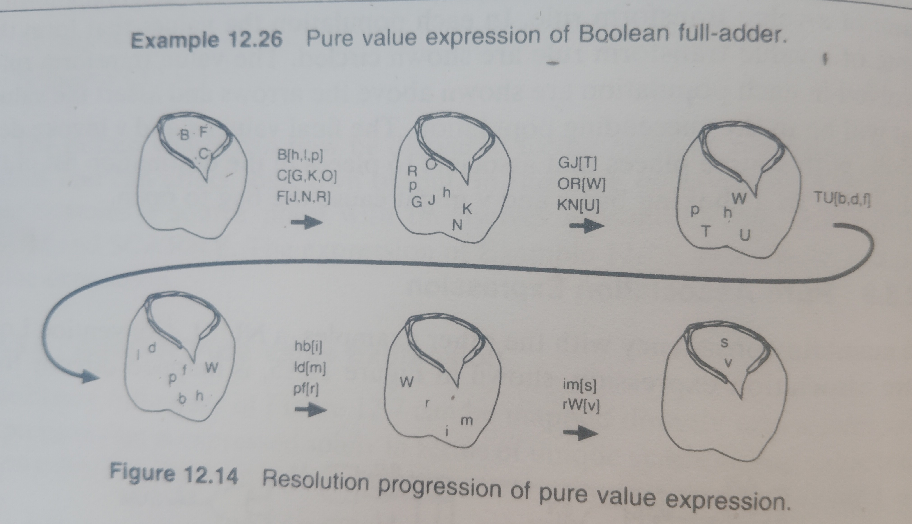

<!-- generated by weave from Linear issue TAG-177 — do not hand-edit -->

### TAG-177: Example 12.26 Pure Value Expression of Boolean Full Adder

**Status:** ✅ Implemented

## Software Notes

**What this example demonstrates:** Example 12.26 is Fant's §12.8.8, "Another Pure Value Expression" — the full-adder rebuilt entirely in terms of unique symbols and value transform rules, resolved via the "shaking bag" mechanism (Figure 12.14): input content is dumped into the place of resolution with no invocation syntax, and formed names — associations of currently-present symbols that happen to match a transform rule's name — assert new symbols into the next population, repeating until the destination-list symbols (`SUM`, `CARRY`) are formed and the definition completes. 

**Correction:** an earlier pass at this ticket, based on a wrong reference figure, mischaracterized this as a "primitive association" / pure-wiring expression (Fant's *different* §12.3.4/§12.9 distinction). That framing, and everything derived from it, should be disregarded.

Two distinct rule shapes appear in this example, and the emitter needs to treat them differently:

* **Single-symbol rules** (`A[g,k,o]`, `B[h,l,p]`, ...) — one input token transforms into several simultaneously-asserted output tokens carrying the same identity. For hardware purposes this genuinely degenerates to plain signal fan-out.
* **Joint-symbol rules** (every other tier: `G,I[S]`, `S,U[a,c,e]`, `i,m[s]`, `q,W[u]`, ...) — the rule's *name* is itself a comma-separated list of previously-formed symbols that must all be simultaneously present for the rule to fire. This is the example's actual dual-rail combinational logic (Figure 12.15's AND/OR/NOT gates), expressed as symbol-formation rather than explicit gate invocation.

Multi-symbol rule names are disambiguated by comma-separation on **both** sides of a bracket definition (`G,I[S]`, matching the existing convention already used for right-side fan-out target lists). This already works via `readCommaSeparatedName`, built for [TAG-136](https://linear.app/taguniversal/issue/TAG-136/example-1245-code-detector-state-machine)  state-symbol disambiguation and already the parser's general name-reading path (`definitions.zig`) — confirmed via direct inspection, not assumed. No parser or AST changes are needed for this ticket.

**What needs to change (entity.zig only):**

* Recognize `contained` definitions shaped as pure-value-only with no sources/destinations (excluding digit-prefixed names, which are numeric lookup-table rows — a separate, pre-existing mechanism) as *value transform rule* definitions, not standalone computational entities. They must never become their own VHDL entity.
* Split each such rule's name on commas to get its constituent input symbols — reusing the same comma-splitting already used for the target/output list.
  * **Exactly one input symbol** → fan-out rule: emit a plain signal assignment per target (`dest <= source;`), since the same token identity is propagating.
  * **More than one input symbol** → joint-symbol rule: the rule fires when *all* its input symbols are simultaneously valid (mirroring the existing `valid_of()`-based completeness pattern already used elsewhere, e.g. `complete <= x_valid and y_valid and ci_valid;`); each target becomes newly asserted (`data_value(<its assigned index>)`) exactly when that joint condition holds, `null_value` otherwise.
* Newly-formed target symbols need their own assigned payload index for `data_value()` — reuse/extend the existing per-definition symbol-interning approach (mirroring `lookup.zig`'s `internSymbol`) rather than inventing a new mechanism.
* Bare `$name` resolution statements (`$X $Y $CI`) are references to already-existing source places, not rules — no VHDL should be emitted for them; their ports already exist via `def.sources`.

**Deliberately out of scope for this ticket:**

* A general-purpose, cross-definition symbol-index registry — scoped only as far as this example needs; broader coordination is a separate concern if a second pure-value-expression example is added later.
* Actual GHDL synthesis/simulation of the result. The network wrapper's pre-existing issues (`fulladd_network`'s undeclared `ncl_signal`/`null_value`/`result`/`carryout` — consistent with a missing `matterscript_ncl` package analysis step in the verify pipeline — and the `$A`/`$B`/`$C` non-literal entry-argument TODOs) are a known, separate blocker, not part of this ticket.
* RTOS/NuttX target work.

Update on symbol collision:



That settles it — the collision is exactly as printed, verbatim. My "the header must differ" theory is directly disproven by the photo. I was wrong about that specifically, and I should say so plainly rather than reach for a third theory to explain it away.

Given that, here's where I actually land: I don't think there's a clean, book-supported answer for what this *should* mean. I can construct a charitable reading — Fant's "bag" model tracks presence, not identity-with-provenance, so maybe a rule asserting `X` and the boundary place `X` are meant to be understood as contributing to the same underlying fact rather than colliding — but even if that's the right way to read his abstract model, it doesn't survive contact with VHDL: an `in` port cannot be assigned to from inside its own architecture, full stop, regardless of how reasonable the semantic story sounds. There's no version of "OR the internal assertion with the port" that's expressible as a plain signal assignment to the port itself. So even the most generous interpretation still needs the port and the internal identity to live as two separate signals under the hood — which is disambiguation by another name, and you already told me you don't want that, for good reason: it would make a construct that might genuinely be an oversight in the text compile silently, instead of surfacing it.

So I think the honest conclusion is: this is either a genuine erratum in Fant's own book, or it depends on some rule from the surrounding prose that hasn't been shown to us — and either way, refusing to compile it, loudly and specifically, is the *correct* behavior for the compiler right now, not a limitation to work around. The validation check from two messages ago doesn't need to change at all — it was written against exactly this condition (a value-transform-rule target colliding with a definition's own boundary port name), and it still catches this case correctly now that we've confirmed the header for real.

Where that leaves TAG-177: as currently transcribed, this example fails validation, by design, with a clear named error rather than a downstream GHDL mystery. That's a legitimate resting state, not a stalled ticket — plenty of real compilers correctly reject inputs that turn out to rely on ambiguous or unsupported source constructs. Worth reflecting in the ticket text: change the status line to something like "🚫 Blocked — source example contains an unresolved place/symbol name collision (verified verbatim against the printed text); needs either a documented erratum or a rule we haven't identified yet before re-attempting" — rather than leaving it looking like an open implementation task.

Two ways forward from here, and I think this is genuinely your call rather than mine to make:

1. **Leave it as a correctly-rejected example.** The validator does its job, the ticket documents why, and we move on to the next example rather than sinking more time into one page's possible erratum.
2. **Keep digging** — if you want, check whether the prose immediately before or after Example 12.26 says anything about place reuse, symbol lifetime, or namespace scoping that we haven't seen yet. I'd only pursue this if there's a specific passage you suspect might explain it — I don't want to send you hunting through pages on my speculation alone a third time.

Update 9/24/2026

---

**TAG-177: Example 12.26 (pure value expression of Boolean full adder): resolved**

**Result:** The full adder runs through the runtime for all 8 input combinations. Each wavefront produces the correct SUM and CARRY symbols, checked through `Testbench` against `X+Y+CI`.

**Root cause of the earlier zero-presentation failure:** Joint-match rules must be comma-separated in the source (`G,I[S]`, `K,M[U]`, `S,U[a,c,e]`, and so on). Without commas the parser treated `GI` as a single place name, so those rules waited forever. The run then ended silently with no wavefronts and no error.

**Other changes to the script:**

* The carry-stage symbol `X` was renamed to `Z` to avoid colliding with boundary port `X` (`TransformRuleSymbolCollidesWithBoundaryPort`). The collision regression test is kept as a separate test.
* The book's table was transcribed correctly, so no logic changes were needed.

**Finding on** `@runtime(consumable)`: The test passes with the directive removed. The pure-value rules resolve under their own action, so this example needs no consumption semantics.

**Caveat:** `Testbench.run` creates a fresh `Environment` for each wavefront, so the test doesn't show whether tokens would leak between wavefronts in a persistent environment. The directive may still matter for continuous streaming (Fant's NULL-phase alternation, [TAG-202](https://linear.app/taguniversal/issue/TAG-202/72-coordinating-boundaries)).

**Follow-ups:**

* Add a stall diagnostic: when `Testbench.run` exits with an incomplete wavefront, report which rules or places were still waiting.
* Add a two-wavefronts-in-one-`Environment` test to settle the consumable question, once `Environment` can enumerate or clear places.
* Consider whether the parser should warn on multi-letter joint-match names that never match any seeded token.

---

Since the directive wasn't needed here, the ticket could also say what `consumable` is meant to do. Right now it's a directive whose purpose that test doesn't establish. Note - it was needed for [TAG-201](https://linear.app/taguniversal/issue/TAG-201/support-multi-operand-stoichiometry-and-multi-emission-fills-via) 

**Root causes (two):** (1) Transform output symbol `X` (`PR[X]`, `qX`, `rX`) matched boundary port `X`, which would create a second driver on the same place; the parser correctly rejects this with `TransformRuleSymbolCollidesWithBoundaryPort`. Fixed by renaming the symbol to `Z`. (2) Joint-match signals require comma separation (`G,I[S]`); without it the runtime parsed `GI` as one place, so the rules never fired and no wavefront completed.





## Reference

12.8.8 Another Pure Value Expression

The binary full-adder of Figure 12-7 can be mapped directly into a pure value expression that is expressed solely in terms of unique symbols and value transform rules. The boolean logic expression uses two unique symbols, 0 and 1, and unique places within the expression to represent unique differentnesses within the expression. The 0 or 1 on this path is different from the 0 or 1 on that path. The graphical circuit in Figure 12.12. shows the mapping of each wire (association path) to two unique symbols. One representing a 0 symbol on the wire and one representing a 1 symbol on the wire.

C means $X = 0$

D means $X = 1$

E means $Y = 0$

F means $Y = 1$, and so on, for each wire in the circuit

The value transform rules for resolving each formed name are derived from the symbols associated with each function. The derivation of the value transform rules for the function surrounded by O, P, Q, R, W, and X is shown in Figure 12.13. The set of derived value transform rules then becomes the set of contained definitions. Example 12.26 is the pure value expression. The input content is dumped into the place of resolution with no invocation syntax and begins forming names.

Figure 12.14 shows the resolution for input values B, C, and F as a progression of populations of symbols in a shaking bag, which represents the place of resolution. In each population of values only certain associations form a name of a value transform rule. In each population the values that form the name of a value transform rule are shown circled. The value transform rules involved in each population are shown above the arrows and assert the values that will be in the succeeding population. The final values s and v invoke definitions with source places that associate to places in the destination list of the definition. In a shaking bag s and v might cause the bag to open.

```
FULLADD($A,$B,$C)(<> CARRYOUT<>)
FULLADD[(X<>Y<>CI<>)( $SUM $CARRY)
  $X $Y $CI:
///"fan-out input symbols"
A[g,k,o] B[h,l,p] C[G,K,O] D[H,L,P] E[I,M,Q] F[J,N,R]
//"define combinational resolution stages"
G,I[S] G,J[T] H,I[S] H,J[S]
K,M[U] K,N[U] L,M[V] L,N[U]
O,Q[W] O,R[W] P,Q[W] P,R[Z]  // corrected from book's 'X'
S,U[a,c,e] S,V[b,d,f] T,U[b,d,f] T,V[b,d,f] //"fan out input to second half-adder"
g,a[i] g,b[j] h,a[i] h,b[i]
k,c[m] k,d[m] l,c[n] l,d[m]
o,e[q] o,f[q] p,e[q] p,f[r]
i,m[s] i,n[t] j,m[t] j,n[t] //"sum"
q,W[u] q,Z[v] r,W[v] r,Z[v] //"carry" renamed X to Z
s[SUM<s>] t[SUM<t>] u[CARRY<u>] v[CARRY<v>] //"output"
]
```
