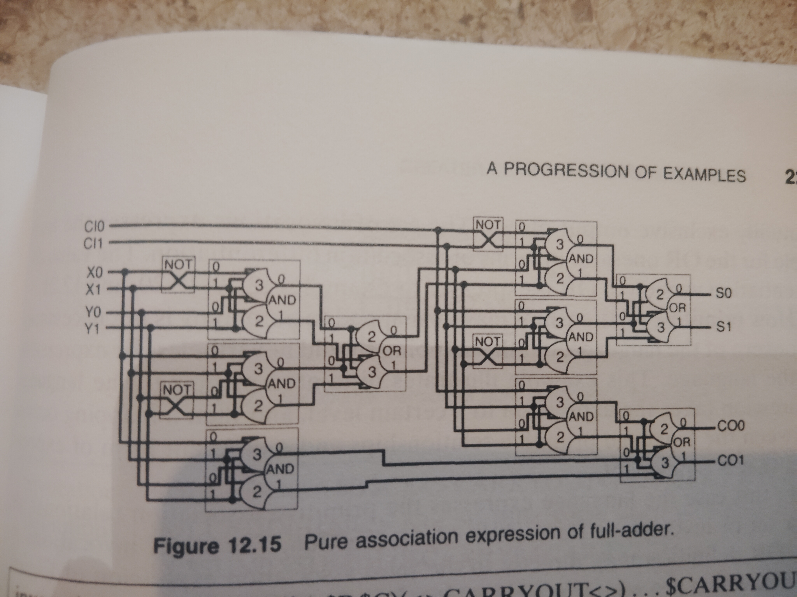

<!-- generated by weave from Linear issue TAG-182 — do not hand-edit -->

### TAG-182: 12.8.9 Pure Association Expression

**Status:** ⬜ Not started

## Software Notes

_(not yet written)_

## Reference

To maintain consistency with the other examples, a NULL Convention Logic pure association expression, shown in Figure 12.15, is mapped directly from the full adder of Figure 12.7 by substituting the Boolean functions with 2NCL expressions. Example 12.27 is a pure association expression. The expression is identical to Example 12.19 except for the definitions of OR, AND, and NOT, which are expressed in terms of a set of invocations only one of which will achieve completeness of its destination list.

A language expression properly ends with either primitive value transform rules or primitive association relationships. Example 12.27 is a pure association expression that ends with primitive association relationships.

The individual paths of the dual-path inputs associate in the destination list of each invocation. For each presentation the destination list of only one of the invocations will have complete content enabling the invocation. The enabled invocation will invoke a definition that associates a data value with one of the mutually exclusive output places. The set of invocations expresses the truth table for the OR operator in terms of association differentiation. The value differentiation version of OR is expressed in Examples 12.19, 12.20, and 12.21.

How primitive relationships may be mapped to autonomy is not necessarily a concern of the language, but the mapping should nevertheless be expressible in the language. This example illustrates disjointed mapping. The language expression takes the expression to a certain level, and then a mapping occurs between the language primitive relationships and a different form of expression that is equivalent.

In this case the language expresses the primitive association relationships as a set of invocations for each Boolean function. The set of invocations in the OR definition map directly to the pure association expression of Figure 12.16a, which is a minterm form NULL Convention Logic (NCL) expression that can be transformed into the equivalent expressions in Figure 12.16b or into the expression in Figure 12.16c. The NCL expression form of Figure 12.16c was directly substituted for the Boolean functions of the full-adder of Figure 12.7 to arrive at the expression of Figure 12.15.

The NCL operators can also be expressed in the language as pure value expressions. Example 12.28 shows the 2of2 operator and the 3of6 operator expressed as pure value expressions within the language.
