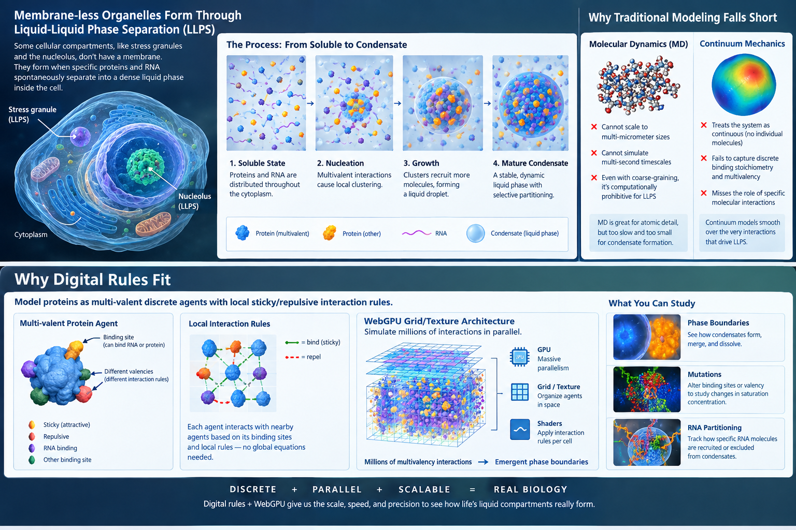

<!-- generated by weave from Linear issue TAG-194 — do not hand-edit -->

### TAG-194: Computational Biology

**Status:** ⬜ Not started

## Software Notes

Simulating biological interactions using discrete digital rules rather than continuous differential equations (like Navier-Stokes or force fields) shifts the paradigm toward cellular automata, discrete agent-based modeling, and rule-based graph rewriting. By running this on WebGPU, you gain massive parallelism across millions or billions of discrete state transitions per second.

Here are several compelling problems in molecular biology that are notoriously hard for traditional physics-based models, but uniquely suited to a discrete, rule-based WebGPU runtime:

### 1. Spatial Phase Separation & Biomolecular Condensates

* **The Problem:** Membrane-less organelles (like stress granules or the nucleolus) form through Liquid-Liquid Phase Separation (LLPS). Traditional molecular dynamics (MD) cannot scale to the multi-micrometer, multi-second scales needed to see these form, while continuum mechanics fails to capture discrete binding stoichiometry.
* **Why Digital Rules Fit:** You can model proteins as multi-valent discrete agents with local sticky/repulsive interaction rules. WebGPU’s grid/texture architecture lets you simulate millions of multivalency interactions simultaneously to study how phase boundaries emerge, how mutations alter saturation concentration, or how condensates partition specific RNA molecules.

### 2. Chromatin Folding & Epigenetic Domain Formation

* **The Problem:** DNA doesn’t just sit in the nucleus; it forms complex 3D loops and topological domains (TADs) driven by loop-extruding complexes (cohesin/CTCF) and epigenetic mark readers (e.g., HP1 binding methylated histones).
* **Why Digital Rules Fit:** Loop extrusion is fundamentally a discrete motor process: a motor steps along a lattice, stalls at specific markers, or drops off. A 3D lattice automaton running on WebGPU can simulate chromatin as a linked string with discrete step, bind, and unbind rules. This allows you to test how local histone modifications globally reconfigure genome architecture in real time.

### 3. Ribosome Jamming & Co-Translational Protein Folding

* **The Problem:** Translation is not uniform. Ribosomes pause at rare codons or specific mRNA secondary structures, causing upstream ribosomal "traffic jams" that trigger Quality Control (RQC) mechanisms or alter how the emerging protein folds.
* **Why Digital Rules Fit:** This is an asymmetric simple exclusion process (ASEP)—a classic discrete stochastic rule system. On WebGPU, you can simulate thousands of mRNAs in parallel, each being translated by multiple ribosomes with explicit rules for step rate, tRNA availability, collision detection, and nascent chain folding states.

### 4. Viral Capsid Self-Assembly and Genome Packaging

* **The Problem:** Viral capsids assemble from hundreds of identical protein subunits into highly symmetric geometries (like icosahedrons), often while selectively packaging viral RNA over host RNA. Traditional physics struggles with the long time horizons required for nucleation and defect correction.
* **Why Digital Rules Fit:** Self-assembly is driven by directional geometric binding rules and state changes upon binding (e.g., conformational switching). You can assign each capsid subunit a set of discrete interaction faces and state-transition rules. WebGPU allows you to run massive stochastic ensembles to discover what specific local binding rules prevent "assembly traps" (malformed capsids).

### 5. Multi-Enzyme Metabolic Channeling (Metabolons)

* **The Problem:** In many metabolic pathways, sequential enzymes cluster into "metabolons" to hand off intermediates directly without letting them diffuse away into the cytoplasm. Understanding the efficiency thresholds of spatial enzyme clustering vs. free diffusion is a major open question in synthetic biology.
* **Why Digital Rules Fit:** Instead of solving reaction-diffusion PDEs, you can treat metabolic intermediates as discrete particles diffusing on a 3D grid with probabilistic binding/reaction rules when colliding with enzyme nodes. This lets you optimize enzyme spatial configurations for synthetic biology constructs.

### Comparison of Biological Target Fit

| **Target Problem** | **Primary Rule Mechanics** | **WebGPU Parallelism Advantage** | **Key Insight Unlocked** |
| -- | -- | -- | -- |
| **Biomolecular Condensates** | Multivalent valence matching & sticky collisions | 3D grid / Voxel neighbor lookups | Emergent phase boundaries & stoichiometry |
| **Chromatin Loop Extrusion** | Directed stepping, stalling, & link constraints | Array/Buffer-driven parallel string updates | Global 3D genome reconfiguration |
| **Ribosome Traffic Jams** | Asymmetric Simple Exclusion Process (ASEP) | Parallel 1D array pipelines across cell transcripts | Translational kinetics & RQC trigger limits |
| **Capsid Self-Assembly** | State-machine shape matching & local bonding | Particle-agent state transitions | Nucleation rates & structural defect control |
| **Enzyme Channeling** | Random walks + discrete enzymatic state transitions | Voxel-based particle movement & collision checks | Optimal spatial layout for synthetic pathways |

### Recommended Starting Point

If you want the quickest proof-of-concept that yields striking visual and quantitative results on WebGPU, start with **Biomolecular Phase Separation (LLPS)**.

Because WebGPU natively maps 3D compute shaders to 3D textures, a 3D cellular automaton with multivalent binding rules will immediately produce visual condensates while letting you measure thermodynamic properties (like critical concentration and coarsening exponents) directly from compute buffers.

## Reference

_(not yet written)_
