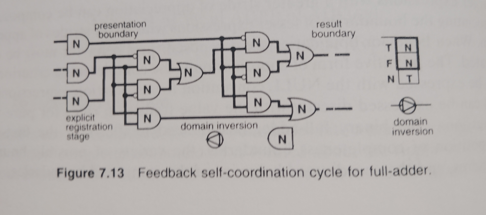
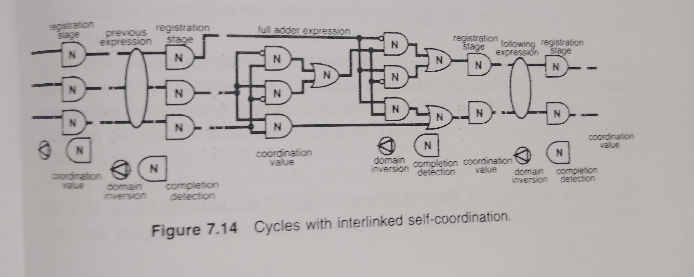
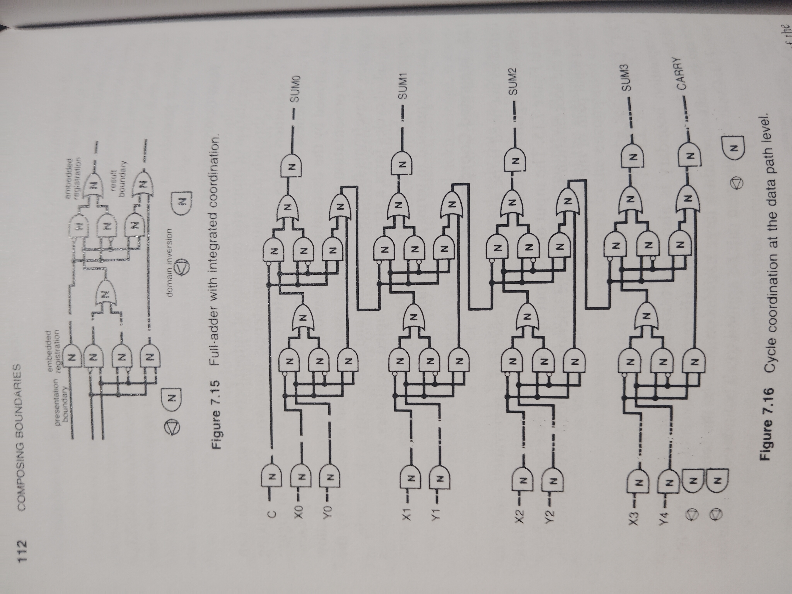
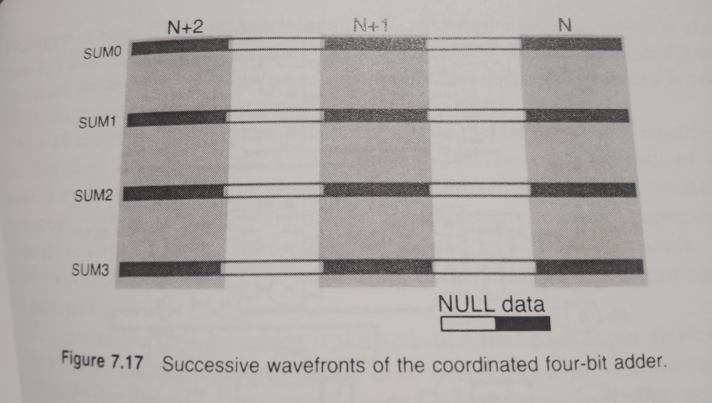

<!-- generated by weave from Linear issue TAG-202 — do not hand-edit -->

### TAG-202: 7.2 Coordinating Boundaries

**Status:** ⬜ Not started

## Software Notes

_(not yet written)_

## Reference

110 COMPOSING BOUNDARIES

7.2 COORDINATING BOUNDARIES

While the composition of completeness boundaries is concurrent, the behavior of each boundary is strictly sequential. Only one input presentation at a time can flow through an input boundary and into an expression. There must be a presentation of empty or NULL between each presentation of data content. The monotonic behavior of the content flow must be maintained, the content must be maintained, and the liveness of the flow must be maintained. Again, there is a simple convention for humans that accomplishes the purpose.

The completeness criterion states that when there is completeness at the output boundary the resolution of the input is complete. The completeness criterion can be used to coordinate the presentation of input and the flow of resolution through an expression.

7.2.1 The Cycle

The fact of completeness of the output can be domain inverted and associated back to the input to coordinate the presentation of the input. Domain inversion shown on the right in Figure 7.13 is a NULL convention primitive that transitions a data value to NULL and NULL to a selected data value, in this case T. This feedback coordination value, also called acknowledge, is associated from the output to a rank of input primitives called a registration stage, as shown in Figure 7.13. When the output is completely data the coordination value transitions to NULL. When the output is completely NULL, the coordination value transitions to data.

Only when the input values presented to the registration stage are data, and the coordination value is data, will the output of the registration stage transition to data and present a data wavefront to the encompassed expression. As long as the coordination value remains data, the registration stage will stably maintain its output data values even if a NULL wavefront is presented to the input of the registration stage.

Only when the input values presented to the registration stage are NULL values, and the coordination value is NULL, will the output of the registration stage transition to NULL and present a NULL wavefront to the encompassed expression. As long as the coordination value remains NULL, the registration stage will stably maintain its NULL output values even if a data wavefront is presented to the input of the registration stage.

The feedback association of the inverted coordination value is a simple dependency relationship that forms a closed oscillating expression called a cycle. The expression continually strives to transition between data and NULL. Not only does the cycle provide coordination of input presentation for an expression, it provides an autonomous expression of liveness.

### 7.2.2 Flow Coordination

Flow of presentation of input and assertion of output between expressions can be coordinated through associated completeness boundaries by interlinking the self-coordination cycles of the associated expressions, as shown in Figure 7.14. If completeness of a source expression is determined strictly after presentation is allowed by the destination expression, then no expression will allow a next input presentation until its current asserted output is accepted by the destination. Wavefronts flow spontaneously and stably from cycle to cycle.

Interlinked cycles form a structure of coupled oscillators, which expresses a spontaneously behaving pipeline structure. Large complex pipeline structures can be expressed in terms of interlinked cycles.

### 7.2.3 Integrated Coordination

There does not need to be a separate expression of a registration stage. The expression of registration can be integrated into the logic expression itself as shown in Figure 7.15. The input and output operators receive one more input which is the coordination signal. A single operator is added to coordinate the topmost input path of the expression.

### 7.2.4 Level of Coordination

A composition boundary is also a partitioning boundary, a completeness boundary and a coordination boundary. Hierarchical levels of nested boundaries can be defined within a large expression such as the four-bit adder Figure 7.12. Cycle coordination can be applied to all boundaries of commensurate hierarchical level within an expression. The hierarchical levels of the four-bit adder will be called the data path level for the four-bit data path  for the boundaries of the four-bit adder, the intermediate level for the boundaries of the full-adders and the primitive level for the boundaries of the primitive operators.

### Data Path Level Cycle Coordination

Figure 7.16 shows the four-bit adder with cycle coordination about its boundary. Other four-bit adders and other four-bit expressions can be composed as interlinked cycles into a spontaneously behaving pipeline structure with its flow coordinated at the level of a four-bit data path.

Figure 7.17 shows the flow of successive data and NULL assertions from the output of the coordinated four-bit adder. The shading indicates related bits of each successive presentation. A data wavefront will propagate all the way through the four-bit adder expression. When the output of the four-bit adder is complete a NULL wavefront will be allowed and will propagate all the way through the four-bit adder until the output is completely NULL, at which point a next data presentation will be allowed to propagate.

**Intermediate Level Cycle Coordination** The feedback coordination might be applied at the level of the full-adder boundaries, as shown in Figure 7.18. The four-bit adder is now a pipeline of four one-bit adders.

The expression is no longer explicitly coordinated at the four-bit level but is coordinated at the bit level. The boundary of the four-bit adder is now above the hierarchical level of cycle coordination. How does the boundary of the four-bit adder coordinate? Because of the carry value each successive full-adder has to wait on the carry of the previous full-adder. SUM0 will be completed and propagated first. SUM1 will be completed and propagate slightly later, and so on. The output of the four-bit adder will be skewed across the data path as shown in Figure 7.19.

While it is clear how an expression encompassed by a cycle is coordinated in terms of the completeness criterion, it is less clear how the un-encompassed expression boundaries at levels above the hierarchical level of cycle coordination are coordinated. For the Nth presentation to the input of the four-bit adder there will be Nth SUM0 and Nth SUM1 an Nth SUM2, and so on. The Nth SUM0 will be followed by an Nth NULL, which will be followed by the Nth + 1 SUM0 for the Nth + 1 input presentation. The same occurs with the other outputs. Each data output is aligned in sequence and separated by NULL. The successive data presentation wavefronts are not temporally or spatially aligned, but they are logically aligned with NULL wavefronts. The boundary of the four-bit adder is coordinated in terms of logical succession relationships.
