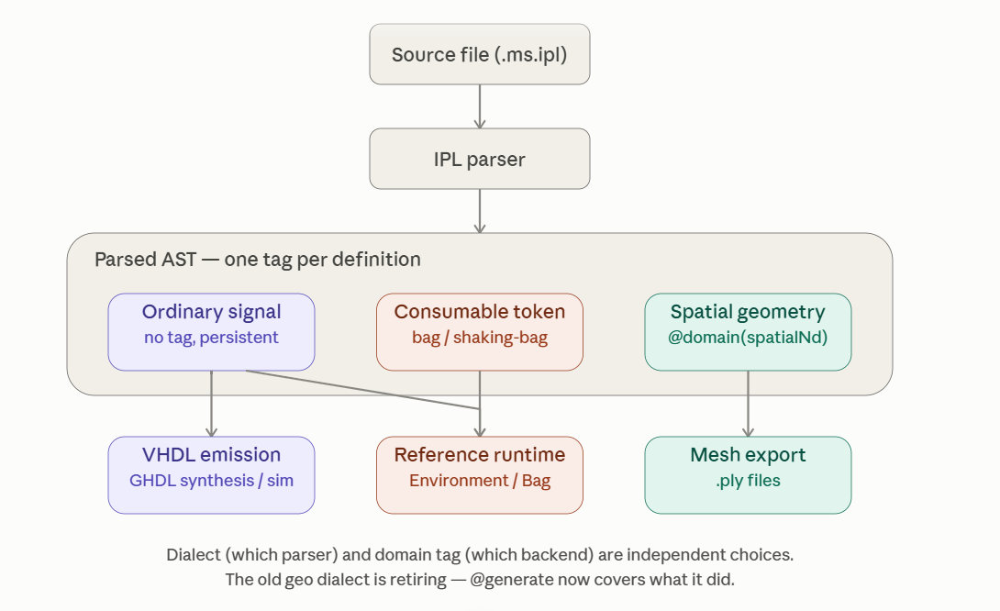

<!-- generated by weave from Linear issue TAG-203 — do not hand-edit -->

### TAG-203: Parsing Pipeline

**Status:** ⬜ Not started

## Software Notes

Three separate decisions are tangled together in "regular vs. shaking-bag," and pulling them apart is most of what resolves the confusion:

**1. Dialect — which parser reads the file.** Right now: `ipl` and `geo`, genuinely different grammars. Once `geo` retires (its job now covered by `@generate`), this collapses to one dialect. This is a real, hard boundary — a file either parses with one grammar or it doesn't.

**2. Domain tag — what a given definition, inside that one grammar, is modeling.** This is where geometry already lives — `@domain(spatial2d/3d)` on an ordinary `.ms.ipl` definition, inspected per-definition by `boundary.shouldSkipSpatialGeometry`, not signaled by file extension at all. It's also, I'd argue, the right home for "ordinary signal" vs. "consumable token" — not because the two are the same kind of tag semantically, but because it's the mechanism already proven to work, and it keeps this concern separate from dialect the same way geometry already is.

**3. Backend — where a tagged definition's output goes.** VHDL, mesh, and now two flavors of reference runtime. A definition's tag determines which backend(s) can meaningfully consume it — ordinary-signal definitions can go to both VHDL and the `Environment`-based runtime (that's the whole cross-verification point of the runtime ticket); consumable-token definitions currently have nowhere to go but `Bag`, because nobody's worked out a hardware realization for token depletion yet; spatial definitions only ever meant mesh export.

The reason I'd steer away from encoding this as a file-extension distinction (`.ms.ipl.consumable`) rather than an in-band tag: geometry already tried the file-extension-as-domain-signal approach once — that's what the standalone `geo` dialect *was* — and you're now retiring it in favor of the in-band `@domain(...)` approach specifically because it turned out to be the better pattern: it lets a single file mix domains side by side, and it doesn't force a new file-extension proliferation problem every time a new domain shows up (chemistry today, something else next month). I think that history is a pretty direct answer to which convention the new distinction should follow.

Concretely, I'd add a sibling directive to `@domain`, something like `@runtime(consumable)` (bare digital logic staying the unmarked default, matching how `@domain` is already opt-in), checked the same way — a small, cheap addition given `assertNoTransformRuleSymbolCollidesWithPort`-style per-definition inspection is already the established pattern for this class of decision.

This doesn't touch the file-organization work you're doing today at all — TAG folders, one issue per example, moving `geo` examples in — since that's about *where files live*, completely orthogonal to *how a definition inside one declares what it's modeling*.

## Reference

_(not yet written)_
