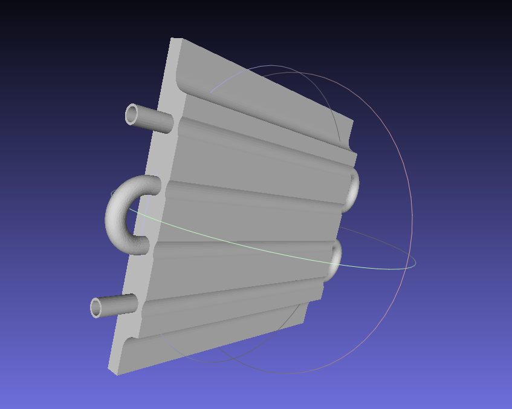
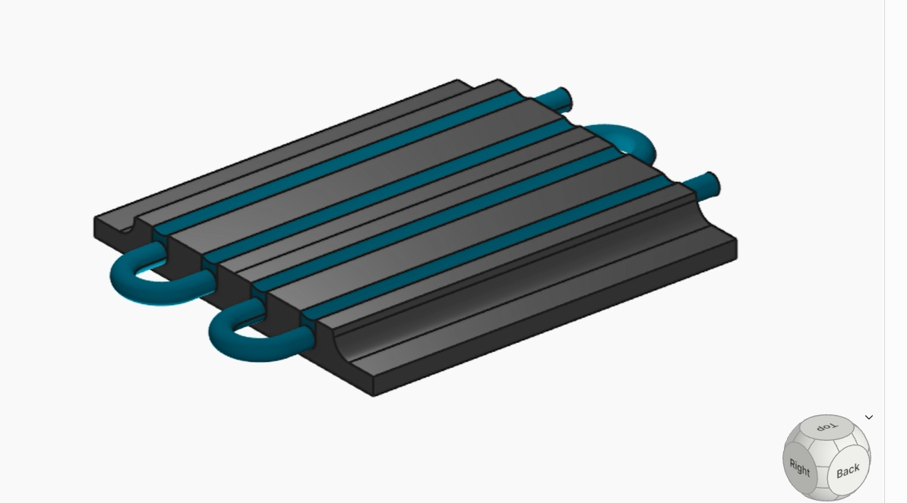

<!-- generated by weave from Linear issue TAG-205 — do not hand-edit -->

### TAG-205: Radiator Model

**Status:** ⬜ Not started

## Software Notes

To make this concrete, consider the problem of modeling an automotive radiator. The radiator is a heat exchanger: coolant enters through an inlet port, flows through a serpentine tube, exchanges heat with the fin array, and exits through an outlet port. The engineering problem is to model this system with sufficient fidelity to support real-time control decisions.

Step 1: Domain geometry acquisition. The radiator geometry is designed in Zoo

Design Studio using parametric KCL modeling and exported as a PLY mesh. MeshLab loads the mesh, computes per-vertex curvature and geodesic distances, and generates a UV parameterization for FPGA fabric projection.

Step 2: Vertex role assignment. The placement engine classifies mesh vertices by geometric role: inlet port vertices (open boundary, single connection), outlet port vertices, coolant channel vertices, fin surface vertices, and channel wall vertices (shared boundary between fluid and thermal domains). Classification is performed from mesh topology and curvature analysis — no manual annotation required.

Step 3: Physics definition. For each vertex role, an appropriate IL definition is

selected from the MatterScript standard library:

• FluidCell — coolant channel vertices. Models pressure and velocity propagation:

pout = clamp(pin − R + vin/2, 0, 7)

• HeatCell — fin surface vertices. Models thermal conduction: Tout = clamp((Tn +Ts + Te + Tw)/4, 0, 7)

• WallCell — channel wall vertices. Couples fluid and thermal domains at the fluid-solid boundary.

• Inlet — inlet port vertices. Pure source definition generating constant pressure and velocity tokens.

• Outlet — outlet port vertices. Absorbs tokens and emits a back-pressure token.

Step 4: Table generation. The compiler enumerates all input combinations for each definition and evaluates the physics expressions at compile time, producing VHDL case statements. No floating point arithmetic appears in the generated hardware. The serpentine coolant path acquires a natural delay structure: coolant tokens take longer to propagate from inlet to outlet than heat tokens take to conduct across a single fin, correctly reflecting physical transit times.

Step 5: Geometry-aware placement and delay synthesis. The annotated mesh is projected onto the FPGA fabric using the MeshLab UV parameterization. Synthetic delay elements are inserted on connections whose projected distance differs from their geodesic distance beyond a threshold.

Step 6: Compilation and simulation. The network compiles to VHDL, is validated by GHDL, synthesized to a Verilog netlist, and simulated by Verilator. Inlet pressure and outlet temperature are compared against physical measurements or analytical solutions.

Step 7: FPGA deployment. The validated VHDL is synthesized to an FPGA bitstream. Sensor logic at specific cell indices reads temperature and pressure at locations corresponding to physical sensor positions. Actuator logic writes boundary conditions as operating conditions change.

## Reference

