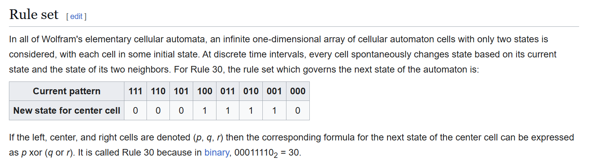

<!-- generated by weave from Linear issue TAG-210 — do not hand-edit -->

### TAG-210: Rule 30 Cellular Automaton

**Status:** 🟡 Partial

## Software Notes

Implement the NKS Rule 30 Cellular Automaton using the @generate directive.



## Reference

```
// Linear: TAG-210 NKS Rule 30 elementary cellular automaton
// New state for center cell = p XOR (q OR r), where (p,q,r) = (left, center, right)
// Rule 30 = 00011110 in binary (Wolfram's rule-number convention)

@domain(spatial2d, size: [128, 256])

@generate {
  // [Left, Center, Right] : New Center State
  [1,1,1]:0
  [1,1,0]:0
  [1,0,1]:0
  [1,0,0]:1
  [0,1,1]:1
  [0,1,0]:1
  [0,0,1]:1
  [0,0,0]:0
}
```
