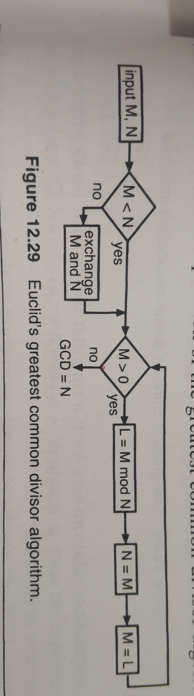
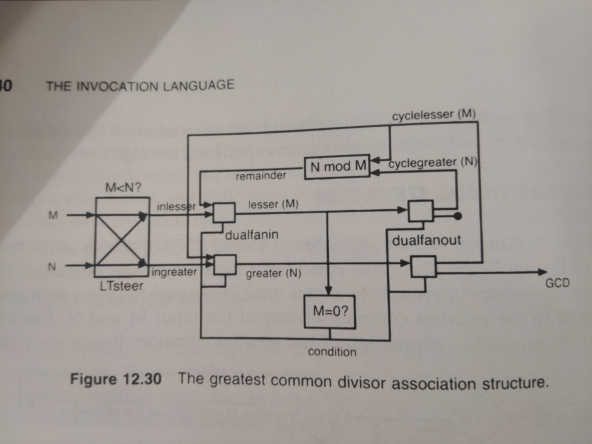

<!-- generated by weave from Linear issue TAG-87 — do not hand-edit -->

### TAG-87: 12.14 Conditional Iteration

**Status:** 🟡 Partial

## Software Notes

This landed with exactly what we needed — genuinely clarifying, and it retroactively closes something I'd flagged as ambiguous much earlier tonight.

**First, the good closure:** remember that `dualfanout($outcondition $lesser $greater)({cyclelesser<> cyclegreater<>} ( SINK<> GCD<>) )` structure I flagged way back as possibly a transcription artifact — brace group followed by a sibling parenthesized group, a pattern I hadn't seen anywhere else? This section fully explains it, and it's **real, meaningful syntax, not a mistake**: `{cyclelesser<> cyclegreater<>}` is the "feed back into the ring" branch, `(SINK<> GCD<>)` is the "done — route to final output, discard `lesser` into `SINK`" branch. That's Fant's Conditional Output mechanism (§12.5.3) doing exactly its job. Good to finally close that loop with confidence instead of a guess.

**Now the part that actually changes my thinking on the register design:**

> "The invocation of dualfanin accepts input from either the input or the feedback ring depending on the content of $lesser... If lesser is equal to zero, then a new input can be accepted. If it is greater than zero, then a resolution is in progress."

`dualfanin` and `dualfanout` are each acting as a **steered mux/demux**, keyed on `$lesser` — not as anything resembling a clocked register. And nowhere in this whole passage does Fant mention a distinct storage/latch primitive at all. The "memory" is described as an emergent property of the *topology itself* — a ring that content "flows around until the termination state is reached" — not a discrete component you'd point to and call a register.

**That's actually a meaningful, somewhat surprising finding, and worth being honest about the gap it exposes in our current VHDL model:** real NCL hardware gets this behavior for free because it's built from **threshold gates**, which have genuine physical hysteresis — a threshold gate holds its DATA output until *all* its inputs have returned to NULL, which is exactly the state-holding behavior a ring needs, built into the gate itself, no separate register required. Our current emitter doesn't model that at all — everything so far has been plain `std_logic_vector` signals and ordinary combinational case-statement lookups, which is a simplification that's been perfectly fine for feedforward logic like `FULLADD` (nothing ever needed to be "held"), but breaks down specifically for a real ring: wiring `dualfanout`'s feedback outputs straight back into `dualfanin` as plain combinational signals would create a genuine zero-delay combinational loop in the generated VHDL — not synthesizable, and not something GHDL could meaningfully simulate either.

**So the real design question isn't "where do we insert a register," it's "how do we approximate a threshold gate's hysteresis using the plain-signal abstraction we've already built."** My instinct: rather than model true threshold-gate behavior throughout (a much bigger undertaking, changing the whole signal model), the pragmatic path is a small, explicitly async latch inserted *only* at the ring's re-entry point — loading when the new wavefront is complete and the previous one has genuinely returned to NULL, gated by completeness signals we already compute, never by a clock. That's a deliberate approximation of the real hardware mechanism, not the real thing — worth being honest about that distinction in whatever we build, probably documented right in `matterscript_ncl.vhd` alongside it.

Yes — genuinely distinct, and worth being precise about the difference, because I think your instinct here is actually *more* correct than what I said a moment ago, and I'd revise my earlier framing.

**Completeness detection (the null-value criterion)** is what we've been doing all along — a stateless, purely combinational function of the *current* inputs: are all sources valid right now, yes or no. It has no memory; it just reflects the instantaneous state of the wires.

**Hysteresis** is a different property entirely: once a gate asserts DATA, it *keeps* asserting that same value even as inputs start changing underneath it (e.g., beginning to return to NULL one at a time), and only actually transitions once *everything* has fully returned to NULL. That's definitionally a memory behavior — holding a past value in the presence of changing present inputs can't be expressed as a pure function of current inputs, no matter how the combinational logic is written.

**Your instinct to scope this to boundaries rather than every internal gate is the right call, and it's not just a convenient shortcut — it matches the book's own structure.** Fant treats boundary coordination (Ch 7) and memory (Ch 8) as separate chapters for a reason: the completeness handshake happens *at* invocation boundaries — where one invocation's outputs meet another's inputs — and that's also where genuine state-holding needs to live, specifically at whichever boundaries close a ring. Internal fill-expression logic *within* a single invocation's resolution never needs to individually hold anything; the boundary around the whole invocation is what provides that property collectively.

Given that, I'd actually walk back what I said earlier — "generalize to every gate" was too strong. The more principled generalization is **every boundary that closes a cycle**, not every gate. That's a meaningfully narrower, more correct target, and it happens to already be close to the "narrow" version I proposed as the starting point — which is a good sign we're converging on the right shape rather than just picking the easy option.

Worth updating the Linear note's acceptance criterion to reflect this more precise framing before it becomes the thing someone checks against later.

**Given Ch 7 directly governs exactly this question** — which boundaries need what kind of coordination — I'd treat it as the natural next section to scan, same discipline as everything else tonight: read the book before designing, rather than generalize from one example.

`❌ `**Do not close as Implemented until:** the hysteresis/hold-until-NULL primitive introduced here for the ring is generalized to *every* emitted gate (not just the feedback re-entry point), and `verify-examples` still shows clean parse+GHDL results for the existing feedforward examples (FULLADD, OR, AND, NOT, etc.) after that generalization — confirming the broader model didn't silently change their behavior. Until then, this should stay tagged `Partial`.

[TAG-166](https://linear.app/taguniversal/issue/TAG-166/823-the-feedback-ring)

## Reference

The greatest common divisor algorithm of Euclid (GCD), shown in the flowchart of Figure 12.29, illustrates conditional iteration in the language. The algorithm generates intermediate values until M is equal to 0, at which point N is equal to the greatest common divisor of the input M and N. [TAG-138](https://linear.app/taguniversal/issue/TAG-138/example-1240-the-invocation-expression-of-the-greatest-common-divisor) is the invocation expression of the greatest common divisor algorithm.

The association relationships form a ring that the content flows around until the termination state is reached. N is passed on as the GCD, and a new pair of numbers is allowed.

Figure 12.30 shows the association structure of the invocation expression. LTsteer makes sure that the inputs are correctly oriented in terms of magnitude. The invocation of dualfanin accepts input from either the input or the feedback ring depending on the content of $lesser (M). If lesser is equal to zero, then a new input can be accepted. If it is greater than zero, then a resolution is in progress. The content of source place init<> provides an input of 0 to the invocation of EQ0 to configure the expression to accept its first input.

The invocation of dualfanout delivers the content of the pipeline into the ring or to the output depending on the value of $lesser. The function N mod M is performed in the feedback ring and passed through dualfanin; then the content of $lesser is tested. If $lesser is zero, then the resolution is completed and dualfanout delivers the content of $greater to the output as the greatest common divisor and discards the content of lesser.

