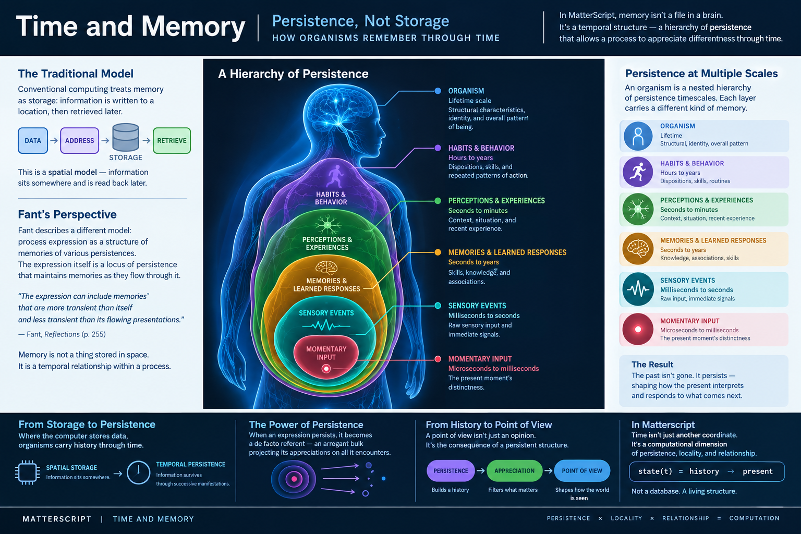

# Time and Memory

Computation is usually described as something that happens **in time**.

A program starts. Instructions execute. Memory is read and written. The program continues. Eventually it produces a result.

In this model, time is largely an external coordinate. The computer exists in space, while computation proceeds along a clock.

MatterScript takes a different view.

Time can itself be part of the computational structure. A process can persist, accumulate history, and respond differently because of what has happened before. Memory, in this sense, is not necessarily a collection of values stored at addresses. It is the persistence of structure through time.

> **Memory is not merely information about the past. Memory is the persistence of the past into the present.**

This distinction becomes fundamental when computation is understood as **propagation** rather than execution.

---

## 5.1 Memory Is Not Storage

The conventional computer provides an extremely useful metaphor for memory:

```text
DATA → ADDRESS → STORAGE → RETRIEVE
```

Something happens. Its representation is written to a location. Later, a program retrieves that representation.

This is a **spatial model of memory**.

Information exists somewhere, and remembering consists of finding it.

The metaphor is so familiar that it is easy to mistake it for a definition.

A hard drive stores files. RAM stores values. A database stores records. A program retrieves them when needed.

But not every system that exhibits memory works this way.

An organism does not carry a collection of discrete files corresponding to everything that has happened to it. A learned skill is not necessarily retrieved from a particular address. A habit does not need to be opened before it can influence behavior. The history of a process can be present in the structure and behavior of the process itself.

This suggests another model:

```text
HISTORY ─────────────────→ PRESENT
   │                          │
   └──── persistent structure ┘
```

The distinction is subtle but important.

In the first model, the past is **stored somewhere**.

In the second, the past **persists as part of what the system is now**.

MatterScript is concerned with the second kind of structure.

---

## 5.2 Persistence

Fant describes a process expression as:

> **A structure of memories of various persistences.**

This provides a useful starting point for thinking about memory in a space-time computational system.

A process is not simply a thing that receives transient inputs. It is itself a **locus of persistence**.

Presentations flow through it. Some are extremely transient. Others persist longer. Some relationships between them persist longer still.

Fant writes:

> **The expression itself is a locus of persistence that is relatively stable from presentation to presentation.**

This means that persistence does not have to be implemented as a separate memory subsystem.

The structure of the process can itself provide persistence.

A presentation may exist for a moment.

A perception may persist for longer.

A learned response may persist for years.

A structural characteristic of an organism may persist for its entire lifetime.

These are all different forms of temporal persistence.

### A hierarchy of persistence



The organism provides an intuitive example of this hierarchy.

At the innermost level is a momentary input: something happening now.

That input may persist as a sensory event.

A collection of events may form a perception or experience.

Repeated experience can produce learned responses.

Repeated responses can become habits and dispositions.

The entire history is incorporated into the continuing structure of the organism.

The result is not a database of increasingly old records.

It is a hierarchy of structures with different **persistence timescales**.

---

## 5.3 Memories of Different Persistence

A conventional memory architecture tends to distinguish memory by *location*:

```text
 register
    ↓
  cache
    ↓
   RAM
    ↓
  disk
    ↓
 archive
```

MatterScript can instead think about memory in terms of **persistence**:

```text
  moment
    ↓
  event
    ↓
perception
    ↓
learned response
    ↓
  habit
    ↓
organism
```

The important property is not where something is stored.

The important property is **how long its structure remains relevant to subsequent propagation**.

This provides a more general definition of memory:

> **A memory is a structure whose persistence allows a process to relate what has happened to what happens next.**

A memory need not be an explicit data object.

It may be:

* a persistent token,
* a geometric relationship,
* a delayed association,
* a stable boundary,
* a learned transformation,
* a physical configuration,
* a recurring pathway,
* or an entire persistent expression.

The same principle applies across different physical implementations.

A neural structure, a mechanical mechanism, a semiconductor circuit, and a MatterScript expression can all exhibit memory without requiring that memory to take the form of a conventional addressable data record.

---

## 5.4 Appreciating Differentness Through Time

MatterScript is fundamentally concerned with **differentness**.

A process encounters one condition, then another. The significance of the second condition can depend upon the persistence of the first.

Fant expresses this directly:

> **Appreciating differentness through time requires memory to associate a differentness from the past with a differentness in the future.**

This is the key transition from simple persistence to temporal computation.

Consider a sequence:

```text
A → B
```

Without memory, `B` is simply the current condition.

With persistence, the process can encounter:

```text
A → B
```

and distinguish that sequence from:

```text
C → B
```

The current event is the same.

The *history* is different.

Therefore the process can behave differently.

Memory has entered the computation.

The system does not need to retrieve a stored representation of `A`. It only needs some aspect of `A` to have persisted sufficiently to participate in the interpretation of `B`.

This is a fundamentally different computational model from:

```text
READ memory[address]
COMPARE value
WRITE result
```

The temporal structure itself performs part of the computation.

---

## 5.5 History Becomes Point of View

Persistence has another consequence.

A sufficiently persistent structure does not merely remember the past. It begins to **interpret the present through the accumulated past**.

Fant describes this as the “arrogance of bulk”:

> **Any association expression of sufficient persistence and stride of appreciation, even if it is continually changing, becomes a de facto referent: an arrogant bulk projecting its appreciations on all it encounters.**

The terminology is deliberately provocative, but the computational idea is important.

A persistent expression carries a *history*.

That history affects which differences it can appreciate.

Those differences affect how it responds.

Thus:

```text
PERSISTENCE
     ↓
  HISTORY
     ↓
APPRECIATION
     ↓
POINT OF VIEW
```

A point of view is therefore not merely an opinion stored inside a system.

It can be understood as the consequence of **persistent structure interacting with new events**.

Two expressions can encounter the same event and respond differently because their histories are different.

The difference does not necessarily reside in a separately retrieved memory.

It resides in the structures that have persisted.

This is one reason biological systems are such useful examples of space-time computation. An organism carries its history in its continuing organization.

---

## 5.6 The Past Is Present

This gives us a useful distinction between two statements:

> “The system remembers the past.”

and:

> “The past is part of the system's present state.”

The first suggests storage and retrieval.

The second suggests *persistence*.

For a sufficiently persistent process, these become nearly inseparable.

A person's ability to recognize a familiar face is not necessarily the result of retrieving a file labeled with that face. The organism has been changed by its previous encounters.

Likewise, a learned physical mechanism does not need to remember its design as an abstract description. Its structure embodies the history that produced it.

The past has become **present structure**.

This can be expressed computationally as:

```text
state(t) = history → present
```

rather than:

```text
state(t) = current_input + memory[address]
```

The first expression is not intended as a conventional equation. It is a change in ontology.

The present is understood as the continuation of a history rather than as a state that periodically consults an external archive.

---

## 5.7 Incidental Time

Not every computation that takes time is a temporal computation.

This distinction is essential.

A conventional program may execute for ten seconds. That does not mean that the program has computationally represented ten seconds.

The passage of time may simply be an incidental consequence of execution.

Fant calls attention to this distinction in his discussion of **incidental time**.

An expression may extend through time simply because of implementation constraints, resource limitations, or the convenience of reusing one structure sequentially rather than constructing many structures in parallel.

A conventional computer is full of such examples.

A processor may execute:

```text
A
B
C
D
```

sequentially even when the computation has no conceptual reason for A, B, C, and D to occupy successive moments.

The sequence is an implementation strategy.

MatterScript distinguishes this from a computation in which **temporal relationship is itself meaningful**.

Compare:

### Incidental time

```text
A → B → C → D
```

The system happens to perform these operations sequentially.

### Computational time

```text
A ───────→ B
    ↑
 persistence
```

The relationship between A and B depends upon A persisting into the interval in which B occurs.

The first is sequential execution.

The second is temporal structure.

This distinction is one of the foundations of space-time programming.

---

## 5.8 Time as Computational Structure

Traditional programming tends to make time external to structure.

A program has:

* data,
* operations,
* memory,
* addresses,
* and a clock.

The clock determines when operations happen.

MatterScript instead permits time to participate directly in the organization of computation.

A delay can be structural.

A persistence can be structural.

A temporal relationship can be structural.

A process can distinguish an event because another event is still present, or because another event has ceased to be present, or because a persistent structure connects the current event to something that happened earlier.

In this model:

```text
TIME
 │
 ├── persistence
 ├── delay
 ├── ordering
 ├── association
 └── memory
```

These are not merely runtime measurements.

They can be properties of the computational expression itself.

This is why MatterScript does not treat time simply as a clock attached to otherwise timeless computation.

> **Time can be part of the machinery.**

---

## 5.9 Temporal Memory and Spatial Structure

Time and space provide two complementary forms of computational relationship.

A spatial relationship says:

> These things are related because of where they are.

A temporal relationship says:

> These things are related because of what persists between their occurrences.

Consider two structures:

```text
SPATIAL RELATIONSHIP

A ───── B
```

The relationship is expressed by their arrangement.

Now consider:

```text
TEMPORAL RELATIONSHIP

A ─────────→ B
     │
     └── A persists
```

The relationship is expressed by persistence through the interval.

MatterScript treats both as computationally meaningful.

This leads to a useful symmetry:

```text
                 COMPUTATION
                      │
          ┌───────────┴───────────┐
          │                       │
        SPACE                    TIME
          │                       │
      LOCALITY               PERSISTENCE
          │                       │
    RELATIONSHIP               MEMORY
          │                       │
     PROPAGATION             APPRECIATION
```

Space determines what can interact through locality.

Time determines what can remain relevant through persistence.

Together they provide a richer substrate for computation than either dimension considered independently.

---

## 5.10 From Memory to MatterScript

The conventional programming model asks:

> Where is the value stored?

MatterScript can ask a different question:

> What persists, where does it persist, and what can that persistence affect?

This changes the programmer's conception of state.

A variable normally represents something whose value can be changed.

A persistent expression represents something whose **continued existence has computational consequences**.

That distinction matters when computation is mapped onto physical systems.

A physical circuit does not need to simulate every aspect of memory as an abstract data structure. It can embody persistence directly through:

* physical state,
* geometry,
* capacitance,
* delay,
* feedback,
* stable configurations,
* asynchronous handshakes,
* or other mechanisms that preserve distinctions through time.

MatterScript's purpose is not to hide these mechanisms behind a conventional sequential abstraction.

It is to describe computational structure in terms that remain meaningful when the computation becomes physical.

---

## 5.11 Memory Without a Memory Subsystem

This leads to a broader principle:

> **A system does not necessarily need a separate memory subsystem in order to have memory.**

If a structure persists and that persistence affects subsequent behavior, the system already possesses a form of memory.

This can happen at many scales.

A token can persist.

A place can persist.

A geometric arrangement can persist.

A process can persist.

A biological structure can persist.

An entire world model can persist.

The implementation may change, but the computational principle remains the same.

Memory is therefore not defined by a particular technology.

It is defined by a relationship between **persistence and subsequent appreciation**.

---

## 5.12 From History to Computation

The resulting model is compact:

```text
EVENT
  ↓
PERSISTENCE
  ↓
HISTORY
  ↓
APPRECIATION
  ↓
RESPONSE
  ↓
NEW EVENT
```

The process continuously transforms its history into its present behavior.

There is no requirement that the history be serialized into a file.

There is no requirement that the system explicitly retrieve the past.

There is no requirement that every historical state remain separately addressable.

What matters is that enough structure persists for the system to distinguish what is happening now in relation to what has happened before.

This is memory as **temporal computation**.

---

## 5.13 The Space-Time Programmer

The conventional programmer thinks primarily in terms of values and operations:

```text
value → operation → value
```

The space-time programmer must also think in terms of:

```text
place
persistence
propagation
locality
delay
association
```

The question is no longer merely:

> What value should this computation produce?

It becomes:

> What should persist, where should it persist, what should it encounter, and for how long should that relationship remain computationally relevant?

This is a different way of designing systems.

It is particularly important when the destination of a program is not merely another software runtime, but a *physical system*.

A conventional compiler translates abstract operations into instructions.

A space-time compiler can instead translate structure into **relationships among physical events, places, and persistence**.

---

## 5.14 The Central Principle

Fant's treatment of time and memory gives us a concise foundation for this view:

> **A process can be understood as a structure of memories of different persistences.**

From that perspective, memory is not fundamentally a container.

It is *persistence*.

And persistence allows a process to relate the past to the future.

That relationship permits the process to appreciate differentness through time.

The accumulated history of those appreciations produces behavior, disposition, and point of view.

Thus:

```text
PERSISTENCE
     ↓
  MEMORY
     ↓
  HISTORY
     ↓
APPRECIATION
     ↓
POINT OF VIEW
     ↓
  BEHAVIOR
```

This is why **time is not merely a clock**.

A clock measures the passage of time from outside the computation.

A temporal structure **uses persistence as part of the computation itself**.

MatterScript treats that distinction as fundamental.

> **Computation does not merely happen in time.
> Computation can be *made* from time.**

---

### Relationship to the Next Chapter

Time provides one dimension of computational relationship.

Space provides another.

If persistence allows a process to maintain relevance across time, **locality** determines which structures can directly encounter one another in space.

The next chapter therefore turns from temporal relationship to spatial relationship:

> **Locality as a Programming Primitive.**

Together, persistence and locality provide the foundation for computation as a physical process rather than as a sequence of abstract instructions.
