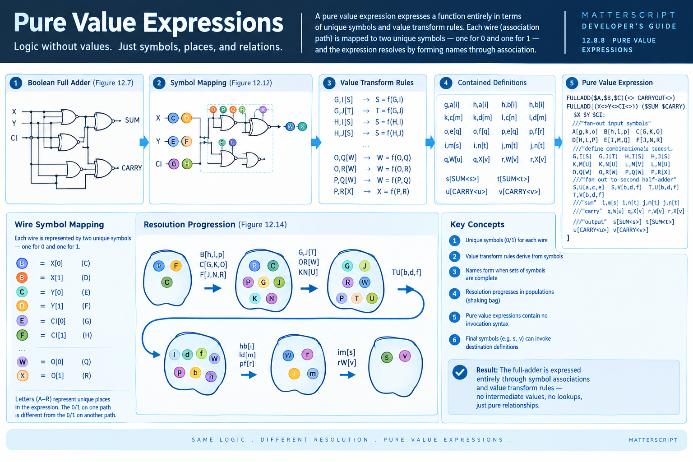

# Pure Value Expressions



A **pure value expression** is a MatterScript expression in which computation is expressed entirely through **unique symbols, places, associations, and value transform rules**. There is no conventional sequence of operations and no requirement that an intermediate value be explicitly stored or passed from one operation to another.

The Boolean full-adder provides a useful example because the same logic can be represented in two fundamentally different ways.

In an ordinary value-oriented representation, an `AND`, `OR`, or `NOT` operation can terminate in a **value transform rule**: a formed name selects a rule, and that rule produces a value. A pure value expression goes one step further. The expression itself becomes a population of symbols whose relationships progressively form the names of applicable rules.

> **Same logic. Different resolution.**
> A pure value expression does not execute a sequence of Boolean operations. It establishes a space of possible associations and allows the arriving symbols to resolve the expression.

---

## From Circuit to Expression

Consider the binary full-adder. Its inputs are:

* `X`
* `Y`
* `CI` — carry in

and its outputs are:

* `SUM`
* `CARRY`

A conventional circuit describes this in terms of gates and wires. MatterScript can instead map every association path in that circuit to a collection of unique symbols.

For example:

```text
C means X = 0
D means X = 1

E means Y = 0
F means Y = 1

G means CI = 0
H means CI = 1
```

The important point is that the symbols are **unique to their places**.

The `0` associated with one path is not simply the same global `0` as every other occurrence of zero. It represents the particular condition associated with that particular place in the expression.

Thus:

```text
C ≠ E
```

even though both may represent the logical value `0`.

Likewise:

```text
D ≠ F
```

even though both represent the logical value `1`.

This distinction allows the topology of the computation to remain encoded in the names themselves.

---

## One Wire, Two Symbols

Each association path can therefore be represented by two unique symbols:

```text
             wire
              │
          ┌───┴───┐
          │       │
          A       B
          │       │
        unique   unique
        symbol   symbol
```

For the full-adder, this produces the initial fan-out relationships:

```text
A[g,k,o]
B[h,l,p]
C[G,K,O]
D[H,L,P]
E[I,M,Q]
F[J,N,R]
```

These statements do not perform Boolean arithmetic.

They establish **name correspondence**.

For example:

```text
A[g,k,o]
```

means that content arriving at `A` is simultaneously associated with `g`, `k`, and `o`.

The bracket list is therefore a compact representation of fan-out. It is equivalent in principle to expressing the same correspondence three times:

```text
A[g]
A[k]
A[o]
```

The comma-separated form simply makes the relationship explicit and compact.

---

## Value Transform Rules as Resolution Points

Once the symbols have been distributed through the expression, combinations of symbols begin to form names.

For example:

```text
G,I[S]
G,J[T]
H,I[S]
H,J[S]
```

These relationships define the next stage of resolution.

A pair of symbols such as:

```text
G + I
```

can form the name:

```text
GI
```

and the association:

```text
GI[S]
```

states that the resulting relationship resolves toward `S`.

The same process continues through the network:

```text
K,M[U]
K,N[U]
L,M[V]
L,N[U]

O,Q[W]
O,R[W]
P,Q[W]
P,R[X]
```

The resulting expression is not a list of instructions such as:

```text
calculate this
then calculate that
then send the result here
```

Instead, it establishes a set of **possible relationships**. When the appropriate symbols coexist at a resolution place, the corresponding name becomes complete and its association becomes available.

---

## The Shaking-Bag Model

This is easiest to understand using the **shaking bag** model.

Imagine that the place of resolution is a bag containing symbols. The bag is repeatedly populated as associations propagate through the expression.

The initial input symbols might produce a population such as:

```text
B  F  C
```

After applying the first set of associations, the next population contains additional symbols:

```text
R  C  P  G  J  K  N
```

Further resolution produces another population:

```text
G  J  R  W  P  T  U
```

The important observation is that **not every possible combination is meaningful**.

Only certain combinations form the names of value transform rules.

For example:

```text
G,J[T]
OR[W]
KN[U]
```

identify particular combinations that become complete within that population.

The resolution process therefore resembles a search through populations of symbols rather than a conventional instruction stream.

### Resolution progression

```text
Input population
      │
      │  associations
      ▼
New population
      │
      │  associations
      ▼
New population
      │
      │  associations
      ▼
...
      │
      ▼
Output symbols
```

The symbols that survive and propagate are determined by the structure of the expression itself.

---

## From the First Half-Adder to the Second

The first portion of the full-adder resolves into the intermediate symbols:

```text
S
T
U
V
W
X
```

These symbols then become the input population for the next stage:

```text
S,U[a,c,e]
S,V[b,d,f]
T,U[b,d,f]
T,V[b,d,f]
```

Again, these are associations rather than conventional assignments.

The result of one resolution stage becomes the population from which the next set of names can form.

The subsequent stages continue this process:

```text
g,a[i]
g,b[j]
h,a[i]
h,b[i]

k,c[m]
k,d[m]
l,c[n]
l,d[m]

o,e[q]
o,f[q]
p,e[q]
p,f[r]
```

and finally:

```text
i,m[s]
i,n[t]
j,m[t]
j,n[t]

q,W[u]
q,X[v]
r,W[v]
r,X[v]
```

The entire Boolean full-adder has therefore been transformed into a network of symbolic associations.

---

## The Pure Value Expression

The complete MatterScript expression is:

```matterscript
FULLADD($A,$B,$C)(<> CARRYOUT<>)

FULLADD[(X<>Y<>CI<>)( $SUM $CARRY)
  $X $Y $CI:

  //"fan-out input symbols"
  A[g,k,o]
  B[h,l,p]
  C[G,K,O]
  D[H,L,P]
  E[I,M,Q]
  F[J,N,R]

  //"define combinational resolution stages"
  G,I[S]
  G,J[T]
  H,I[S]
  H,J[S]

  K,M[U]
  K,N[U]
  L,M[V]
  L,N[U]

  O,Q[W]
  O,R[W]
  P,Q[W]
  P,R[X]

  //"fan out input to second half-adder"
  S,U[a,c,e]
  S,V[b,d,f]
  T,U[b,d,f]
  T,V[b,d,f]

  g,a[i]
  g,b[j]
  h,a[i]
  h,b[i]

  k,c[m]
  k,d[m]
  l,c[n]
  l,d[m]

  o,e[q]
  o,f[q]
  p,e[q]
  p,f[r]

  //"sum"
  i,m[s]
  i,n[t]
  j,m[t]
  j,n[t]

  //"carry"
  q,W[u]
  q,X[v]
  r,W[v]
  r,X[v]

  //"output"
  s[SUM<s>]
  t[SUM<t>]
  u[CARRY<u>]
  v[CARRY<v>]
]
```

Notice what is absent.

There is no expression such as:

```text
SUM = X XOR Y XOR CI
```

There is no procedural sequence:

```text
a = ...
b = ...
c = ...
```

There are no explicit intermediate Boolean values.

Instead, the program describes **which symbols can associate with which other symbols**.

---

## No Invocation Is Required

This distinction is particularly important in MatterScript.

A conventional invocation might explicitly name a computational operation:

```text
some_gate(input1, input2)
```

A pure value expression does not require that form.

The input content is simply introduced into the place of resolution:

```text
$X $Y $CI:
```

From there, the content begins forming names through the associations defined in the expression.

The expression is therefore closer to a **declarative topology of possible resolution** than to an imperative program.

The computational behavior emerges from the relationships.

---

## Final Symbols Become Output Associations

At the end of the resolution process, the surviving symbols are:

```text
s
t
u
v
```

These are associated with the external result places:

```text
s[SUM<s>]
t[SUM<t>]

u[CARRY<u>]
v[CARRY<v>]
```

The `<...>` notation identifies the destination place and the corresponding content.

Conceptually:

```text
             ┌── SUM
s ───────────┤
t ───────────┘

             ┌── CARRY
u ───────────┤
v ───────────┘
```

In the shaking-bag model, these final symbols can be thought of as causing the destination definition to open: the appropriate destination association becomes complete and the resulting content can propagate outward.

---

## Pure Values Versus Value Transforms

It is useful to distinguish two ways an expression can terminate.

### Value-transform resolution

A formed name identifies a value transform rule:

```text
symbols
   ↓
formed name
   ↓
value transform
   ↓
value
```

This is the model used by the earlier full-adder example.

### Pure association resolution

A formed name identifies an association:

```text
symbols
   ↓
formed name
   ↓
association
   ↓
new symbol/place
```

The second form does not require the computation to terminate in a conventional stored value.

This distinction is fundamental to MatterScript because **the same logical function can be represented by different kinds of resolution**.

A Boolean full-adder can therefore be expressed using explicit value transforms, or it can be expressed as a network of primitive symbolic relationships.

---

## Why This Matters for MatterScript

Pure value expressions demonstrate an important property of the MatterScript model:

> **Computation does not have to be represented as the transformation of values. It can be represented as the formation and propagation of relationships.**

Once computation is expressed in this form, several familiar distinctions begin to collapse.

The boundary between:

* data and connectivity,
* value and identity,
* computation and wiring,
* expression and topology,
* software and hardware,

becomes much less rigid.

The expression already contains the connectivity information that a hardware implementation requires.

For example:

```text
A[g,k,o]
```

is simultaneously:

1. a symbolic relationship,
2. a fan-out description,
3. a piece of computational topology, and
4. a potential hardware wiring relationship.

The MatterScript compiler can therefore lower the same semantic structure into different physical representations without requiring the programmer to rewrite the computation as a conventional hardware description.

---

## Pure Value Expressions and Physical Computation

This is particularly significant for asynchronous and spatial computation.

A conventional program generally describes **what operation happens next**.

A pure value expression describes **what relationships are possible where**.

That distinction becomes increasingly useful as computation moves toward:

* asynchronous logic,
* NULL Convention Logic,
* spatially distributed computation,
* FPGA fabrics,
* hardware synthesis,
* sensor networks,
* edge computation, and
* physically embedded computation.

In these systems, locality and connectivity are not merely implementation details. They are part of the computational structure.

Pure value expressions provide a language-level mechanism for expressing that structure directly.

---

## A Useful Mental Model

When reading a pure value expression, resist the temptation to read it as a sequence of assignments.

Instead, read it as a **field of possible associations**.

```text
             symbols arrive
                    │
                    ▼
          ┌──────────────────┐
          │ resolution place │
          │                  │
          │   B  F  C        │
          │      G  J        │
          │   P       K      │
          └──────────────────┘
                    │
             names become
               complete
                    │
                    ▼
             new associations
                    │
                    ▼
          next resolution place
```

The expression is not telling the runtime to *execute* each line.

It is defining the relationships that allow symbols to propagate and form complete names.

That is why the full-adder can be described without an explicit chain of Boolean operations.

---

## Summary

A pure value expression:

* represents computation through **unique symbols and associations**;
* assigns distinct symbols to the distinct paths of a computation;
* allows symbols to propagate through **name correspondence**;
* forms names when the required symbols coexist;
* uses value transform rules or associations as resolution points;
* progresses through populations of symbols rather than a procedural instruction sequence;
* can express fan-out directly through constructs such as `A[g,k,o]`;
* can terminate in destination associations such as `s[SUM<s>]`; and
* preserves the topology of the computation as part of the expression itself.

The Boolean full-adder demonstrates the central idea:

> **The logic does not need to be described as a sequence of value transformations. The relationships that make the logic possible can themselves constitute the expression.**

This is one of the steps by which MatterScript moves from describing **what a computation calculates** toward describing **where computation exists, what can associate with what, and how information propagates through physical structure**.
