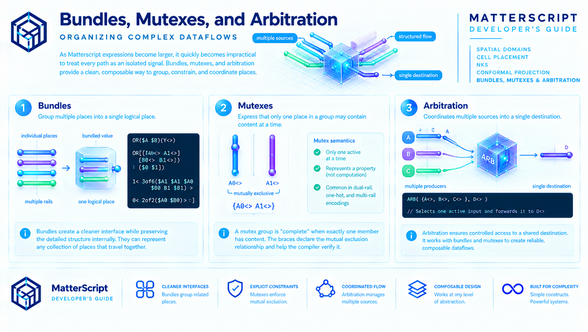

## Bundles, Mutexes, and Arbitration



As Matterscript expressions become larger, it quickly becomes impractical to treat every path as an isolated signal. A single value may be represented by multiple rails, a bus may consist of dozens of paths, and multiple producers may need to communicate through a shared destination. Matterscript provides three closely related mechanisms to address these common patterns:

- **Bundles** group multiple places into a single logical place.
- **Mutexes** express that only one place in a group may contain content at a time.
- **Arbitration** coordinates the flow of multiple independent sources into a single destination.

Together, these constructs allow complex dataflows to be expressed without sacrificing the explicit association model that lies at the heart of the language.

### Bundles

A bundle is simply a collection of places that travel together as a single logical unit.

Rather than exposing every constituent place at every level of composition, a bundle allows an expression to present a cleaner interface while preserving the detailed structure internally.

For example, a dual-rail Boolean value consists of two mutually exclusive rails. At a higher level of composition it is often more convenient to treat those two rails as a single value.

```matterscript
OR($A $B)(Y<>)
```

Internally, however, the Boolean function still operates on the individual rails.

```matterscript
OR[( [{A0<> A1<>}] [{B0<> B1<>}] ) ( [{$0 $1}] )
     1< 3of6($A1 $A1 $A0 $B0 $B1 $B1) >
     0< 2of2($A0 $B0) > : ]
```

The two bracketed groups in the definition source list unbundle the invocation places `$A` and `$B` into their individual rails.

Likewise, the destination rails `$0` and `$1` are bundled back together and associated with the single invocation place `Y<>`.

This allows the implementation to operate on the explicit physical representation while the surrounding design works with a more convenient logical representation.

Bundles are not limited to dual-rail logic. They can represent any collection of places that naturally travel together.

A four-digit number, for example, might be represented internally as:

```matterscript
A0<> A1<> A2<> A3<>
```

while appearing externally as simply:

```matterscript
A<>
```

Each level of composition may bundle or unbundle information as appropriate for its level of abstraction.

Conceptually, bundling is similar to a structure or record in conventional programming languages, except that the bundle represents **paths of association** rather than fields of memory.

### Nested Bundles

Bundles may themselves contain other bundles.

Each additional level of bundling adds another outer pair of brackets.

For example:

```matterscript
[A0 A1]
```

represents a single bundle.

```matterscript
[[A0 A1] [B0 B1]]
```

represents two bundles grouped into a larger bundle.

When content flows into a definition, each level of unbundling removes one level of brackets until the expression reaches the individual places it operates upon.

Because bundling follows the natural hierarchy of composition, large interfaces remain compact while definitions retain complete visibility of their internal structure.

### Mutual Exclusion (Mutex)

Many bundled representations describe values for which only one member may ever be active.

Dual-rail logic is the simplest example.

If a Boolean value is represented by two rails:

```matterscript
A0<>
A1<>
```

then only one rail may contain content at any instant.

The rails are therefore enclosed in braces:

```matterscript
{A0<> A1<>}
```

The braces declare a **mutual exclusion relationship**.

Rather than describing computation, the mutex expresses a property of the representation itself.

It tells the reader—and the compiler—that these places are alternative representations of the same logical value.

Mutexes appear naturally throughout Matterscript:

- dual-rail values
- multi-rail encodings
- one-hot state machines
- alternative symbolic representations

They communicate intent while allowing the compiler to verify that mutually exclusive paths remain mutually exclusive throughout the design.

#### Mutex and completeness

A mutex group participates in **completeness** differently than a bundle does.

A bundle's completeness is the conjunction of its members: the group is complete when *every* member has content.

A mutex group's completeness is the disjunction of its members: the group is complete when *at least one* member has content, and the mutual exclusion property guarantees that at most one does. "Complete" for a mutex therefore means "exactly one member has content."

This distinction matters for source and destination lists. Consider a definition whose source list contains two mutex groups:

```matterscript
OR[({A0<> A1<>}{B0<> B1<>})({$0 $1})
  :
  A0,B0[0]
  A0,B1[1]
  A1,B0[1]
  A1,B1[1]
]
```

(Example 12.9, *Mutually exclusive completeness*.)

The source list `({A0<> A1<>}{B0<> B1<>})` names two mutex groups. The definition is *complete* when the first group has exactly one of `A0`/`A1`, and the second group has exactly one of `B0`/`B1`. No other combination counts as complete — an empty group means the source is still waiting for content.

The destination list `({$0 $1})` is also a mutex group. The definition's output is a value on exactly one of `$0` or `$1`, never both. Which one is determined by the resolution rules.

Each rule reads a completeness pattern from the sources and asserts a value on the corresponding destination:

| Sources present | Destination |
|---|---|
| `A0`, `B0` | `0` |
| `A0`, `B1` | `1` |
| `A1`, `B0` | `1` |
| `A1`, `B1` | `1` |

The `0` and `1` in the rules are **tokens**, not destination names. Because the destination list is a mutex group of places named `$0` and `$1`, and the tokens asserted by the rules are `0` and `1`, the mutex acts as the routing mechanism: asserting token `0` means "activate `$0`", asserting token `1` means "activate `$1`". Only one rule fires per wavefront, so only one destination place receives content — exactly what the mutex declares.

#### How mutexes affect emitted hardware

Mutually exclusive destinations are wired as mutually exclusive drivers. When the compiler emits VHDL for the example above, each destination place becomes an output signal driven by a conditional assignment:

```vhdl
ms_0 <= data_value(0) when (A0_valid = '1' and B0_valid = '1') else null_value;
ms_1 <= data_value(1) when (A0_valid = '1' and B1_valid = '1')
                       or (A1_valid = '1' and B0_valid = '1')
                       or (A1_valid = '1' and B1_valid = '1')
             else null_value;
```

Each destination's assignment falls back to `null_value` when its condition doesn't hold, so the two signals are never both driven in the same cycle. That's the mutex property, enforced structurally by the emitted code rather than by convention.

#### Design consequences

The mutex is not a notation for exclusive-or logic, and it is not a shorthand for a decoder. It is a statement about the *representation*: these places are alternative encodings of a single logical value, and content appearing in more than one of them would be a contradiction.

Because it's a property of the representation rather than a computation, the mutex propagates through composition. A definition that consumes a mutex group and produces another mutex group has preserved the property end-to-end. Composing two such definitions preserves it again. The compiler can therefore reason about mutexes at every level of a design without having to re-derive the property at each layer.

This is also why mutexes and bundles are not interchangeable: a bundle asserts "all members together," a mutex asserts "exactly one member." Using the wrong one describes a different representation, and the emitted hardware follows.

### Arbitration

Mutual exclusion describes values.

Arbitration describes **behavior**.

Consider two independent producers attempting to send content to the same destination.

If both produce content simultaneously, which one should proceed first?

In conventional software this often becomes a lock, semaphore, message queue, or scheduler.

In Matterscript, arbitration is expressed directly as part of the association graph.

```matterscript
Arbiter({{$place1 $place2}}(next<>)

Arbiter[
    (placeB<>)
    ($pass)
    pass<$placeB> :
]
```

The double braces in the invocation indicate that `$place1` and `$place2` are competing for access to the same flow path.

If both places contain content simultaneously, the arbiter performs a competition.

The winner proceeds through the expression.

The remaining content simply waits until the next opportunity.

Importantly, the language does **not** define which competitor wins.

The result is intentionally nondeterministic.

If only one place contains content, no competition occurs and the content flows immediately.

The effect is to transform multiple independent, uncoordinated flows into a single coordinated flow.

```text
place1  ─┐
         │
place2 ──┼──► Arbiter ───► next<>
         │
place3 ──┘
```

Arbitration therefore provides the synchronization point between concurrent producers while preserving Matterscript's declarative association model.

### A Hierarchy of Flow

Bundles, mutexes, and arbitration each solve a different problem.

Bundles organize related paths.

Mutexes describe alternative representations of the same logical value.

Arbitration coordinates independent flows that converge upon a common destination.

Although distinct, they frequently appear together.

A bundled value may contain mutually exclusive rails.

Multiple bundled values may compete through an arbiter.

An arbiter may produce another bundled value for the next stage of computation.

These constructs allow Matterscript to scale naturally from individual signal paths to complex computational fabrics while preserving the same fundamental principle introduced throughout this guide:

**computation is expressed as the movement and transformation of associations rather than the execution of sequential instructions.**