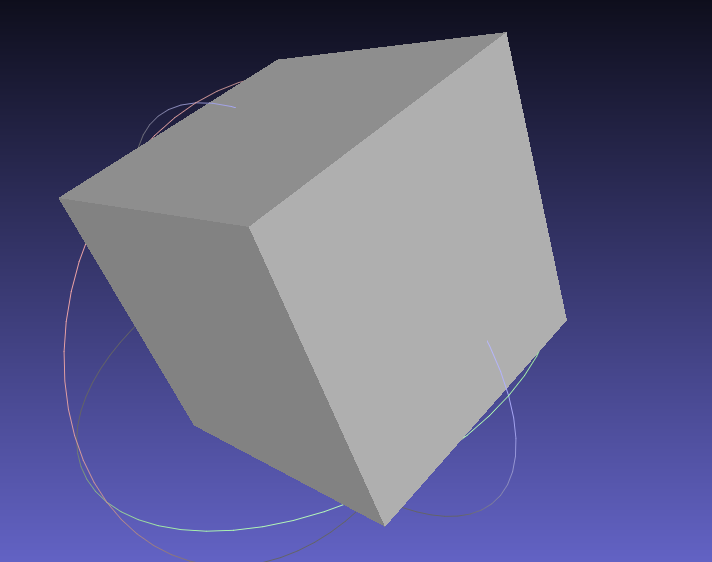

# Spatial Domains: Geometry Construction Inside IPL

## 1. Motivation

The Invocation Language describes causal relationships — completeness,
fills, invocations — with no inherent notion of space. Some definitions,
however, need to describe *where* things are: point coordinates,
connectivity between points, and surfaces built from that connectivity.
Rather than inventing a second language for this, MatterScript introduces 
the `@domain` directive so that a definition can bring a small
set of geometry-construction functions into scope, and lets those
functions build up a **parallel, loosely linked geometry graph** alongside
the definition's ordinary causal-network AST.

This matters beyond convenience. IPL's whole premise is describing causal
relationships in the abstract — Fant's model doesn't actually care whether
the thing being resolved is a logic signal or a physical coordinate. The
spatial domain is the first proof that the *same* language, with the same
binding discipline and the same `$`-reference convention used everywhere
else in IPL, can also describe physical structure. How digital networks
and physical geometry eventually get coupled — a definition whose
resolution depends on both a signal's value *and* a point's position, say
— is still an open question, deliberately not addressed here. But the
direction this points toward is a single MatterScript program describing
both the electronics and the physical structure they live in, rather than
two separate toolchains that have to be kept in sync by hand.

The two ASTs are kept deliberately separate for now:

- The **IPL network AST** (`network.Definition`, `network.Statement`, ...)
  is unchanged by any of this. No new grammar, no new statement kinds.
- The **spatial graph** (`spatial.SpatialGraph` — points, edges, loops,
  faces) is built by a resolution pass that walks an already-parsed
  definition and interprets certain fills as geometry calls.

## 2. Scoping: `@domain` brings functions into scope

A definition declares its domain once, in its header:

```matterscript
Shape[
  ()
  ()
  @domain(spatial2d)
  ...
]
```

`@domain(spatial2d | spatial3d)` is existing IPL syntax
(`network.parseDomainSpec`), previously used only to parametrize
cellular-automata generate blocks. It now does double duty: when a
definition's `domain_spec.kind` is `spatial2d` or `spatial3d`, that
definition's resolution body is understood to have a set of
domain-specific geometry functions in scope: `point`, `edge`, `loop`, and
`face`.

There is no per-statement annotation to sprinkle through a definition's
body. The domain is declared once, at the top, exactly like any other
`@domain` usage already in the language.

`spatial1d` is **not** a geometry domain — it remains scoped to its
existing cellular-automata usage and has no function registry. Declaring
`@domain(spatial1d)` and then calling `point(...)` inside it is treated as
an ordinary (undefined-function) fill, not a geometry binding.

## 3. Binding: geometry calls are ordinary fills

No new syntax was introduced for defining a geometry entity. This is
already-legal IPL:

```matterscript
p0<point(0.0, 0.0)>
```

This is parsed today as an ordinary `Statement.fill`:

```
dest_name: "p0"
expr:      "point(0.0, 0.0)"
parsed_expr: Expr{ kind: .call, func: "point", args: [...] }
```

The IPL parser (`expressions.parseILExpr`) already recognizes
`name(args...)` inside `<...>` and produces a structured `.call`
expression — this was true before any of the spatial-domain work began.
The resolution pass (§6) is what gives that structure new meaning when
the enclosing definition is domain-scoped to `spatial2d`/`spatial3d` and
the call's function name matches something in the registry; outside that
context, the exact same syntax continues to behave exactly as it always
has.

## 4. Reference: `$name` connects to an existing binding

To connect a new geometry call to something defined earlier in the same
definition, use `$name` — the same sigil IPL already uses everywhere else
to mean "look this up" rather than "declare this" (composed table keys,
generate-block variables, ordinary fill expressions):

```matterscript
p0<point(0.0, 0.0)>
p1<point(1.0, 0.0)>
e0<edge($p0, $p1)>
```

`$p0` and `$p1` parse as `.variable` expression nodes (distinct from the
`.constant` nodes that plain numeric literals produce — see §7), and the
resolution pass looks them up in the definition's geometry-binding table
built so far.

This applies uniformly to every kind of geometric element, not just
points — edges are referenced by `loop` the same way points are
referenced by `edge`, and loops are referenced by `face` the same way:

```matterscript
l0<loop($e0, $e1, $e2, $e3)>
f0<face($l0)>
```

There is no special inline/nested form (`face(loop(edge(...), ...))`)
even though IPL's expression grammar could parse one — every element,
at every level, is bound once at the top level and referenced by `$name`
from then on. This was a deliberate choice: it keeps every geometric
element individually addressable, with a single uniform rule instead of
a special case for elements built "inline."

## 5. Binding semantics: define once, reference many times

A name may be bound to a geometry handle **exactly once**. After that
first binding, it is immutable — later statements may reference it via
`$name` as many times as needed, but nothing may redefine what it refers
to.

Concretely:

- The first `p0<point(...)>` encountered binds `p0` to a new
  `spatial.PointId` in the resolution pass's binding table.
- Any later `$p0` reference resolves to that same handle.
- A second `p0<point(...)>` statement — an attempt to rebind an
  already-bound name — is rejected with `error.DuplicateGeometryBinding`,
  not silently overwritten and not silently ignored.

This mirrors ordinary single-assignment conventions and matches how a
geometry graph is naturally authored: declare the entities that matter,
then wire connectivity between them by reference, without ever having to
worry that a later statement quietly changed what an earlier name meant.

## 6. Resolution: a single top-to-bottom pass

Geometry binding happens in a dedicated resolution pass
(`spatial_domain.resolveSpatialBindings`), run over an already-parsed
`network.Definition` — it does not run during parsing, and it does not
alter the parser's output. The pass:

1. Confirms `def.domain_spec` is `spatial2d` or `spatial3d` (returns
   `error.UnsupportedSpatialDomain` for `spatial1d`, `error.MissingDomainSpec`
   if there's no domain at all).
2. Walks `def.resolution` in source order. For each `.fill` statement
   whose `parsed_expr` is a `.call` matching a name in the domain's
   function registry (`point`, `edge`, `loop`, `face`), it dispatches to
   that function's handler, which builds the corresponding entity in a
   `spatial.SpatialGraph` and returns a `GeometryHandle`.
3. Records the handle against the fill's `dest_name` in a
   `std.StringHashMapUnmanaged(GeometryHandle)` binding table — this
   table, together with the `SpatialGraph`, is the definition's
   "geometry AST," addressed by the same names the IPL source uses.
4. Fill statements whose call name isn't in the registry are left
   untouched, for ordinary fill-resolution logic elsewhere to handle.

Because this is a single forward pass, **a name must be bound before it
is referenced**. Writing `edge($p0, $p1)` before either point is defined
is a forward reference and is not currently supported —`$p0` would
resolve against an empty binding table and fail with
`error.UndefinedGeometryReference`. This matches how geometry source is
naturally written (points, then the things that connect them), so in
practice it isn't a real constraint on authoring — just documented here
since it isn't enforced by any grammar rule, only by pass order.

## 7. Argument shapes

Two argument shapes matter for the implemented functions:

- **Numeric literals** (`point(0.0, 0.0)`'s arguments) arrive as
  `Expr{ .kind = .constant, .name = "0.0" }` — the raw text, not a
  pre-parsed number. The resolution pass parses this with
  `std.fmt.parseFloat(f64, ...)`. This is a property of
  `parseILCallArgument`, not something specific to the spatial domain —
  worth knowing if you add a function whose arguments need different
  types.
- **Name references** (`edge($p0, $p1)`'s arguments) arrive as
  `Expr{ .kind = .variable, .name = "p0" }`. Resolution looks the name up
  in the binding table and type-checks that the bound handle is the kind
  the function expects (e.g. `edge` requires two `.point` handles, `loop`
  requires `.edge` handles, `face` requires a single `.loop` handle).

## 8. Loops, closure, and a note on shared edges

`loop($e0, $e1, ...)` builds an ordered boundary from previously-bound
edges, and validates that they actually close: each edge's endpoint must
match the next edge's start point, and the last edge must return to the
first edge's starting point. A loop that doesn't close raises
`error.DiscontinuousLoop` or `error.UnclosedLoop`; fewer than 3 edges
raises `error.DegenerateLoop`.

This closure check only cares about a single loop's own continuity — it
has no concept of two different loops needing to traverse a shared edge
in opposite directions to stay consistent with each other (the way a
proper watertight mesh normally works). In practice this means: when two
faces share a physical edge, give each face **its own edge binding** for
that segment, even though the two are geometrically identical. This is a
small, deliberate duplication rather than a limitation to work around —
it keeps every loop's closure trivially self-contained and avoids needing
any notion of "traverse this edge backward."

## 9. The full pipeline: from IPL source to a mesh file

Putting the above together, an `@domain(spatial2d|spatial3d)` definition
flows through four stages, each a separate, independently testable piece:

```
  .ms.ipl source
        |
        v
  ipl_parser.parse            (unchanged — ordinary IPL parsing)
        |
        v
  spatial_domain.resolveSpatialBindings   (§6 — builds SpatialGraph + binding table)
        |
        v
  spatial.triangulate         (SpatialGraph -> TriangulatedMesh)
        |
        v
  spatial.exportPly           (TriangulatedMesh -> binary PLY bytes)
```

This is wired into the CLI, not just tests: `main.zig`'s `.ms.ipl`
handling now calls `ipl_export_mesh.writeNetworkMeshes` after parsing,
which walks every definition in the file and, for each one whose
`domain_spec` is `spatial2d`/`spatial3d`, runs it through the pipeline
above and writes `<definition-name>.ply` under the run's workspace
directory (`ipl_export_mesh.writeDefinitionMesh` does the single-
definition version of this, if you need to call it directly).

Definitions with no `@domain`, or with `@domain(spatial1d)`, are left
alone by the mesh exporter — they go through the existing VHDL emission
path instead. A single `.ms.ipl` file can mix causal definitions and
geometry definitions side by side; each is routed to the emitter that
actually understands it, based purely on `domain_spec`. This is the seed
of the unification mentioned in §1: one source file, one parser, two
independent consumers of the same AST shape today — and eventually,
ideally, definitions that draw on both at once.

## 10. Worked example: a unit square, start to finish

```matterscript
cube[()()
    @domain(spatial3d)

    // 8 corners: b0..b3 form the bottom face (z=0),
    // t0..t3 form the top face (z=1), directly above
    // their b-counterparts.
    p0< point(0.0, 0.0, 0.0) >  // b0
    p1< point(1.0, 0.0, 0.0) >  // b1
    p2< point(1.0, 1.0, 0.0) >  // b2
    p3< point(0.0, 1.0, 0.0) >  // b3
    p4< point(0.0, 0.0, 1.0) >  // t0
    p5< point(1.0, 0.0, 1.0) >  // t1
    p6< point(1.0, 1.0, 1.0) >  // t2
    p7< point(0.0, 1.0, 1.0) >  // t3

    // Each of the 6 faces owns its own 4 edges, even where an
    // edge geometrically coincides with one used by a neighboring
    // face (e.g. p0->p1 appears both here and in the front face).
    // This keeps every loop closing in a single consistent
    // direction with no reversed-edge traversal needed anywhere —
    // unlike the Möbius example, an ordinary cube's faces never
    // need to share a directed edge to stay correct.

    // bottom face: b0 -> b1 -> b2 -> b3 -> b0
    e_b0<edge($p0, $p1)>
    e_b1<edge($p1, $p2)>
    e_b2<edge($p2, $p3)>
    e_b3<edge($p3, $p0)>
    l_bottom<loop($e_b0, $e_b1, $e_b2, $e_b3)>
    f_bottom<face($l_bottom)>

    // top face: t0 -> t1 -> t2 -> t3 -> t0
    e_t0<edge($p4, $p5)>
    e_t1<edge($p5, $p6)>
    e_t2<edge($p6, $p7)>
    e_t3<edge($p7, $p4)>
    l_top<loop($e_t0, $e_t1, $e_t2, $e_t3)>
    f_top<face($l_top)>

    // front face: b0 -> b1 -> t1 -> t0 -> b0
    e_f0<edge($p0, $p1)>
    e_f1<edge($p1, $p5)>
    e_f2<edge($p5, $p4)>
    e_f3<edge($p4, $p0)>
    l_front<loop($e_f0, $e_f1, $e_f2, $e_f3)>
    f_front<face($l_front)>

    // right face: b1 -> b2 -> t2 -> t1 -> b1
    e_r0<edge($p1, $p2)>
    e_r1<edge($p2, $p6)>
    e_r2<edge($p6, $p5)>
    e_r3<edge($p5, $p1)>
    l_right<loop($e_r0, $e_r1, $e_r2, $e_r3)>
    f_right<face($l_right)>

    // back face: b2 -> b3 -> t3 -> t2 -> b2
    e_k0<edge($p2, $p3)>
    e_k1<edge($p3, $p7)>
    e_k2<edge($p7, $p6)>
    e_k3<edge($p6, $p2)>
    l_back<loop($e_k0, $e_k1, $e_k2, $e_k3)>
    f_back<face($l_back)>

    // left face: b3 -> b0 -> t0 -> t3 -> b3
    e_l0<edge($p3, $p0)>
    e_l1<edge($p0, $p4)>
    e_l2<edge($p4, $p7)>
    e_l3<edge($p7, $p3)>
    l_left<loop($e_l0, $e_l1, $e_l2, $e_l3)>
    f_left<face($l_left)>
    :
]
```

No `sources`/`destinations` are needed — this definition exists to
produce geometry, not to compute a causal output, and neither the
resolution pass nor the mesh exporter looks at `def.destinations` at all.
(Note: if this definition were ever run through the *VHDL* emitter
instead, an empty destination list would trigger Fant's §12.3.4
single-return normalization, which assumes any zero-destination
definition is implicitly returning something and would try to turn
`p0`–`f0` into VHDL ports. That normalization currently doesn't
distinguish a geometry-only definition from an ordinary one — the mesh
exporter sidesteps it entirely by never invoking `writeDefinition`, but
it's a known rough edge if this definition path is ever exposed to VHDL
emission by mistake.)

Walking it through the pipeline:

1. **Parse.** Each `pN<point(...)>` and the rest parse as ordinary
   `Statement.fill` values, each carrying a structured `.call`
   `parsed_expr` — nothing spatial-domain-specific happens yet.
2. **Resolve.** `resolveSpatialBindings` sees `domain_spec.kind ==
   .spatial2d`, and walks the four point fills, then the four edge
   fills (each resolving its `$pN` arguments against the binding table
   built so far), then `l0` (resolving its four `$eN` edge references
   and validating that they close: `p0→p1→p2→p3→p0`), then `f0`
   (resolving its single `$l0` reference). The result is a
   `SpatialGraph` with 4 points, 4 edges, 1 loop, 1 face, and a binding
   table mapping all nine names to their handles.
3. **Triangulate.** `spatial.triangulate` turns the single quad face
   into 2 triangles over the same 4 vertices.
4. **Export.** `spatial.exportPly` writes those 4 vertices and 2
   triangular faces out as a binary PLY file — real bytes on disk,
   openable in MeshLab or any other mesh viewer.

<br>



## 11. Looking ahead

This is deliberately the smallest complete example: one face, closed by
hand-traced edges, small enough to walk through statement by statement as
above. The same primitives — `point`, `edge`, `loop`, `face`, the
`$`-reference convention, define-once-reference-many binding — scale
directly to more complex solids (multiple faces, each with its own
edges per §8) without any new syntax or resolution logic.

The larger direction this is building toward, per §1, is a single
MatterScript program in which the *same* language constructs — the same
`@domain` scoping, the same binding discipline — describe both the
digital logic of a system and the physical structure it's embedded in or
actuates. That coupling isn't designed yet, and this document doesn't
attempt to anticipate its shape. What's here is the first concrete proof
that IPL's causal-network model and physical geometry can be expressed
side by side in the same file, resolved by independent passes over the
same parsed AST, without the language itself needing to know in advance
which one it's describing.