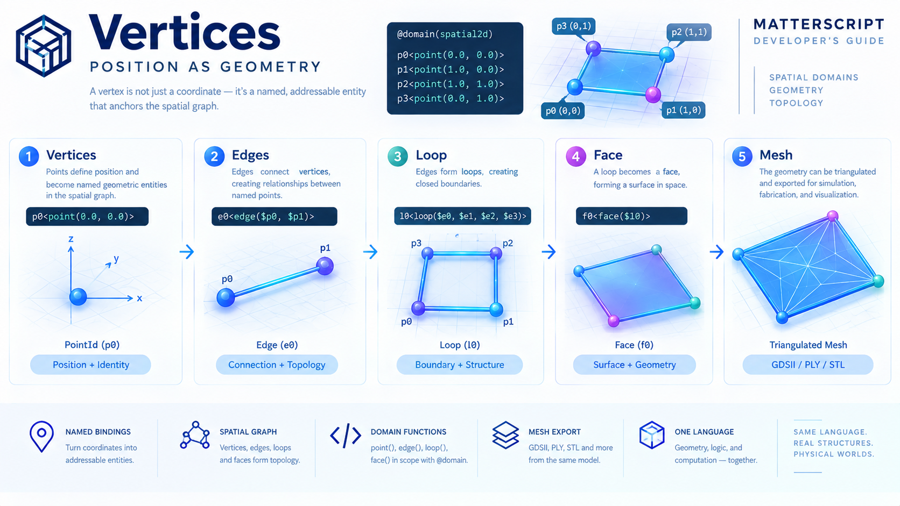

# Vertices



A spatial structure has to begin somewhere.

Before there can be an edge, there must be something for the edge to connect. Before there can be a loop, there must be edges to arrange. Before there can be a face, there must be a closed boundary.

In MatterScript, that foundation is the **vertex**.

A vertex is introduced with the `point(...)` geometry function:

```matterscript
p0<point(0.0, 0.0)>
```

At first glance, this looks like nothing more than a coordinate declaration. But the important part of the MatterScript model is that the coordinate is not left as anonymous numerical data. The statement gives the point a **name**, and that name becomes the way the rest of the geometry refers to it.

The progression is therefore:

```text
coordinate
    ↓
point
    ↓
named binding
    ↓
PointId
    ↓
SpatialGraph vertex
    ↓
topological reference
```

The vertex is where numerical position becomes an addressable piece of geometry.

---

## 1. A Point Is a Named Geometric Entity

The simplest spatial definition can introduce a point directly:

```matterscript
Shape[
  ()
  ()

  @domain(spatial2d)

  p0<point(0.0, 0.0)>

]
```

The `p0` on the left is not merely a variable in the conventional programming-language sense. It establishes a binding between the MatterScript name and a geometry entity.

During parsing, the statement is still an ordinary IPL fill:

```text
destination: p0
expression:  point(0.0, 0.0)
```

The parser does not need to understand what a geometric point means.

The spatial resolution pass interprets the `point(...)` call because the enclosing definition has declared a spatial domain.

This separation is deliberate:

```text
MatterScript source
       │
       ▼
    IPL parser
       │
       ▼
ordinary Statement.fill
       │
       ▼
spatial resolution
       │
       ▼
    SpatialGraph
```

Geometry therefore does not require a second language or a special geometry-specific grammar.

The same IPL expression machinery is reused.

---

## 2. The Spatial Domain Gives `point` Its Meaning

Geometry functions are brought into scope by the definition's domain:

```matterscript
@domain(spatial2d)
```

or:

```matterscript
@domain(spatial3d)
```

Within those domains, the spatial resolver recognizes:

```text
point
edge
loop
face
```

The important distinction is that the syntax itself does not change.

This:

```matterscript
p0<point(0.0, 0.0)>
```

is syntactically an ordinary fill regardless of where it appears.

Its interpretation depends on the surrounding domain.

That means the geometry system follows the same general principle as the rest of MatterScript:

> **Context gives structure meaning.**

A `point(...)` call inside a spatial definition becomes a geometric binding. Outside that context, it remains an ordinary expression rather than being silently interpreted as geometry.

---

## 3. Coordinates Define Position

A point's arguments are numerical coordinates.

In two dimensions:

```matterscript
p0<point(0.0, 0.0)>
p1<point(1.0, 0.0)>
p2<point(1.0, 1.0)>
p3<point(0.0, 1.0)>
```

These four points describe the corners of a unit square:

```text
p3 ───────── p2
│             │
│             │
│             │
p0 ───────── p1
```

In three dimensions, the same construction simply receives a third coordinate:

```matterscript
p0<point(0.0, 0.0, 0.0)>
p1<point(1.0, 0.0, 0.0)>
p2<point(1.0, 1.0, 0.0)>
p3<point(0.0, 1.0, 0.0)>

p4<point(0.0, 0.0, 1.0)>
p5<point(1.0, 0.0, 1.0)>
p6<point(1.0, 1.0, 1.0)>
p7<point(0.0, 1.0, 1.0)>
```

The first four points form the lower layer of a cube. The second four form the corresponding upper layer.

The spatial resolver currently parses these numeric arguments as floating-point values.

Conceptually:

```text
point(x, y)
point(x, y, z)
```

becomes a spatial point located at those coordinates.

---

## 4. Coordinates Are Not Identity

A useful distinction appears immediately when two geometric entities occupy the same location.

The coordinate describes **position**.

The MatterScript binding provides **identity**.

For example:

```matterscript
p0<point(0.0, 0.0)>
```

does two things:

1. It specifies a location: `(0.0, 0.0)`.
2. It gives that geometric entity the name `p0`.

The name is what later geometry uses:

```matterscript
e0<edge($p0, $p1)>
```

The edge does not repeat the coordinates.

It does not say:

```matterscript
edge(0.0, 0.0, 1.0, 0.0)
```

Instead, it refers to previously established geometric entities:

```text
$p0 ────────> first endpoint
$p1 ────────> second endpoint
```

This is an important part of the MatterScript geometry model.

**Coordinates establish where. Names establish what. References establish relationships.**

---

## 5. Define Once, Reference Many

Geometry bindings follow the same single-assignment discipline established elsewhere in IPL.

A name is bound once:

```matterscript
p0<point(0.0, 0.0)>
```

After that, the name can be referenced repeatedly:

```matterscript
e0<edge($p0, $p1)>
e3<edge($p3, $p0)>
```

Both references resolve to the same geometric point.

The binding is not replaced by a later statement.

A second definition such as:

```matterscript
p0<point(5.0, 5.0)>
```

is therefore not interpreted as "move `p0`."

It is an attempt to bind an already-bound name again and is rejected as a duplicate geometry binding.

This distinction is important because the geometry graph is intended to remain structurally understandable after resolution.

Once:

```text
p0 → PointId
```

has been established, every occurrence of:

```text
$p0
```

means that same point.

There is no hidden reassignment.

---

## 6. The `$` Reference Connects Geometry

The `$` sigil is the bridge between independent geometry declarations.

Consider:

```matterscript
p0<point(0.0, 0.0)>
p1<point(1.0, 0.0)>

e0<edge($p0, $p1)>
```

The first two statements create geometric entities.

The third does not create new points.

Instead, it retrieves the existing bindings:

```text
$p0 → p0 → PointId
$p1 → p1 → PointId
```

and uses those handles to construct an edge.

The same pattern continues upward through the geometry hierarchy:

```matterscript
p0<point(...)>
p1<point(...)>

e0<edge($p0, $p1)>

l0<loop($e0, ...)>

f0<face($l0)>
```

Each level references an entity that already exists.

```text
POINT
  │
  │ $p0
  ▼
EDGE
  │
  │ $e0
  ▼
LOOP
  │
  │ $l0
  ▼
FACE
```

This gives the geometry graph a uniform binding discipline.

---

## 7. Resolution Is Ordered

Spatial bindings are resolved in a single top-to-bottom pass.

That means a point must exist before another geometric element can reference it.

This works:

```matterscript
p0<point(0.0, 0.0)>
p1<point(1.0, 0.0)>

e0<edge($p0, $p1)>
```

This does not:

```matterscript
e0<edge($p0, $p1)>

p0<point(0.0, 0.0)>
p1<point(1.0, 0.0)>
```

At the time `e0` is resolved, neither `p0` nor `p1` exists in the geometry binding table.

The resolver therefore reports an undefined geometry reference.

This gives spatial source code a natural construction order:

```text
points
  ↓
edges
  ↓
loops
  ↓
faces
```

The source order mirrors the dependency structure of the geometry.

---

## 8. From Coordinates to `PointId`

Internally, the point does not remain merely a line of source code.

During spatial resolution, the `point(...)` handler creates a point in the `SpatialGraph` and returns a geometry handle representing that entity.

The binding table then associates the MatterScript name with that handle:

```text
"p0"
  │
  ▼
PointId
  │
  ▼
SpatialGraph
```

Conceptually, the source:

```matterscript
p0<point(0.0, 0.0)>
```

becomes something like:

```text
p0 ──────► PointId(0)
             │
             └──► (0.0, 0.0)
```

The exact internal identifier is an implementation detail.

The important abstraction is that MatterScript has transformed a textual name and a coordinate into an addressable entity within a geometric graph.

That graph is then available to subsequent spatial operations.

---

## 9. Vertices Are the Foundation of Topology

A point by itself has no connectivity.

It simply establishes a location.

An edge introduces the first topological relationship:

```matterscript
e0<edge($p0, $p1)>
```

Now two vertices have become connected.

Multiple edges can then form a boundary:

```matterscript
l0<loop($e0, $e1, $e2, $e3)>
```

And the closed boundary can become a face:

```matterscript
f0<face($l0)>
```

The progression is therefore:

```text
                    GEOMETRY

                 ┌───────────┐
                 │   FACE    │
                 └─────▲─────┘
                       │
                     loop
                       │
                 ┌─────┴─────┐
                 │    LOOP   │
                 └─────▲─────┘
                       │
                     edges
                       │
                 ┌─────┴─────┐
                 │   EDGES   │
                 └─────▲─────┘
                       │
                    points
                       │
                 ┌─────┴─────┐
                 │  VERTICES │
                 └───────────┘
```

The vertex is therefore not merely the smallest drawable object.

It is the **reference point from which topology is constructed**.

---

## 10. A Vertex Can Participate in Many Relationships

Because bindings are immutable and references can be reused, a single point can participate in many geometric structures.

Consider the corner of a cube:

```matterscript
p0<point(0.0, 0.0, 0.0)>
```

That same vertex can be referenced by several edges:

```matterscript
e_b0<edge($p0, $p1)>
e_f3<edge($p4, $p0)>
e_l1<edge($p0, $p4)>
```

The point is not copied each time.

Each `$p0` resolves to the same underlying point handle.

This creates a distinction between **geometric identity** and **topological participation**:

```text
                     p0
                  PointId
                     │
          ┌──────────┼──────────┐
          │          │          │
          ▼          ▼          ▼
        edge       edge       edge
          │          │          │
          ▼          ▼          ▼
        face       face       face
```

The vertex can therefore become a shared anchor for multiple structures without changing its own definition.

---

## 11. The Vertex List Survives Triangulation

The spatial graph is not necessarily the final representation consumed by downstream tools.

After spatial resolution, a geometry graph can be triangulated:

```text
SpatialGraph
     │
     ▼
triangulate
     │
     ▼
TriangulatedMesh
```

For example, a quadrilateral face can become two triangles while continuing to use the same four vertices.

```text
Before:

p3 ───────── p2
│             │
│    FACE     │
│             │
p0 ───────── p1


After triangulation:

p3 ───────── p2
│ \           │
│   \         │
│     \       │
p0 ───────── p1
```

The topology changes at the face representation level, but the underlying vertex positions remain the same.

This distinction becomes important when the geometry is exported.

A four-vertex quad can become:

```text
Vertices:
    p0
    p1
    p2
    p3

Triangles:
    (p0, p1, p2)
    (p0, p2, p3)
```

The vertices are therefore fundamental data, not merely temporary construction syntax.

---

## 12. Vertices and the Mesh Boundary

Eventually the geometry can cross the runtime boundary into a conventional mesh format.

The current pipeline is:

```text
.ms.ipl source
      │
      ▼
 IPL parser
      │
      ▼
SpatialGraph
      │
      ▼
TriangulatedMesh
      │
      ▼
 binary PLY
      │
      ▼
 MeshLab / mesh tools
```

A simple spatial definition containing four points, four edges, one loop, and one face can therefore become a mesh containing four vertices and two triangular faces.

The important thing is that the original MatterScript source remains the description from which that structure was constructed.

The PLY file is an output representation.

The MatterScript source describes the geometry at the level of named entities and relationships.

---

## 13. Geometry Begins with Addressable Position

The significance of the vertex becomes clearer when viewed from the entire spatial model.

MatterScript does not begin with a mesh.

It begins with **named geometric facts**:

```matterscript
p0<point(0.0, 0.0, 0.0)>
p1<point(1.0, 0.0, 0.0)>
p2<point(1.0, 1.0, 0.0)>
p3<point(0.0, 1.0, 0.0)>
```

Those facts are then connected:

```matterscript
e0<edge($p0, $p1)>
e1<edge($p1, $p2)>
e2<edge($p2, $p3)>
e3<edge($p3, $p0)>
```

The connections are organized:

```matterscript
l0<loop($e0, $e1, $e2, $e3)>
```

And the boundary is promoted into a surface:

```matterscript
f0<face($l0)>
```

Nothing in that sequence requires an external geometry editor.

The geometry emerges from the same fundamental mechanism used elsewhere in IPL:

```text
name
  +
expression
  +
reference
  =
structure
```

---

## 14. Why Vertices Matter to MatterScript

The vertex is the first place where MatterScript's abstract binding model acquires physical position.

An ordinary IPL relationship might establish that one thing is connected to another.

A spatial relationship can establish something more:

```text
this entity
     │
     └── exists at this position
```

Once positions become named and addressable, those names can participate in larger structures.

That makes the spatial graph compatible with the broader MatterScript philosophy:

> **Geometry is not an artifact produced after computation. Geometry can itself be described as computation.**

The current implementation keeps the causal-network AST and spatial graph as separate structures. That separation is intentional. But the spatial domain demonstrates that the same language can already describe both kinds of structure using the same fundamental ideas:

* definitions,
* fills,
* names,
* references,
* domains,
* resolution,
* immutable bindings.

The vertex is the simplest concrete example of that unification.

---

## 15. Complete Example

A minimal spatial definition containing four vertices can be written as:

```matterscript
Square[
  ()
  ()

  @domain(spatial2d)

  p0<point(0.0, 0.0)>
  p1<point(1.0, 0.0)>
  p2<point(1.0, 1.0)>
  p3<point(0.0, 1.0)>
]
```

At this stage, there is no topology yet.

There are simply four named geometric entities:

```text
p3 ───────── p2
│             │
│             │
│             │
p0 ───────── p1
```

Adding edges establishes connectivity:

```matterscript
e0<edge($p0, $p1)>
e1<edge($p1, $p2)>
e2<edge($p2, $p3)>
e3<edge($p3, $p0)>
```

The edges can then form a loop:

```matterscript
l0<loop($e0, $e1, $e2, $e3)>
```

And the loop can become a face:

```matterscript
f0<face($l0)>
```

The complete progression is:

```text
  p0  p1  p2  p3
   │   │   │   │
   └───┴───┴───┘
       edges
         │
         ▼
        loop
         │
         ▼
        face
         │
         ▼
   triangulated mesh
         │
         ▼
       PLY file
```

The vertex is where this entire chain begins.

---

## 16. Looking Ahead: Edges

A vertex establishes **position**.

An edge establishes **connection**.

That is the next step in the spatial construction model.

Once two named vertices exist:

```matterscript
p0<point(0.0, 0.0)>
p1<point(1.0, 0.0)>
```

MatterScript can express their relationship directly:

```matterscript
e0<edge($p0, $p1)>
```

The edge does not need to know the coordinates independently.

It only needs to know which vertices it connects.

This is the fundamental transition from **geometry as position** to **geometry as topology**.

The next chapter examines that transition in detail.

*Drafting in progress...*
