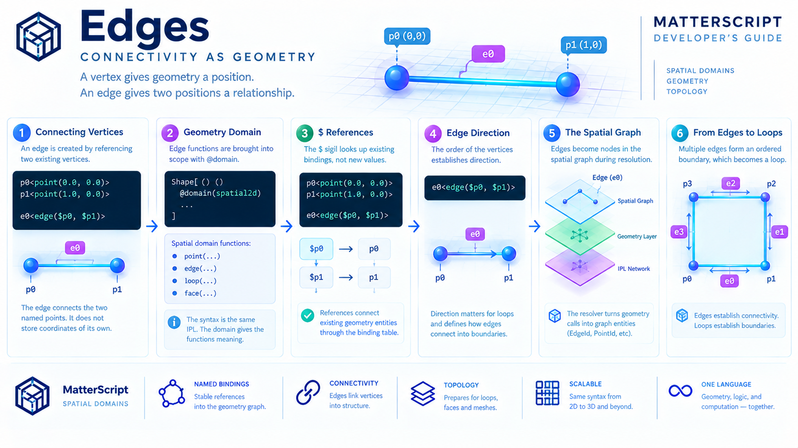

# Edges - Connectivity as Geometry




A vertex gives geometry a position.

An edge gives two positions a relationship.

In MatterScript, an edge is not introduced as an independent line segment with its own coordinates. It is constructed by referencing two previously defined vertices:

```matterscript
p0<point(0.0, 0.0)>
p1<point(1.0, 0.0)>

e0<edge($p0, $p1)>
```

The important idea is that the edge does not duplicate the geometry of its endpoints. It **connects existing geometric entities by name**.

This is the next step in the progression established by vertices:

```text
        point
          │
          ▼
     named position
          │
          ▼
        edge
          │
          ▼
   named connectivity
```

MatterScript therefore builds geometry incrementally. Points establish *where*. Edges establish *between*.

---

## 1. An Edge Connects Existing Vertices

The `edge` function takes two geometry references:

```matterscript
e0<edge($p0, $p1)>
```

Here:

* `p0` is an existing point binding.
* `p1` is an existing point binding.
* `$p0` and `$p1` refer to those bindings.
* `e0` becomes the name of the resulting edge.

The edge does not contain a second copy of the coordinates.

Instead, its structure can be understood conceptually as:

```text
p0 ─────────────────── p1
        │
        │
       e0
```

The geometry graph now contains three named entities:

```text
p0 ──────────────── p1
        e0
```

The two vertices provide the positions. The edge provides the relationship between them.

This is a recurring MatterScript principle: **relationships are constructed through references rather than by duplicating the things being related.**

---

## 2. `edge(...)` Is a Domain Function

Edges use the same mechanism introduced by the spatial-domain system.

A definition first establishes its spatial domain:

```matterscript
Shape[
    ()
    ()
    @domain(spatial2d)

    ...
]
```

Within a `spatial2d` or `spatial3d` definition, the geometry functions

```text
point(...)
edge(...)
loop(...)
face(...)
```

are brought into scope.

There is no separate geometry grammar for edges.

The following is simply an IPL fill whose expression happens to be a call:

```matterscript
e0<edge($p0, $p1)>
```

The parser already understands the general form:

```text
name(arguments...)
```

as a structured call expression. The spatial resolution pass is what gives `edge(...)` its geometric meaning when the enclosing definition has a supported spatial domain.

This separation is important.

The parser does not need to know that `edge` represents geometry. The geometry resolver interprets the already-parsed expression and constructs the corresponding entity in the `SpatialGraph`.

---

## 3. `$` Means Reference

The arguments to `edge(...)` are not new points.

They are references to points that have already been bound.

```matterscript
p0<point(0.0, 0.0)>
p1<point(1.0, 0.0)>

e0<edge($p0, $p1)>
```

The `$` sigil tells MatterScript to look up an existing binding.

This is the same reference convention used elsewhere in IPL. Geometry does not introduce a second mechanism for connecting things.

The progression is therefore uniform:

```matterscript
p0<point(...)>
p1<point(...)>

e0<edge($p0, $p1)>
```

followed by:

```matterscript
l0<loop($e0, $e1, $e2, $e3)>
```

and eventually:

```matterscript
f0<face($l0)>
```

Every geometric level uses the same rule:

> **Define an entity once. Reference it by name thereafter.**

---

## 4. An Edge Requires Points

The geometry resolver does not merely look up names. It also checks that the referenced geometry has the expected kind.

An `edge` requires two `.point` handles.

Conceptually:

```text
edge(
    Point,
    Point
)
```

So this is valid:

```matterscript
p0<point(0.0, 0.0)>
p1<point(1.0, 0.0)>
e0<edge($p0, $p1)>
```

while an edge cannot be constructed by passing an unrelated geometry handle where a point is expected.

The same type relationship will appear again as geometry grows:

```text
point ──► edge ──► loop ──► face
```

Each level consumes the geometry constructed by the level below it.

This gives the spatial graph a simple structural hierarchy without requiring a separate type declaration for every geometric object.

---

## 5. Binding Happens in Source Order

Spatial geometry is resolved in a single forward pass.

The resolver walks the definition in source order, constructs each recognized geometry element, and records its resulting handle in the geometry binding table.

That means a point must exist before an edge can reference it.

This is valid:

```matterscript
p0<point(0.0, 0.0)>
p1<point(1.0, 0.0)>

e0<edge($p0, $p1)>
```

This is not currently valid:

```matterscript
e0<edge($p0, $p1)>

p0<point(0.0, 0.0)>
p1<point(1.0, 0.0)>
```

The second form attempts to use forward references. At the time `e0` is resolved, neither point has been entered into the geometry binding table.

The result is:

```text
error.UndefinedGeometryReference
```

This is not a special syntactic restriction on `edge`. It follows directly from the implementation of the spatial resolution pass.

The natural authoring order is therefore also the resolution order:

```text
points
  ↓
edges
  ↓
loops
  ↓
faces
```

---

## 6. Define Once, Reference Many

An edge binding follows the same single-assignment rule established for vertices.

Once:

```matterscript
e0<edge($p0, $p1)>
```

has bound the name `e0`, subsequent geometry may reference it:

```matterscript
l0<loop($e0, $e1, $e2, $e3)>
```

The meaning of `e0` does not change.

A second attempt to bind the same name is rejected as a duplicate geometry binding rather than silently replacing the original entity.

This gives the geometry graph a useful property:

```text
        e0
       /  \
     p0    p1

e0 always means this edge.
```

The name becomes an address for the geometric entity.

This is particularly important once a model contains many edges. Geometry remains understandable because connectivity is expressed through stable names rather than through repeated coordinate data.

---

## 7. Edge Direction Is Part of Its Construction

An edge is written with an ordered pair:

```matterscript
e0<edge($p0, $p1)>
```

The source establishes the edge from `p0` to `p1`.

That ordering becomes important when edges are assembled into loops.

For example:

```matterscript
e0<edge($p0, $p1)>
e1<edge($p1, $p2)>
e2<edge($p2, $p3)>
e3<edge($p3, $p0)>
```

These edges form the sequence:

```text
p0 → p1 → p2 → p3 → p0
```

The edges are not merely four unrelated segments. Their endpoint relationships provide the information from which a closed boundary can be recognized.

That is why the next geometric primitive, `loop(...)`, takes **ordered edge references** rather than simply receiving a collection of points.

The edge is where connectivity begins to acquire topology.

---

## 8. Building a Boundary from Edges

Consider a square:

```matterscript
p0<point(0.0, 0.0)>
p1<point(1.0, 0.0)>
p2<point(1.0, 1.0)>
p3<point(0.0, 1.0)>

e0<edge($p0, $p1)>
e1<edge($p1, $p2)>
e2<edge($p2, $p3)>
e3<edge($p3, $p0)>
```

The resulting structure can be visualized as:

```text
p3 ─────────────── p2
│                   │
│                   │
│                   │
p0 ─────────────── p1

e3                  e1
        e0     e2
```

More precisely, the directed sequence is:

```text
p0 ──e0──► p1
             │
             e1
             ▼
             p2
             │
             e2
             ▼
             p3
             │
             e3
             ▼
             p0
```

Nothing new had to be invented to describe this boundary.

The points already existed.

The edges simply expressed how those points are connected.

This is one of the central advantages of constructing geometry through references: **topology emerges from the relationships between named entities.**

---

## 9. Edges Belong to the Spatial Graph

During resolution, each recognized geometry call produces an entity in the `spatial.SpatialGraph`.

The geometry binding table associates the source-level name with the resulting geometry handle.

Conceptually:

```text
MatterScript source
        │
        ▼
e0<edge($p0, $p1)>
        │
        ▼
Geometry resolver
        │
        ├── lookup p0
        ├── lookup p1
        │
        ▼
   SpatialGraph
        │
        ▼
     EdgeId
```

The important separation is that the source name and the graph's internal representation serve different purposes.

The MatterScript author works with:

```text
$p0
$p1
$e0
```

while the spatial implementation can work with its internal geometry handles.

The binding table connects those two worlds.

This is the same pattern established for vertices: source-level names provide stable addresses into the constructed geometry graph.

---

## 10. Coincident Edges and Shared Geometry

There is an important detail in the current implementation when multiple faces meet.

Two faces may contain an edge occupying exactly the same geometric segment. For example, both may contain an edge corresponding to:

```text
p0 → p1
```

The current spatial model does not require those two faces to share one edge binding.

Instead, each face can have its own edge binding for the geometrically identical segment.

For example:

```matterscript
e_front<edge($p0, $p1)>
...
e_back<edge($p0, $p1)>
```

These are distinct bindings even though the underlying endpoints describe the same geometric segment.

This is deliberate in the current implementation.

A loop validates its own continuity by examining the ordered edges supplied to it. It does not currently reason about neighboring loops traversing a shared edge in the opposite direction.

Giving each face its own edge binding therefore keeps each loop's boundary self-contained and avoids requiring a separate reversed-edge traversal mechanism.

The distinction is worth remembering:

```text
same coordinates
      ≠
same binding
```

Two edges can describe geometrically coincident segments while still being separately named entities in the source.

---

## 11. Why Not Just Connect Coordinates Directly?

It would be possible to imagine a geometry syntax in which a loop simply contained raw coordinates:

```text
loop(
    (0,0),
    (1,0),
    (1,1),
    (0,1)
)
```

That is not how MatterScript's spatial construction works.

Instead:

```matterscript
p0<point(0.0, 0.0)>
p1<point(1.0, 0.0)>
p2<point(1.0, 1.0)>
p3<point(0.0, 1.0)>

e0<edge($p0, $p1)>
e1<edge($p1, $p2)>
e2<edge($p2, $p3)>
e3<edge($p3, $p0)>
```

Each level remains independently addressable.

The advantage is not merely syntactic.

The graph now knows that:

```text
p0
```

is an entity that can participate in multiple relationships.

Likewise:

```text
e0
```

is an entity that can participate in a loop.

The geometry is therefore constructed from **named relationships**, not from repeatedly embedded coordinate descriptions.

---

## 12. Edges Scale Naturally

The same mechanism used for one line segment scales to complete structures.

A four-edge boundary:

```text
p0 → p1 → p2 → p3 → p0
```

can become a loop.

Multiple loops can become multiple faces.

Multiple faces can describe a three-dimensional structure.

The syntax does not change as the model becomes larger:

```text
point(...)
edge(...)
loop(...)
face(...)
```

Nor does the reference mechanism change:

```text
$p0
$p1
$e0
$l0
```

The graph simply becomes larger.

This is the same principle that makes the spatial domain useful as a language feature rather than merely as a geometry-export convenience: **the complexity of the structure grows without requiring a different representation for every scale.**

---

## 13. From Edges to Loops

An edge is the first geometric primitive that describes connectivity.

But connectivity alone does not yet define a surface.

Four edges such as:

```text
e0<edge($p0, $p1)>
e1<edge($p1, $p2)>
e2<edge($p2, $p3)>
e3<edge($p3, $p0)>
```

still need to be interpreted as an ordered, closed boundary.

That is the job of `loop(...)`:

```matterscript
l0<loop($e0, $e1, $e2, $e3)>
```

The loop resolver verifies that the edges form a continuous path and that the path closes back on itself.

The progression is now explicit:

```text
POINT
  │
  │ position
  ▼
EDGE
  │
  │ connectivity
  ▼
LOOP
  │
  │ boundary
  ▼
FACE
  │
  │ surface
  ▼
MESH
```

The edge is therefore the bridge between **position** and **topology**.

---

## 14. The Geometry Graph Is Built Incrementally

A complete spatial definition can be read almost like a construction sequence:

```matterscript
@domain(spatial3d)

// 1. Positions
p0<point(0.0, 0.0, 0.0)>
p1<point(1.0, 0.0, 0.0)>
p2<point(1.0, 1.0, 0.0)>
p3<point(0.0, 1.0, 0.0)>

// 2. Connectivity
e0<edge($p0, $p1)>
e1<edge($p1, $p2)>
e2<edge($p2, $p3)>
e3<edge($p3, $p0)>

// 3. Boundary
l0<loop($e0, $e1, $e2, $e3)>

// 4. Surface
f0<face($l0)>
```

Each statement adds another layer of structure.

Nothing at the edge level needs to know how a face will eventually use it.

Nothing at the point level needs to know that it will eventually participate in a face.

The graph is assembled through references, one relationship at a time.

This is the same **loosely linked geometry graph** introduced by the spatial-domain architecture: geometry is constructed alongside the ordinary IPL network without changing the underlying parser or requiring a second language.

---

## 15. Edges and the Mesh Pipeline

Once the geometry has been resolved, the edge itself does not need to be exported directly as a mesh primitive.

Instead, edges contribute to the higher-level topology from which a mesh can be generated.

The pipeline is:

```text
MatterScript
     │
     ▼
IPL Parser
     │
     ▼
Spatial Binding Resolution
     │
     ├── Points
     ├── Edges
     ├── Loops
     └── Faces
     │
     ▼
Triangulation
     │
     ▼
TriangulatedMesh
     │
     ▼
PLY
```

For example, a single quadrilateral face can be constructed from four points, four edges, one loop, and one face. Triangulation then turns that face into two triangles over the same four vertices.

The edge therefore occupies an important middle layer:

```text
coordinates
     ↓
vertices
     ↓
edges
     ↓
topological boundary
     ↓
surface
     ↓
triangles
```

It is the structure that makes the transition from isolated positions to connected geometry possible.

---

## 16. A Complete Edge Example

Here is the complete construction of a simple square:

```matterscript
Square[()()
    @domain(spatial2d)

    p0<point(0.0, 0.0)>
    p1<point(1.0, 0.0)>
    p2<point(1.0, 1.0)>
    p3<point(0.0, 1.0)>

    e0<edge($p0, $p1)>
    e1<edge($p1, $p2)>
    e2<edge($p2, $p3)>
    e3<edge($p3, $p0)>

    l0<loop($e0, $e1, $e2, $e3)>

    f0<face($l0)>
]
```

The construction reads from the bottom of the geometric hierarchy upward:

```text
p0 ─────────────── p1
│                   │
│                   │
│                   │
p3 ─────────────── p2

  Points
     ↓
  Edges
     ↓
  Loop
     ↓
  Face
```

The important part is not the square itself. The important part is that every stage uses the same language mechanisms:

* `@domain` establishes the spatial context.
* `point(...)` creates named positions.
* `edge(...)` connects named positions.
* `$name` references existing entities.
* `loop(...)` consumes named edges.
* `face(...)` consumes a named loop.

No separate geometry language is necessary.

---

## 17. Connectivity Becomes Structure

The vertex chapter established a fundamental distinction:

> **A coordinate is not yet an entity until it has an identity in the geometry graph.**

Edges establish the next distinction:

> **Two entities are not yet connected merely because they occupy related coordinates. The relationship itself must be represented.**

That representation is the edge.

MatterScript therefore treats connectivity as something that can be named, referenced, validated, and composed.

The result is a progression from numerical data toward structure:

```text
coordinate
    ↓
named point
    ↓
named edge
    ↓
ordered loop
    ↓
face
    ↓
mesh
```

Each level adds information without discarding the level below it.

This is what makes the spatial graph useful as a computational representation rather than merely as an intermediate format for drawing geometry.

---

## 18. Looking Ahead: Loops

An edge establishes a connection between two vertices.

A collection of appropriately ordered edges can establish something more important: a **closed boundary**.

That is the role of `loop(...)`.

```matterscript
l0<loop($e0, $e1, $e2, $e3)>
```

The loop takes the connectivity already established by the edges and verifies that it forms a continuous, closed structure.

The next step in MatterScript's geometric hierarchy is therefore:

> **Edges establish connectivity. Loops establish boundaries.**

Once a boundary exists, it can become a surface through `face(...)`.

The geometry hierarchy is now complete enough to see the larger pattern:

```text
              FACE
               ▲
               │
             LOOP
               ▲
               │
              EDGE
               ▲
               │
             POINT
```

Geometry is being constructed not by embedding ever-larger descriptions inside one another, but by **naming each level and composing those names into the next level of structure**.

*Drafting in progress...*
