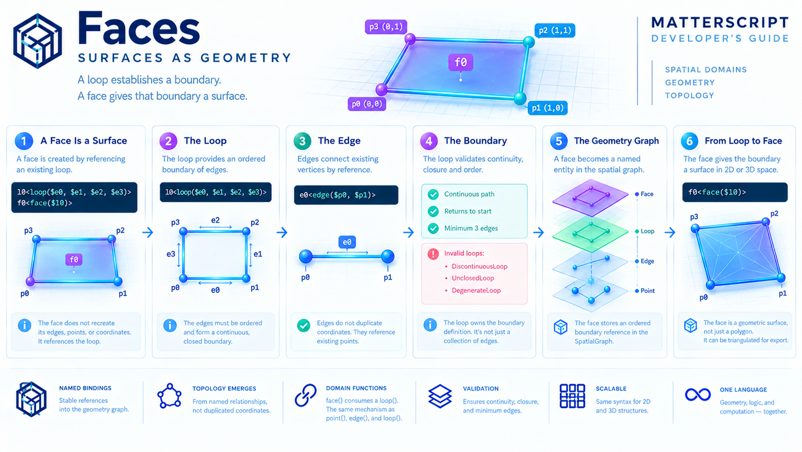

# Faces: Surfaces as Geometry



A loop establishes a boundary.

A face gives that boundary a **surface**.

In MatterScript, a face is constructed by referencing a previously defined loop:

```matterscript
f0<face($l0)>
```

The important idea is that a face does not redefine its edges, points, or coordinates.

It references an existing boundary and promotes that boundary into a geometric region.

This completes the core hierarchy of MatterScript spatial geometry:

```text
POINT
   │
   │ position
   ▼
EDGE
   │
   │ connectivity
   ▼
LOOP
   │
   │ boundary
   ▼
FACE
   │
   │ surface
   ▼
MESH
```

A vertex establishes **where**.

An edge establishes **between**.

A loop establishes **around**.

A face establishes **across**.

---

## 1. A Face Is a Surface

Consider a square boundary:

```matterscript
p0<point(0.0, 0.0)>
p1<point(1.0, 0.0)>
p2<point(1.0, 1.0)>
p3<point(0.0, 1.0)>

e0<edge($p0, $p1)>
e1<edge($p1, $p2)>
e2<edge($p2, $p3)>
e3<edge($p3, $p0)>

l0<loop($e0, $e1, $e2, $e3)>
```

The loop establishes a closed boundary:

```text
p0 → p1 → p2 → p3 → p0
```

But a boundary is not yet a surface.

The face provides that final step:

```matterscript
f0<face($l0)>
```

Conceptually:

```text
Before:

p0 ───────── p1
│            │
│            │
│            │
p3 ───────── p2

Boundary only


After:

┌───────────────┐
│               │
│     FACE      │
│               │
└───────────────┘
```

A face therefore answers a simple question:

> What region is enclosed by this loop?

---

## 2. Faces Consume Loops

The geometric hierarchy is intentionally simple:

```text
point(...)
    ↓
edge(point, point)
    ↓
loop(edge, edge, ...)
    ↓
face(loop)
```

A face consumes loops.

It does not consume points directly.

It does not consume edges directly.

This separation keeps each primitive responsible for one level of structure:

```text
Point
  └── position

Edge
  └── connectivity

Loop
  └── boundary

Face
  └── surface
```

Each layer builds on the previous layer without duplicating information.

---

## 3. Faces Use the Same Binding Model

No special geometry syntax is introduced for surfaces.

A loop receives a name:

```matterscript
l0<loop($e0, $e1, $e2, $e3)>
```

A face references that name:

```matterscript
f0<face($l0)>
```

The same rule applies throughout MatterScript:

> Define once. Reference many.

The `$` sigil continues to mean:

> Look up an existing binding.

This consistency is important.

The language does not introduce a separate way of describing surfaces.

Faces participate in the same naming and composition system as every other entity.

---

## 4. Faces Become Geometry Entities

When a face is resolved, it becomes a new geometry entity inside the `SpatialGraph`.

Conceptually:

```text
MatterScript

f0<face($l0)>
        │
        ▼
Geometry Resolver
        │
        ▼
 SpatialGraph
        │
        ▼
    FaceId
```

The source-level name:

```text
$f0
```

provides a stable reference to that geometric surface.

This allows faces to participate in later processing stages:

* triangulation
* mesh generation
* placement
* delay synthesis
* sensor mapping
* hardware projection

The face is therefore more than a drawing primitive.

It becomes a named region within the geometry graph.

---

## 5. A Face Is More Than a Polygon

Traditional graphics systems often describe surfaces as lists of coordinates:

```text
[(0,0), (1,0), (1,1), (0,1)]
```

MatterScript takes a different approach.

The surface is constructed gradually:

```text
coordinates
      ↓
points
      ↓
edges
      ↓
loops
      ↓
faces
```

The advantage is that every intermediate structure remains visible and addressable.

The language can therefore express:

* position,
* connectivity,
* boundary,
* and surface

as separate concepts.

This makes geometry compositional rather than monolithic.

---

## 6. A Face Does Not Reconstruct Its Boundary

The face:

```matterscript
f0<face($l0)>
```

does not create new edges.

It does not recreate points.

It simply refers to an already validated loop.

Conceptually:

```text
Face
  │
  ▼
Loop
  │
  ▼
Edges
  │
  ▼
Points
```

Each level owns a specific responsibility.

The face assumes that the loop already forms a valid boundary.

This keeps the system modular.

---

## 7. Surface Identity

Two faces may occupy neighboring regions.

For example:

```text
+-----+-----+
|  F0 |  F1 |
+-----+-----+
```

Each face has its own identity:

```text
f0
f1
```

Even if they share geometric boundaries, the surfaces remain distinct entities.

This is important because surfaces often represent meaningful regions:

* walls,
* floors,
* sensor zones,
* computational cells,
* hardware regions,
* physical materials.

The face is therefore not merely geometry.

It is a named spatial object.

---

## 8. Faces Compose Larger Structures

A single face describes one surface.

Many faces can describe more complex structures.

For example:

```text
Cube

   +------+
  /|     /|
 +------+ |
 | |    | |
 | +----|-+
 |/     |/
 +------+
```

The cube is not a special primitive.

It is composed from faces:

```text
Face
 + Face
 + Face
 + Face
 + Face
 + Face
```

The same construction applies at larger scales:

```text
faces
   ↓
shells
   ↓
objects
   ↓
assemblies
```

The language scales through composition.

No new syntax is required.

---

## 9. Faces in Three Dimensions

A face is not limited to flat two-dimensional examples.

The same primitive applies in three-dimensional geometry.

For example:

```matterscript
p0<point(0,0,0)>
p1<point(1,0,0)>
p2<point(1,1,0)>
p3<point(0,1,0)>

...

f0<face($l0)>
```

The face still represents:

> A surface enclosed by a loop.

The coordinates simply happen to exist in three-dimensional space.

This is why the same vocabulary works for both:

```text
spatial2d
spatial3d
```

The underlying ideas remain unchanged.

---

## 10. Faces and Triangulation

Most rendering systems ultimately operate on triangles.

MatterScript intentionally does not expose triangles directly.

Instead:

```text
Face
   ↓
Triangulation
   ↓
Triangles
```

For example:

```text
Quadrilateral Face

+---------+
|         |
|         |
+---------+
```

may become:

```text
+---------+
|\        |
| \       |
|  \      |
+---------+
```

The triangulation step converts high-level surfaces into low-level mesh primitives.

This is important because the programmer works with meaningful geometry while the exporter produces efficient representations.

---

## 11. Faces and Mesh Generation

The geometry pipeline is now complete:

```text
MatterScript Source
        │
        ▼
IPL Parser
        │
        ▼
Spatial Resolver
        │
        ├── Points
        ├── Edges
        ├── Loops
        └── Faces
        │
        ▼
Triangulation
        │
        ▼
TriangulatedMesh
        │
        ▼
PLY
```

The face is the final topological primitive before mesh generation.

Everything below it becomes implementation detail.

---

## 12. Faces and Physical Computation

Faces become particularly interesting when geometry is connected to computation.

A face can represent:

* a sensor region,
* a hardware tile,
* an FPGA area,
* a robotic workspace,
* a simulation cell,
* a thermal region,
* a biological membrane.

For example:

```text
Face
   ↓
Computational Region
```

This allows geometry to become part of the execution model rather than merely an output format.

A face is no longer just something that can be drawn.

It becomes a region where relationships exist.

---

## 13. Faces and Placement

Later chapters will use faces as targets for placement:

```text
cell
   ↓
face
   ↓
physical location
```

This enables statements such as:

> Place this computation within this region.

The face becomes part of the bridge between:

```text
geometry
      ↔
computation
```

This is one of MatterScript's central goals.

---

## 14. The Complete Example

```matterscript
Square[()()
    @domain(spatial2d)

    p0<point(0.0, 0.0)>
    p1<point(1.0, 0.0)>
    p2<point(1.0, 1.0)>
    p3<point(0.0, 1.0)>

    e0<edge($p0, $p1)>
    e1<edge($p1, $p2)>
    e2<edge($p2, $p3)>
    e3<edge($p3, $p0)>

    l0<loop($e0, $e1, $e2, $e3)>

    f0<face($l0)>
]
```

The structure is:

```text
Points
   ↓
Edges
   ↓
Loop
   ↓
Face
   ↓
Mesh
```

Each layer adds meaning:

```text
Point
  = position

Edge
  = connectivity

Loop
  = boundary

Face
  = surface
```

---

## 15. Why Faces Matter

A graphics system might stop at triangles.

MatterScript stops at relationships.

The programmer does not describe:

> How should this be triangulated?

Instead they describe:

> What surfaces exist?

The system derives the implementation details.

This allows geometry to remain:

* meaningful,
* compositional,
* reusable,
* physically interpretable.

The face therefore becomes an important bridge between:

```text
space
geometry
computation
hardware
```

---

## 16. Looking Ahead

With faces, the core topological hierarchy is complete:

```text
POINT
   ↓
EDGE
   ↓
LOOP
   ↓
FACE
```

From here, the system can move toward:

```text
faces
   ↓
meshes
   ↓
placement
   ↓
hardware
```

The next chapters explore how geometry becomes physical computation:

* Cell Placement
* Conformal Projection
* Delay Synthesis
* Sensor Placement
* Hardware Fidelity

The geometric language is now complete enough to describe not only shapes, but the physical structure of computation itself.

*Drafting in progress...*
