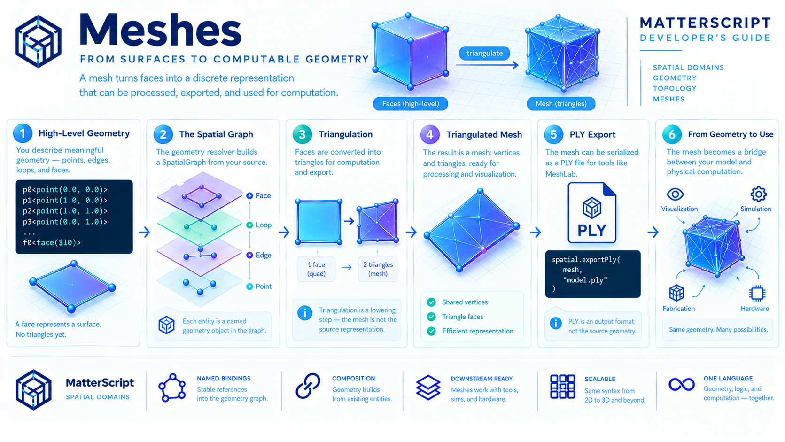

# Meshes



Vertices establish position.

Edges establish connectivity.

Loops establish boundaries.

Faces establish surfaces.

A **mesh** turns those surfaces into a discrete representation that can be processed, exported, inspected, and eventually used as the foundation for physical computation.

In MatterScript, the mesh is not the starting point.

It is the result of lowering the higher-level geometric structure into a collection of computational primitives:

```text
 POINT
   │
   │ position
   ▼
 EDGE
   │
   │ connectivity
   ▼
 LOOP
   │
   │ boundary
   ▼
 FACE
   │
   │ surface
   ▼
 MESH
   │
   │ discretization
   ▼
  PLY
```

This distinction is fundamental.

MatterScript describes geometry in terms of meaningful structures. The mesh is generated afterward as a representation of that structure.

> **A face describes a surface. A mesh discretizes that surface into computable primitives.**

---

## 1. Why Have a Mesh?

A face is a useful geometric concept:

```matterscript
f0<face($l0)>
```

It tells us that a particular loop represents a surface.

But many downstream systems do not operate directly on arbitrary surfaces.

They operate on discrete elements.

A mesh provides that discrete representation.

Conceptually:

```text
High-level geometry

       FACE
        │
        ▼
   continuous
    surface
        │
        ▼
   triangulation
        │
        ▼
Low-level geometry

   ▲───────▲
   │\      │
   │ \     │
   │  \    │
   │   \   │
   ▲───────▲
```

The mesh therefore acts as an interface between the geometric model and systems that need explicit vertices and triangles.

---

## 2. MatterScript Does Not Start with Triangles

A conventional mesh-oriented workflow might begin with something like:

```text
vertices
+
triangle indices
```

MatterScript starts higher up.

The programmer describes:

```text
points
edges
loops
faces
```

and the system derives the triangle representation.

This gives the source language a more meaningful vocabulary.

Instead of writing:

> Split this quadrilateral into these two triangles.

the programmer writes:

> This is a surface bounded by this loop.

Triangulation becomes an implementation step.

```text
MatterScript

face
  │
  ▼
triangulate
  │
  ▼
triangles
```

The distinction allows the source representation to remain independent of the particular mesh representation eventually produced.

---

## 3. The Spatial Graph Is the Source Geometry

The geometry resolver builds a `SpatialGraph`.

That graph contains the geometric entities constructed from the MatterScript source:

```text
SpatialGraph

  Points
     │
     ├── Edges
     │
     ├── Loops
     │
     └── Faces
```

The source-level names remain associated with the corresponding geometry handles through the geometry binding table.

For example:

```matterscript
p0<point(0.0, 0.0)>
p1<point(1.0, 0.0)>

e0<edge($p0, $p1)>
```

becomes part of the graph as actual geometry entities rather than remaining merely as source text.

The mesh is generated **from this graph**.

That makes the architecture:

```text
MatterScript
     │
     ▼
SpatialGraph
     │
     ▼
TriangulatedMesh
```

rather than:

```text
MatterScript
     │
     ▼
triangle list
```

This is an important architectural distinction.

---

## 4. Triangulation Is a Lowering Step

The current implementation provides a `spatial.triangulate` stage:

```text
SpatialGraph
     │
     ▼
spatial.triangulate
     │
     ▼
TriangulatedMesh
```

Triangulation converts the higher-level surfaces into triangles.

For a simple quadrilateral face:

```text
+---------+
|         |
|         |
+---------+
```

the resulting mesh can contain:

```text
+---------+
|\        |
| \       |
|  \      |
|   \     |
+---------+
```

The important point is that the diagonal is an artifact of triangulation.

It was not part of the original MatterScript geometry description.

The source described a face.

The mesh generator chose a discrete representation of that face.

---

## 5. A Simple Example

Consider the smallest useful surface:

```matterscript
Square[()()
    @domain(spatial2d)

    p0<point(0.0, 0.0)>
    p1<point(1.0, 0.0)>
    p2<point(1.0, 1.0)>
    p3<point(0.0, 1.0)>

    e0<edge($p0, $p1)>
    e1<edge($p1, $p2)>
    e2<edge($p2, $p3)>
    e3<edge($p3, $p0)>

    l0<loop($e0, $e1, $e2, $e3)>

    f0<face($l0)>
]
```

The source describes:

```text
4 points
4 edges
1 loop
1 face
```

The triangulation stage turns the single quadrilateral face into:

```text
2 triangles
```

over the same four vertices.

Conceptually:

```text
Face

p0 ───────── p1
│          /  │
│        /    │
│      /      │
│    /        │
p3 ───────── p2


Mesh

Triangle 1: p0, p1, p3
Triangle 2: p1, p2, p3
```

The exact triangulation strategy is an implementation concern. The important architectural fact is that the surface existed before the triangles did.

---

## 6. The Vertices Survive the Conversion

The mesh does not need to invent a new set of positions for every triangle.

In the simple quadrilateral example, triangulation produces two triangles **over the same four vertices**.

That means:

```text
SpatialGraph
    │
    ├── p0
    ├── p1
    ├── p2
    └── p3
         │
         ▼
TriangulatedMesh
    │
    ├── Triangle
    └── Triangle
```

The triangles reference the mesh's vertex representation.

This is one reason it is useful to distinguish the geometric graph from the triangulated representation.

The graph expresses the geometry.

The mesh expresses a discrete computational representation of that geometry.

---

## 7. A Mesh Is Not Just a Collection of Points

A point list alone does not tell a mesh viewer how surfaces are connected.

For example:

```text
p0
p1
p2
p3
```

contains positions, but not topology.

A mesh adds relationships between those positions:

```text
vertices
   +
triangle connectivity
```

Conceptually:

```text
Vertices:

p0    p1
       
p3    p2


Triangles:

p0 ───── p1
 │      / │
 │    /   │
 │  /     │
 p3 ───── p2
```

The mesh therefore combines geometric position with explicit discrete surface connectivity.

This makes it suitable for systems that need to process individual elements rather than reason about an abstract face.

---

## 8. From Face to Triangles

The complete lowering process can be summarized as:

```text
Face
  │
  │ bounded by
  ▼
Loop
  │
  │ composed of
  ▼
Edges
  │
  │ connecting
  ▼
Points
```

and then, in the opposite direction for representation:

```text
Points + Faces
       │
       ▼
 Triangulation
       │
       ▼
Triangles
```

The source geometry and the mesh therefore describe the same physical structure at different levels.

```text
HIGH LEVEL

"this region is a surface"


LOW LEVEL

"these vertices and triangles represent that surface"
```

MatterScript keeps those levels separate.

---

## 9. The Complete Pipeline

The actual implementation pipeline is deliberately divided into independently testable stages:

```text
.ms.ipl source
      │
      ▼
ipl_parser.parse
      │
      ▼
spatial_domain.resolveSpatialBindings
      │
      ▼
SpatialGraph
      │
      ▼
spatial.triangulate
      │
      ▼
TriangulatedMesh
      │
      ▼
spatial.exportPly
      │
      ▼
binary PLY
```

The parser itself remains ordinary IPL parsing.

The spatial resolution pass interprets recognized geometry calls and constructs the spatial graph.

Triangulation converts that graph into a mesh.

PLY export serializes the mesh.

Each stage therefore has a clearly defined responsibility.

---

## 10. Parsing Does Not Produce the Mesh

This separation is worth emphasizing.

When MatterScript encounters:

```matterscript
p0<point(0.0, 0.0)>
```

the parser does not immediately create a mesh vertex.

It parses an ordinary IPL fill whose expression is a structured call.

Likewise:

```matterscript
f0<face($l0)>
```

is initially just parsed syntax.

The spatial resolution pass gives those calls their geometry-specific meaning when the enclosing definition is scoped to `spatial2d` or `spatial3d`.

The architecture is therefore:

```text
        Syntax
          │
          ▼
       IPL AST
          │
          ▼
   Spatial Resolution
          │
          ▼
    Spatial Graph
          │
          ▼
      Triangulation
          │
          ▼
         Mesh
```

The mesh is several semantic levels downstream from parsing.

---

## 11. Mesh Generation Is Domain-Specific

Spatial geometry functions are available when the definition declares:

```matterscript
@domain(spatial2d)
```

or:

```matterscript
@domain(spatial3d)
```

The mesh exporter uses that same domain information to determine which definitions should be processed as geometry.

Definitions without a spatial domain are not sent through the mesh path.

Likewise, `spatial1d` is not currently a geometry domain.

This means one `.ms.ipl` source file can contain different kinds of definitions:

```text
MatterScript file
       │
       ├── causal definitions
       │       ↓
       │     VHDL path
       │
       └── spatial definitions
               ↓
            mesh path
```

The routing is determined by the definition's domain.

---

## 12. Mesh Export

Once the `TriangulatedMesh` exists, it can be serialized.

The current implementation provides:

```text
spatial.exportPly
```

which produces binary PLY data.

The resulting file contains the mesh representation:

```text
vertices
+
triangular faces
```

For the simple quadrilateral example, the exported mesh contains:

```text
4 vertices
2 triangular faces
```

and can be opened by mesh inspection tools such as MeshLab.

The important distinction is:

```text
MatterScript
    ↓
SpatialGraph
    ↓
TriangulatedMesh
    ↓
PLY
```

PLY is an **output representation**.

It is not the language's fundamental geometry model.

---

## 13. Why PLY?

PLY provides a convenient interchange boundary between MatterScript and external geometry tools.

The MatterScript pipeline can produce an actual binary mesh file:

```text
<definition-name>.ply
```

under the run's workspace.

That means the generated geometry can leave the compiler/runtime environment and enter an ordinary mesh-processing workflow.

For example:

```text
MatterScript
     ↓
    PLY
     ↓
  MeshLab
     ↓
inspection / validation
```

This gives the spatial compiler a concrete artifact that can be examined independently of the compiler itself.

---

## 14. Meshes Make Geometry Testable

A particularly useful property of the mesh boundary is that it creates an observable artifact.

A MatterScript definition can be transformed into a PLY file and then inspected independently.

The pipeline can therefore be tested at multiple levels:

```text
Source
  │
  ├── parser tests
  │
  ├── geometry-resolution tests
  │
  ├── topology tests
  │
  ├── triangulation tests
  │
  └── PLY export tests
```

This is valuable because each stage can be verified without requiring the entire system to be treated as one opaque operation.

The mesh becomes a concrete boundary between **semantic geometry** and **external representation**.

---

## 15. Geometry-Only Definitions

A geometry definition does not need ordinary IPL sources or destinations.

For example:

```matterscript
Cube[()()
    @domain(spatial3d)

    ...
]
```

can exist specifically to produce geometry.

The mesh exporter does not require the definition to have ordinary causal destinations.

This reflects an important distinction:

```text
Causal definition

inputs → computation → outputs


Geometry definition

positions → topology → surface → mesh
```

Both use the same IPL source language.

They simply make use of different consumers of the parsed definition.

---

## 16. A Complete Three-Dimensional Example

A cube demonstrates why the distinction between geometry and mesh becomes increasingly useful.

The source can define eight points:

```matterscript
p0<point(0.0, 0.0, 0.0)>
p1<point(1.0, 0.0, 0.0)>
p2<point(1.0, 1.0, 0.0)>
p3<point(0.0, 1.0, 0.0)>

p4<point(0.0, 0.0, 1.0)>
p5<point(1.0, 0.0, 1.0)>
p6<point(1.0, 1.0, 1.0)>
p7<point(0.0, 1.0, 1.0)>
```

Each face is then constructed from its own four-edge loop.

For example, the bottom face:

```matterscript
e_b0<edge($p0, $p1)>
e_b1<edge($p1, $p2)>
e_b2<edge($p2, $p3)>
e_b3<edge($p3, $p0)>

l_bottom<loop($e_b0, $e_b1, $e_b2, $e_b3)>
f_bottom<face($l_bottom)>
```

The other five faces follow the same pattern.

The source therefore describes:

```text
8 points
6 faces
24 edge bindings
6 loops
```

with each face owning its own four edge bindings, including geometrically coincident segments.

The triangulation stage can then lower those surfaces into a triangle mesh.

The source remains understandable as a cube.

The mesh remains understandable as a collection of triangles.

Both representations describe the same structure at different levels.

---

## 17. The Mesh as a Computational Boundary

The mesh is particularly important because it provides a representation that other systems can consume.

Once geometry has been reduced to explicit vertices and triangles, it can be used by:

* mesh viewers,
* geometry processors,
* spatial algorithms,
* simulation systems,
* fabrication pipelines,
* physical layout tools.

The mesh therefore becomes a bridge:

```text
MatterScript
     │
     ▼
semantic geometry
     │
     ▼
discrete mesh
     │
     ├── visualization
     ├── simulation
     ├── fabrication
     └── physical computation
```

The important architectural principle is that these downstream systems do not need to understand MatterScript's entire geometric construction language.

They can consume the representation appropriate to their task.

---

## 18. The Mesh Is Not the End

It would be tempting to think of:

```text
MatterScript → PLY
```

as the purpose of the spatial system.

It is not.

PLY is simply the current concrete endpoint of the implemented pipeline.

The more important transformation is:

```text
source description
       ↓
semantic geometry
       ↓
computable geometry
```

The mesh makes geometry explicit enough for another computational system to operate on it.

This becomes particularly important when geometry is eventually connected to MatterScript's other concepts.

A spatial region could become a placement target.

A distance could become a delay.

A surface could become a sensor domain.

A mesh could become the physical substrate on which computation is mapped.

The mesh is therefore a boundary between **describing physical structure** and **computing with physical structure**.

---

## 19. From Mesh to Physical Computation

The larger direction of the MatterScript spatial system can now be seen:

```text
Geometry

POINT
  ↓
EDGE
  ↓
LOOP
  ↓
FACE
  ↓
MESH

Computation

MESH
  ↓
PLACEMENT
  ↓
PROJECTION
  ↓
DELAY
  ↓
SENSING
  ↓
HARDWARE
```

The first half constructs the physical model.

The second half uses that model.

This is where MatterScript begins to move beyond conventional geometry processing.

A mesh is not merely something to render.

It can become a coordinate system for computation.

---

## 20. One Language, Multiple Representations

The same source definition can move through several representations:

```text
MatterScript source
        │
        ▼
      IPL AST
        │
        ▼
   SpatialGraph
        │
        ▼
 TriangulatedMesh
        │
        ▼
      PLY file
```

Each representation answers a different question.

### MatterScript

What did the programmer describe?

### SpatialGraph

What geometric entities and relationships exist?

### TriangulatedMesh

How can those surfaces be represented as discrete triangles?

### PLY

How can that mesh be serialized for another tool?

The representations are therefore not competing models.

They are layers.

---

## 21. The Geometry Pipeline Is Compositional

The complete Part V geometry construction sequence can now be summarized:

```text
@domain(spatial2d | spatial3d)
              │
              ▼
           point()
              │
              ▼
            edge()
              │
              ▼
            loop()
              │
              ▼
            face()
              │
              ▼
         triangulation
              │
              ▼
          TriangulatedMesh
              │
              ▼
             PLY
```

Every stage consumes the structure produced by the stage before it.

No new representation has to be invented for every step.

The same names, the same `$` reference convention, and the same define-once binding discipline continue throughout the construction.

That continuity is one of the most important properties of the design.

---

## 22. Why the Mesh Layer Matters

The mesh is where MatterScript's abstract geometric relationships become a form that ordinary computational machinery can consume.

The progression is:

```text
point
  = position

edge
  = connectivity

loop
  = boundary

face
  = surface

mesh
  = discrete representation
```

This is more than a convenient export pipeline.

It establishes a boundary between two ways of thinking about geometry:

```text
SEMANTIC

"What is this structure?"


COMPUTATIONAL

"How do I represent and process it?"
```

MatterScript works on the semantic side.

The mesh provides the computational bridge.

---

## 23. Looking Ahead: Computing Within Geometry

With the mesh layer in place, Part V can now change direction.

The first chapters constructed space:

```text
Spatial Domains
      ↓
   Vertices
      ↓
    Edges
      ↓
    Loops
      ↓
    Faces
      ↓
    Meshes
```

The remaining chapters ask what computation can do **with** that space:

```text
Meshes
   ↓
Cell Placement
   ↓
Conformal Projection
   ↓
Delay Synthesis
   ↓
Sensor Placement
   ↓
Hardware Fidelity
```

The fundamental transition is:

> **First we construct space. Then we compute within it.**

The mesh is the boundary between those two worlds.

It takes the physical structure described by MatterScript and gives it a discrete, inspectable, computational form.

That is what makes geometry more than an output.

It makes geometry available as a substrate for computation.

*Drafting in progress...*
