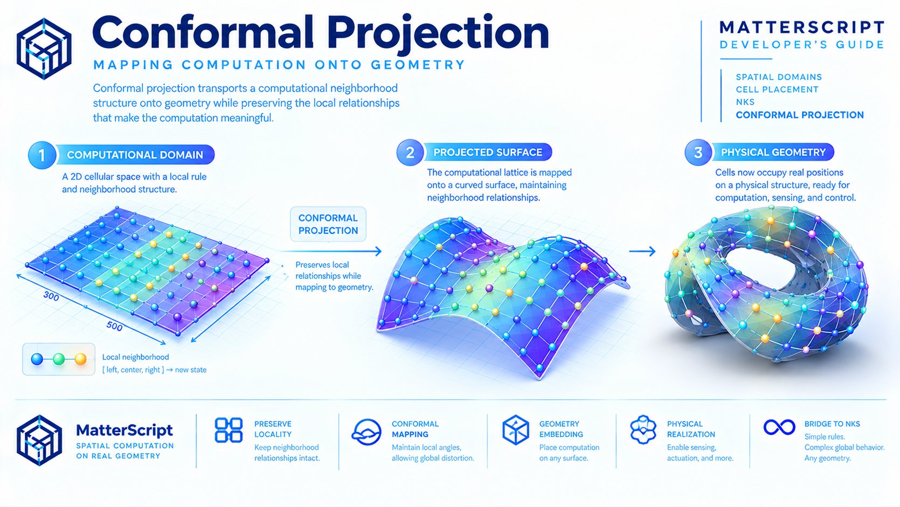

# Conformal Projection: Mapping Computation onto Geometry



Cell placement gives MatterScript a way to turn space into a computational substrate.

A spatial domain establishes where cells exist. A local rule establishes how those cells interact. Repeated application of the rule produces behavior across the domain.

But the computational space does not have to remain a flat rectangle.

A computational lattice can be mapped onto a surface.

A surface can be curved.

A curved surface can belong to a physical object.

And once the computational structure is mapped onto physical geometry, the distinction between *where computation happens* and *what computation does* begins to disappear.

This is the purpose of **conformal projection**.

> **Conformal projection transports a computational neighborhood structure onto geometry while attempting to preserve the local relationships that make the computation meaningful.**

The important idea is not simply projection as visualization.

It is **projection as placement**.

---

## From Flat Cells to Shaped Space

The cellular domain introduced in the previous chapter is conceptually simple:

```text
+---+---+---+---+---+
|   |   |   |   |   |
+---+---+---+---+---+
|   |   |   |   |   |
+---+---+---+---+---+
|   |   |   |   |   |
+---+---+---+---+---+
```

Each location represents a computational cell.

A neighborhood might be defined by the cells immediately to the left and right:

```text
       neighborhood

       left    center    right
         ↓       ↓         ↓
       [ 3 ]   [ 2 ]     [ 4 ]

                  |
                  v

              new state
                  6
```

The rule does not care about the physical interpretation of the cells.

It only requires that the neighborhood relationships remain meaningful.

This gives us an important separation:

```text
               COMPUTATION

             local rule
                 |
                 v
       +---------------------+
       | neighborhood graph  |
       +---------------------+
                 |
                 v
              geometry
```

The rule describes **relationships**.

The geometry describes **where those relationships are realized**.

Conformal projection provides a way to connect the two.

---

## The Computational Surface

Consider a cellular system defined on a rectangular domain:

```text
        computational domain

      o---o---o---o---o
      |   |   |   |   |
      o---o---o---o---o
      |   |   |   |   |
      o---o---o---o---o
      |   |   |   |   |
      o---o---o---o---o
```

Now imagine wrapping that computational structure around a cylinder:

```text
              ___________
           .-'           '-.
         .'   o---o---o     '.
        /     |   |   |       \
       |      o---o---o        |
       |      |   |   |        |
        \     o---o---o       /
         '.                 .'
           '-.___________.-'
```

The underlying computational structure has not fundamentally changed.

The cells still have neighbors.

The local rule still operates on those neighbors.

What has changed is **where those cells are located in physical space**.

This is the key abstraction:

> **The computational topology can remain stable while the geometric embedding changes.**

MatterScript therefore has two related but distinct descriptions:

```text
          COMPUTATIONAL STRUCTURE
                    |
             neighborhoods
                    |
                    v
              local rules
                    |
                    |
                    v
             GEOMETRIC EMBEDDING
                    |
             coordinates
                    |
                    v
             physical surface
```

The first describes computation.

The second describes realization.

---

## Mapping Cells onto Geometry

A projection establishes a correspondence between computational coordinates and geometric coordinates.

Conceptually:

```text
computational space              physical space

      (u, v)                         (x, y, z)
        |                                ^
        |                                |
        +---------- projection ----------+
```

A cell at computational position `(u, v)` is assigned a position in geometric space.

For a flat surface this mapping might be nearly trivial:

```text
(u, v) → (x, y, 0)
```

For a curved surface, the same computational coordinates may map to something like:

```text
(u, v) → (x(u,v), y(u,v), z(u,v))
```

The resulting coordinates can describe a surface that is curved, folded, wrapped, or otherwise shaped.

The cellular system therefore becomes embedded in the geometry.

```text
             CELLULAR SPACE

       +---+---+---+---+
       |   |   |   |   |
       +---+---+---+---+
       |   |   |   |   |
       +---+---+---+---+
       |   |   |   |   |
       +---+---+---+---+
                 |
                 | projection
                 v
             PHYSICAL SPACE

              .-------.
           .-'         '-.
         .'  o---o---o    '.
        /    |   |   |      \
       |     o---o---o       |
        \    |   |   |      /
         '.  o---o---o    .'
           '-._________.-'
```

This is more than a coordinate transformation.

It establishes a **correspondence between a computational domain and a geometric domain**.

---

## Preserving Locality

Why does the nature of the projection matter?

Because cellular computation depends on locality.

A cell does not normally require knowledge of the entire system.

It requires information from a small neighborhood.

For example:

```text
[ left ] [ center ] [ right ]
```

The rule might be:

```matterscript
[*, 1, 5]: 4
```

The center cell changes according to the states of its neighbors.

If the projection moves those cells onto a physical surface, we want the neighborhood relationship to remain meaningful.

That gives us a fundamental requirement:

> **A useful geometric projection should preserve computational locality as much as possible.**

A projection that dramatically separates neighboring cells can damage the physical interpretation of the computation.

A projection that keeps neighboring cells close together provides a more faithful physical realization.

This creates a hierarchy:

```text
             local rule
                 |
                 v
          neighborhood
                 |
                 v
            cell graph
                 |
                 v
          geometric map
                 |
                 v
          physical layout
```

Each layer preserves information from the previous one.

---

## What Does "Conformal" Mean?

In geometry, a conformal mapping preserves local angles.

That property is useful because angles describe the local shape of neighborhoods.

A general projection can introduce distortion.

A small square might become:

```text
       square

       +---+
       |   |
       +---+
```

and after projection become:

```text
       distorted

        /---/
       /   /
       \  /
        \/
```

A conformal mapping attempts to preserve the local angular structure even when the overall shape changes.

This does **not** mean that distances are globally preserved.

A map can preserve angles while stretching regions.

That distinction matters.

```text
CONFORMAL

local angles       preserved
local scale        may vary
global distances   not necessarily preserved
```

For MatterScript, this makes conformal mapping particularly interesting.

The computational system is fundamentally about **relationships**.

If the local neighborhood structure is important, preserving local geometric relationships can be more useful than preserving absolute distances everywhere.

---

## Geometry Changes; Relationships Persist

This is a recurring principle throughout MatterScript.

A name identifies a thing.

A reference establishes a relationship.

A geometry graph establishes topology.

A cellular domain establishes locality.

Projection establishes an embedding.

The representation changes at each level, but the relationships can remain coherent.

Consider three cells:

```text
A ---- B ---- C
```

Their computational relationship is:

```text
A ↔ B ↔ C
```

Now bend the geometry:

```text
A
 \
  B
   \
    C
```

The physical positions have changed.

The computational relationship has not.

This distinction is crucial:

> **Geometry is an embedding of relationships, not a replacement for them.**

That is why MatterScript can reason about computational structure independently from the geometry used to realize it.

---

## Cell Placement on Curved Surfaces

Suppose a cellular automaton occupies a rectangular domain:

```matterscript
@domain(spatial2d, size: [300, 500])
```

Conceptually, this establishes a two-dimensional computational field.

Now imagine that field being placed onto a curved surface.

Instead of:

```text
+----------------------+
|                      |
|     COMPUTATION      |
|                      |
+----------------------+
```

we might have:

```text
          physical surface

             ______
         .-'      '-.
       .'            '.
      /   COMPUTATION  \
     |                  |
      \                /
       '.            .'
         '-.______.-'
```

The cellular system has acquired a physical shape.

This is where the geometry chapters and the NKS chapters meet.

The geometry tells us **where the cells are**.

The cellular rule tells us **what the cells do**.

The projection tells us **how the computational world is embedded into the physical world**.

---

## A Surface Becomes a Computational Substrate

Once cells are mapped onto a surface, the surface itself can become part of the computation.

This opens a different way of thinking about physical computing.

Traditional programming often begins with an abstract machine:

```text
program
   |
   v
processor
   |
   v
memory
```

MatterScript can instead begin with a spatial substrate:

```text
geometry
    |
    v
cells
    |
    v
local relationships
    |
    v
local rules
    |
    v
emergent behavior
```

The machine is no longer necessarily a single processor.

It can be a **distributed geometry of interacting locations**.

This is one of the most important consequences of combining MatterScript's geometry model with cellular computation.

---

## Projection as Compilation

Conformal projection can also be understood as a compilation step.

At the source level we may describe:

```text
a cellular domain
```

At the computational level we have:

```text
cells + neighborhoods + rules
```

At the geometric level we have:

```text
positions + topology + surfaces
```

Projection connects these descriptions.

```text
       MatterScript source
                |
                v
       cellular domain
                |
                v
      computational topology
                |
                v
       conformal projection
                |
                v
       geometric embedding
                |
                v
        physical substrate
```

This is closely related to the broader MatterScript idea that a program can become machinery.

The source description is not merely interpreted.

It can be progressively lowered into a more concrete representation.

The same conceptual process appears elsewhere in the system:

```text
MatterScript
     |
     +--> VHDL
     |
     +--> PLY
     |
     +--> geometry
     |
     +--> physical placement
     |
     +--> machine realization
```

Conformal projection adds another possible lowering step:

```text
computational space
        ↓
physical space
```

---

## Geometry as a Computational Constraint

Projection also works in the opposite direction.

Geometry does not merely receive computation.

It constrains computation.

A cell placed on a physical surface has a real location.

That location can determine:

- which cells are nearby,
- how far signals must travel,
- what physical structures can connect,
- where sensors can be placed,
- where actuators can be located,
- how much material is available,
- and how information propagates through the system.

The geometry therefore becomes part of the problem definition.

```text
       computation
            ↕
         geometry
            ↕
      physical limits
```

This is fundamentally different from treating geometry as a final rendering step.

The shape of the computational substrate can influence the behavior of the computation itself.

---

## The NKS Connection

This brings us back to the ideas introduced with cellular computation and *A New Kind of Science*.

A cellular automaton can be defined by a remarkably small local rule.

Yet repeated application of that rule across a large space can produce behavior that is difficult to predict from the rule alone.

```text
             SIMPLE RULE

                 |
                 v

        +----------------+
        |  |  |  |  |  |
        |  |  |  |  |  |
        |  |  |  |  |  |
        +----------------+

                 |
           repeated evolution
                 |
                 v

        COMPLEX GLOBAL BEHAVIOR
```

Conformal projection adds another dimension to this idea.

The computational universe does not have to be confined to a rectangular grid.

The same principles can be embedded into different geometries.

```text
             LOCAL RULE
                  |
          +-------+-------+
          |       |       |
          v       v       v
        plane   cylinder  surface
          |       |       |
          +-------+-------+
                  |
                  v
        emergent computation
```

The rule remains local.

The computational substrate changes.

The resulting physical behavior can therefore depend not only on **what rule is used**, but also on **where and how the rule is embedded**.

This is an important expansion of the NKS perspective:

> **The rule space and the geometry space can become coupled experimental dimensions.**

---

## Exploring Rule Space and Geometry Space

Traditional cellular automata experimentation varies the rule.

For example:

```text
Rule A
Rule B
Rule C
Rule D
...
```

MatterScript can potentially vary both rule and geometry:

```text
                RULE SPACE
                    |
       +------------+------------+
       |            |            |
       v            v            v
     Rule A       Rule B       Rule C
       |            |            |
       +------------+------------+
                    |
                    v
              GEOMETRY SPACE
                    |
       +------------+------------+
       |            |            |
       v            v            v
     Plane      Cylinder      Surface
```

Now an experiment is no longer simply:

> What happens when this rule runs?

It can become:

> What happens when this rule runs on this geometry?

And then:

> What changes when the same rule is embedded in a different geometry?

This is exactly the kind of open-ended experimental space that makes computational geometry more than visualization.

---

## From Cellular Automata to Physical Systems

Once cells occupy physical geometry, a cellular automaton begins to resemble a physical system.

Each cell can represent something physically meaningful:

```text
sensor
logic element
material region
actuator
memory element
particle
chemical site
electrical node
```

The neighborhood can represent a physical relationship:

```text
electrical proximity
material adjacency
thermal coupling
mechanical contact
signal propagation
chemical interaction
```

And the local rule can represent a transformation:

```text
state transition
signal response
material change
control decision
```

The abstract cellular system therefore becomes a template for constructing physical systems.

```text
       CELLULAR MODEL

       [A] [B] [C]
       [D] [E] [F]
       [G] [H] [I]

            ↓

       GEOMETRIC MODEL

        A---B---C
       / \ / \ / \
      D---E---F
       \ / \ / \ /
        G---H---I

            ↓

       PHYSICAL SYSTEM

      sensor → logic → actuator
```

The exact realization depends on the target hardware or material system.

The computational principle remains the same.

---

## Locality Becomes Physical

In a purely abstract cellular automaton, locality is a mathematical relationship.

In a physical system, locality can become a physical fact.

Two cells may be neighbors because they occupy adjacent positions on a surface.

A signal may propagate from one cell to another because a physical connection exists between them.

A delay may arise because the path between two cells has a measurable length.

This is where the next stages of MatterScript become particularly interesting.

Geometry can begin to determine time.

```text
position
   |
   v
distance
   |
   v
propagation
   |
   v
 delay
   |
   v
state transition
```

The spatial graph constructed in the earlier chapters therefore provides more than a representation of shape.

It provides the foundation for reasoning about **space-time computation**.

---

## Projection and Physical Fidelity

A useful MatterScript system should distinguish between different levels of fidelity.

At the most abstract level:

```text
cell A is adjacent to cell B
```

At a geometric level:

```text
A = (x₁, y₁, z₁)
B = (x₂, y₂, z₂)
```

At a physical level:

```text
distance(A,B) = d
```

At a timing level:

```text
propagation(A,B) = Δt
```

These are not necessarily separate systems.

They can be successive refinements of the same description.

```text
relationship
     ↓
geometry
     ↓
distance
     ↓
delay
     ↓
physical behavior
```

This is one of the central ambitions of MatterScript:

> **Preserve the relationship as the description becomes progressively more physical.**

---

## A Computational Surface Is More Than a Mesh

The mesh chapter established a distinction between source geometry and its triangulated representation.

That distinction becomes important here.

A mesh may describe the physical surface:

```text
vertices
edges
triangles
```

The cellular system may describe computation:

```text
cells
neighbors
states
rules
```

Projection establishes the relationship between them.

```text
       CELLULAR GRAPH
       --------------
       cells
       neighborhoods
       states
            |
            | projection
            v
       GEOMETRIC MESH
       --------------
       vertices
       edges
       faces
```

The mesh is therefore not necessarily the computation.

It is the geometric substrate onto which computation is placed.

This separation allows the same computational structure to potentially be realized on different physical geometries.

---

## One Computation, Many Geometries

Imagine a cellular rule defined once:

```matterscript
@generate {
  [*, 1, 5]: 4
  [3, 2, 4]: 6
}
```

The rule itself does not encode a particular physical surface.

That means the same computational idea can potentially be explored on:

```text
flat plane
     |
     v
cylindrical surface
     |
     v
spherical surface
     |
     v
custom mesh
     |
     v
fabricated physical structure
```

The geometry becomes a parameter of realization.

This is a powerful consequence of separating **rule**, **topology**, and **embedding**.

---

## Projection as a MatterScript Primitive

The broader MatterScript architecture suggests a useful principle:

```text
describe the thing
        ↓
resolve relationships
        ↓
construct structure
        ↓
place structure
        ↓
generate realization
```

Conformal projection belongs to the placement stage.

The computational structure already exists.

The geometry already exists.

Projection establishes their correspondence.

That means projection is not simply a mathematical utility.

It becomes part of the language's larger process of turning descriptions into realizable systems.

---

## Toward Physical Cellular Systems

At this point the progression of Part V becomes clear.

We began with geometry:

```text
Spatial Domain
      ↓
Vertices
      ↓
Edges
      ↓
Loops
      ↓
Faces
      ↓
Meshes
```

We then introduced computation into that space:

```text
Meshes
      ↓
Cell Placement
      ↓
Local Rules
      ↓
Emergent Behavior
```

Conformal projection now connects that computation back to arbitrary geometry:

```text
             GEOMETRY
                 |
                 v
             CELLULAR
            COMPUTATION
                 |
                 v
             PROJECTION
                 |
                 v
          PHYSICAL SURFACE
```

The result is a much larger idea than either geometry or cellular automata alone.

MatterScript can describe **computation that has a place**.

And once computation has a place, it can have:

- distance,
- adjacency,
- orientation,
- propagation,
- delay,
- physical constraints,
- and eventually measurable behavior.

---

## Why Conformal Projection Matters to MatterScript

Conformal projection is the point where spatial computation begins to become physical computation.

Cell placement established that locations can be computational entities.

NKS established that simple local rules can produce complex global behavior.

Geometry established that space can be explicitly constructed and represented.

Projection connects these ideas.

It provides a mechanism for taking a computational structure and embedding it into a physical shape while preserving the local relationships that define the computation.

The resulting model is neither purely geometric nor purely algorithmic.

It is both.

```text
              MATTERSCRIPT

        computation + geometry
                  |
                  v
             relationships
                  |
                  v
               locality
                  |
                  v
              placement
                  |
                  v
             physical form
```

The deeper principle is:

> **Computation does not have to happen inside an abstract machine. The machine itself can be a geometry.**

Once that is possible, space is no longer merely the environment in which computation runs.

**Space becomes part of the computation.**

---

## Looking Ahead: Delay Synthesis

Conformal projection gives cells a physical location.

The next question is unavoidable:

**What does physical distance mean computationally?**

If two computational elements are separated by a measurable distance, a physical implementation may require a signal to travel between them.

That travel can take time.

A path through geometry can therefore become a timing relationship:

```text
        A
        |
        | physical path
        |
        +------------------+
                           |
                           v
                           B

        distance → propagation → delay
```

This suggests a new computational primitive:

> **A spatial relationship can become a temporal relationship.**

That is the subject of the next chapter.

**Delay Synthesis** explores how geometry, propagation, and timing can be brought together so that the physical structure of a system contributes directly to its computational behavior.

The progression continues:

```text
space
  ↓
placement
  ↓
geometry
  ↓
distance
  ↓
propagation
  ↓
delay
  ↓
space-time computation
```

MatterScript has constructed the space.

Now it is time to make that space **compute in time**.

*Drafting in progress...*
