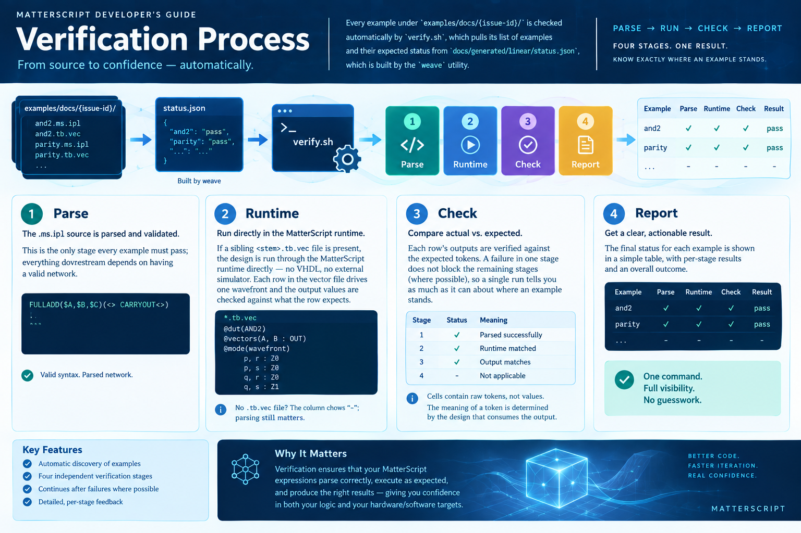

## Verification Process



Every example under `examples/docs/{issue-id}/` is checked automatically by
`verify.sh`, which pulls its list of examples and their expected status from
`docs/generated/linear/status.json`, which is built by the `weave` utility.
Each example advances through up to four independent stages.
A stage that finds nothing to do reports `-`
rather than pass or fail, and a failure at one stage does not block the
stages after it from being attempted where possible, so a single run
tells you as much as it can about where an example stands.

### The four stages

**1. Parse.** The `.ms.ipl` source is parsed and validated. This is the
only stage every example must pass; everything downstream depends on
having a valid network.

**2. Runtime.** If a sibling `<stem>.tb.vec` file is present next to the
`.ms.ipl` source, the design is run through the MatterScript runtime
directly — no VHDL, no external simulator. The vector file declares input
and output columns and a table of rows; each row is driven into the
parsed network as one wavefront, and the resulting output values are
checked against what the row expects. A design with no `.tb.vec` file
shows `-` in this column: parsing correctly is still meaningful on its
own, but nothing has verified its behavior.

Cells in a vector row are **raw tokens**: the token driven on an input
place, or the token expected on an output place. There is no
value↔symbol mapping layer — if the design uses `p`/`q` for a dual-rail
wire, the vectors use `p`/`q`, and it is the DUT author's convention
that those tokens mean "0" and "1". This keeps the testbench pure: it
exercises the expression in the vocabulary the expression already
speaks, and the meaning of a token is decided by whoever consumes the
output.

A minimal vector file for `AND2` looks like this:

```
@dut(AND2)
@vectors(A, B : OUT)
@mode(wavefront)

p, r : Z0
p, s : Z0
q, r : Z0
q, s : Z1
```

`@dut` names the definition under test (optional — it defaults to the
first definition in the network). `@vectors` declares the input and
output columns and must precede the rows. Each subsequent line is one
row, one wavefront. A `-` in an output cell means "don't check this
output". A row can assert `!stall`, meaning the wavefront is expected
to never complete — the correct behavior for an input combination the
design deliberately leaves unresolved.

### Streaming a sequence of tokens

A single-row-per-wavefront testbench is fine for a combinational design,
but a state machine wants to be fed a *sequence*: one bit at a time, with
the design's state carried from each wavefront into the next. That is
what `@stream` provides.

The problem it solves is this. A state machine like a parity detector
has a state (`E` or `O`) and an input bit (`0` or `1`), and on each
wavefront it consumes one bit and produces the next state. To feed it a
bit stream `1, 1, 0, 1`, you need the first row to seed the state
explicitly, and every row after that to take its `state` input from
whatever the previous row's `next` output was. Writing that by hand
means transcribing each intermediate state into the next row, which is
exactly the kind of bookkeeping a testbench should do for you.

`@stream` plus `@carry` does that bookkeeping. `@carry(input=output)`
declares that the named input column is fed from the named output column
of the previous row. A cell written as `_` in that input column means
"use the carried value here" rather than a literal token. The first row
still needs a literal seed for any carried column, because there is no
previous row to pull from.

A parity detector and its stream vectors:

```
PARITY[(state<> bit<>)($next)
  $state$bit() :
  E,0[next<E>]
  E,1[next<O>]
  O,0[next<O>]
  O,1[next<E>]
]
```

```
@dut(PARITY)
@vectors(state,bit : next)
@carry(state=next)
@stream()

E,1 : O
_,1 : E
_,0 : E
_,1 : O
```

Read row by row:

- **Row 1** seeds `state=E` and drives `bit=1`. The table says `E,1` produces
  `next=O`, and the row expects `O`. Row 1's actual output becomes the
  carried value for the next row.
- **Row 2** writes `_` for `state`, meaning "take it from `@carry(state=next)`"
  — that is, from row 1's `next`, which was `O`. So `state=O`, `bit=1`,
  which produces `next=E`. The row expects `E`.
- **Row 3** carries `E` forward, drives `bit=0`, produces `next=E`.
- **Row 4** carries `E` forward, drives `bit=1`, produces `next=O`.

The sequence of bits tested is `1, 1, 0, 1`, and the state moves along
the stream without the vector author ever writing an intermediate state
name. This is what "a state-dependent read/test head moving along the
stream" means: the head is the pair `(state, bit)` being read from the
stream at each step, and `@carry` keeps the state half of that head
synchronized with where the previous step left it.

Two parse-time checks make a silently-broken carry loud rather than
silent, which matters because a carry that fails to thread is otherwise
indistinguishable from a correct run until the rows after it start
mismatching:

- A `_` in a column with no matching `@carry(input=…)` is rejected at
  parse time — there is nothing to pull from, so the row could never run.
- A `@carry` whose target is not an output column of the DUT, or whose
  source is not an input column, is rejected before any row runs, so a
  typo in the mapping is caught as a testbench error rather than as a
  mysterious mid-stream stall.

The runtime then carries the *actual* output of each completed wavefront
forward, not the expected value, so a row whose output is `-`
(don't-check) still threads its real result into the next row. `!stall`
is not supported under `@stream` today, because a stalled wavefront
leaves the carry state undefined.

**3. GHDL (VHDL emission and analysis).** The parsed network is emitted
as VHDL and run through GHDL's analyzer. This checks that the design
translates to synthesizable VHDL and that GHDL accepts it, independent
of what the design actually computes.

**4. Simulate.** If simulation is requested for the issue, the emitted
VHDL is run through a GHDL simulation and its output is checked. This is
the closest stage to a full hardware-equivalent run, at the cost of
being the most indirect way to catch a bug in the network itself — a
failure here can originate in the network, the emitter, or the
simulation harness.

### Reading a result

An example's overall `result` column reflects whether every stage that
was expected to pass, did. Expectations come from Linear's tracked
status (`Implemented`, `Partial`, `Spec Only`, and so on) crossed with
whether simulation was requested:

- **✅ PASS** — parse, runtime (if present), GHDL, and simulation (if
  requested) all succeeded, matching an `Implemented` expectation.
- **❌ FAIL** — a stage that was expected to pass, didn't.
- **⬛ expected fail** — a stage failed, but that failure was itself the
  expected outcome (for example, an issue tracked as `Partial` whose
  known-incomplete feature causes GHDL to reject it).
- **🟡 unexpected pass** — everything passed, but Linear's tracked status
  didn't expect it to (commonly a `Partial` or `Spec Only` issue whose
  example happens to already work). This isn't a failure; it's a signal
  that the tracked status may be stale and worth revisiting.

### Current results

```
Issue    example                          expected     parse runtime    ghdl  simulate   result
-------------------------------------------------------------------------------------------------
TAG-112  mobius_ring.ms.ipl               Partial      ok    -          FAIL  -          ⬛ expected fail
TAG-129  example-12.19.ms.ipl             Implemented  ok    ok 8/8     FAIL  FAIL       ❌ FAIL
TAG-130  example-12.1.ms.ipl              Implemented  ok    ok 8/8     ok    FAIL       ❌ FAIL
TAG-136  example-12.45.ms.ipl             Implemented  ok    ok 14/14   ok    -          ✅ PASS
TAG-137  example-12.41.ms.ipl             Implemented  ok    ok 4/4     ok    -          ✅ PASS
TAG-138  example-12.40.ms.ipl             Implemented  FAIL  -          -     -          ❌ FAIL
TAG-142  example-12.3.ms.ipl              Partial      ok    -          ok    -          🟡 unexpected pass
TAG-143  example-12.2.ms.ipl              Implemented  ok    ok 4/4     ok    -          ✅ PASS
TAG-147  example-12.13.ms.ipl             Implemented  ok    -          ok    -          ✅ PASS
TAG-148  example-12.11.ms.ipl             Implemented  ok    ok 8/8     ok    FAIL       ❌ FAIL
TAG-149  example-12.9.ms.ipl              Spec Only    ok    -          FAIL  -          ⬛ expected fail
TAG-151  example-12.17.ms.ipl             Partial      ok    -          ok    -          🟡 unexpected pass
TAG-153  example-12.8.ms.ipl              Implemented  ok    -          ok    -          ✅ PASS
TAG-160  example-12.33.ms.ipl             Implemented  ok    -          ok    -          ✅ PASS
TAG-163  example-12.36.ms.ipl             Implemented  ok    -          ok    -          ✅ PASS
TAG-177  example-12.26.ms.ipl             Implemented  ok    ok 8/8     ok    -          ✅ PASS
TAG-180  example-12.10.ms.ipl             Implemented  ok    ok 20/20   FAIL  -          ❌ FAIL
TAG-181  example-12.11.ms.ipl             Implemented  ok    ok 4/4     ok    -          ✅ PASS
TAG-184  example-12.24.ms.ipl             Implemented  ok    ok 8/8     ok    -          ✅ PASS
TAG-185  case-unique-signals.ms.ipl       Implemented  ok    -          ok    -          ✅ PASS
TAG-187  generate_syntax.ms.ipl           Implemented  ok    -          ok    -          ✅ PASS
TAG-189  example-12.14-arbitration.ms.ipl Implemented  ok    -          ok    -          ✅ PASS
TAG-190  example-12.5.ms.ipl              Implemented  ok    -          ok    -          ✅ PASS
TAG-192  entity_labeling.ms.ipl           Partial      ok    -          ok    -          🟡 unexpected pass
TAG-196  cube.ms.ipl                      Implemented  ok    -          FAIL  -          ❌ FAIL
TAG-198  example-12.25.ms.ipl             Implemented  ok    ok 8/8     ok    -          ✅ PASS
TAG-200  dual-rail.ms.ipl                 Partial      ok    ok 4/4     ok    -          🟡 unexpected pass
TAG-201  combustion-reaction.ms.ipl       Partial      ok    -          ok    -          🟡 unexpected pass
TAG-207  example-12.35.ms.ipl             Implemented  ok    -          ok    -          ✅ PASS
TAG-210  rule30.ms.ipl                    -            ok    -          ok    -          🟡 unexpected pass
TAG-211  example-12.18-bundling.ms.ipl    Partial      ok    -          FAIL  -          ⬛ expected fail
TAG-212  and3.ms.ipl                      Implemented  ok    ok 8/8     ok    -          ✅ PASS
TAG-217  parity.ms.ipl                    Implemented  ok    ok 4/4     ok    -          ✅ PASS
-------------------------------------------------------------------------------------------------
21 ok, 12 unexpected
```

The runtime stage now exercises seven examples: TAG-143, TAG-177,
TAG-136, TAG-148, TAG-180, TAG-198, TAG-200, TAG-212, and TAG-217 —
covering combinational logic, a full adder, a code detector, a dual-rail
network, an AND3, and the parity stream test that motivated `@stream`.
Every `Implemented` example that has a `.tb.vec` currently passes its
runtime stage. Writing a `.tb.vec` for more of the `Implemented`
examples — and especially for the `❌ FAIL` rows where the runtime stage
is still `-` — is the most direct way to find out whether a failure is
in the network itself or in VHDL emission/simulation, since the runtime
stage checks the design's behavior without going through either.

---
