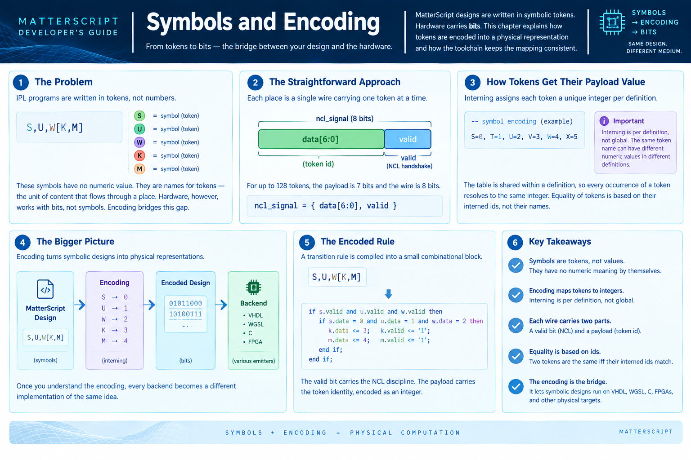

# Symbols and Encoding


By this point in the pipeline, the design has been parsed, its
transitions analyzed, its places placed, and its delays inserted. What
remains is to turn it into something a physical medium can carry — bits
on a wire, gates in silicon, memory cells on a chip. That step is where
IPL's symbolic vocabulary has to be reconciled with the fact that
hardware doesn't know what a symbol means.

This chapter is about that reconciliation. It's not a chapter about any
particular backend; it's about the conceptual bridge every backend has
to cross. Once the bridge is understood, the VHDL emitter, the WGSL
emitter, the C generator, and the FPGA synthesizer all become readable
as variations on one theme.

## The problem

IPL programs are written in tokens. A transition rule might be:

```
S,U,W[K,M]
```

`S`, `U`, `W`, `K`, and `M` are all symbols. They have no numeric value.
They don't stand for bits. They're names for tokens — a token being the
unit of content that flows through a place, in the same sense that a
number flows through a register or a packet flows through a wire.

So `S,U,W[K,M]` reads: *when `S`, `U`, and `W` are simultaneously valid
on their respective source places, assert `K` and `M` on their
respective destinations.* The symbols are the operands and results of a
combinational relationship, and their *names* are the only thing that
distinguishes them.

The hardware, though, wants bits. A wire carries a voltage. A memory
cell holds a small integer. A gate takes a `0` or a `1`. None of these
substrates can carry the symbol `K`. They can only carry some encoding
of it.

So there's an implicit step between "the design is correct in terms of
symbols" and "the design is correct in terms of bits". That step is
called **encoding**, and it is the subject of this chapter.

## The straightforward approach: one token per wire

The simplest encoding is also the one that's used everywhere in the
current toolchain. Each place is represented by a single wire — a
signal, in VHDL terms — and that wire carries exactly one token at a
time. The wire has two parts:

- a **valid bit**, saying whether the wire currently carries any token
  at all, and
- a **payload**, a small integer that identifies which token it carries.

For a design with at most 128 distinct tokens, the payload is 7 bits
and the whole wire is 8 bits. This is the `ncl_signal` type that the
VHDL emitter produces throughout.

```
ncl_signal = { data[6:0], valid }
```

Every place in every definition maps to exactly one such wire. A
definition with three source places and two destination places has
three input wires and two output wires. The transition rule
`S,U,W[K,M]` becomes a small combinational block that reads the three
input wires, checks that each carries the expected token, and drives
the two output wires with the appropriate tokens.

The two parts of the wire do different jobs:

- The **valid bit** carries the NCL discipline. A wire with `valid = 0`
  is empty; a wire with `valid = 1` is ready. Completeness checks,
  synchronization, and the null/data handshake all operate on the valid
  bit alone. They don't care what the payload says.

- The **payload** carries the symbolic content. It's the token's
  identity, encoded as a small integer.

Splitting the wire this way is what lets the toolchain reason about
NCL's correctness properties (completeness, mutual exclusion,
persistence) independently of what any particular token *means*. The
valid bit is the part that's about timing and synchronization; the
payload is the part that's about computation.

## How tokens get their payload value

The mapping from tokens to payload integers is called **interning**. For
each definition, the toolchain walks every place the definition mentions
and every token that could appear on it, and assigns each a distinct
integer, in first-seen order. So a definition whose first two tokens are
`K` and `L` might intern them as `K → 0`, `L → 1`. A definition whose
first tokens are `S` and `T` might intern them as `S → 0`, `T → 1`.

Interning is *per definition*, not global. This matters because two
definitions can reuse the same token name — say both use `S` to mean
something — and there's no reason for them to agree on a numeric value.
Each definition is its own scope; each has its own table.

Within a definition, though, the table is *shared*. Every place the
definition mentions resolves tokens against the same table. If `S`
appears as a fill in one rule and as a key in another, both occurrences
go through the same interning step and produce the same integer. This is
what makes equality of tokens meaningful: two tokens are the same iff
their interned ids are the same.

The interning table is emitted alongside the design, usually as a
comment. For a small definition it might look like:

```vhdl
-- symbol encoding: S=0, T=1, U=2, V=3, W=4, X=5
```

This comment is not decoration. It's the specification of the encoding.
If you read the emitted VHDL and see `data_value(3)`, you can look up
that `3` in the symbol encoding and know the token is `V`.

## What an encoded rule looks like

Once tokens have payloads and places have wires, a transition rule
becomes a small combinational expression over those wires. For the
FULLADD definition's rule

```
S,U,W[K,M]
```

the emitted logic is roughly:

```
K_valid  <= valid_of(S) and valid_of(U) and valid_of(W)
K_data   <= data_value(0)      -- K's interned id
M_valid  <= valid_of(S) and valid_of(U) and valid_of(W)
M_data   <= data_value(1)      -- M's interned id
```

In practice it's wrapped in a `process` that also handles the
dispatch-table structure of the definition, but the essential shape is
what you see: the rule's *guard* is a conjunction of valid bits on the
source places, and the rule's *result* is the interned id of the token
being written, presented on the destination's payload.

This is what makes the encoding work. `S`, `U`, `W`, `K`, `M` become
small integers, and those integers travel as payloads on the wires
between places. Nothing downstream needs to remember that `K` was
originally a symbol; it just needs to know that the wire carries
integer `0`.

## What the encoding preserves, and what it loses

Encoding preserves **identity**. Two places that ought to be carrying
the same token will carry the same integer. Two places that ought to be
carrying different tokens will carry different integers. Equality of
integers is the correct notion of equality of tokens.

Encoding *loses* **meaning**. The integer `0` doesn't mean anything. It
isn't "false", it isn't "0", it isn't "the absence of something". It's
the id of whatever token was interned first in this definition's table.
The same definition might use `0` for `K` in one compilation and for
`S` in another, depending on the order the tokens happen to appear.

This is fine, because the design doesn't depend on the meaning of any
token. It only depends on tokens being distinguishable, and on rules
firing when their guard tokens are present.

The consequence is that **you cannot test a design by inspecting its
encoded form alone**. A signal carrying `data_value(0)` doesn't tell you
whether the design is computing 0 or K or any other symbol — it tells
you the design interned *some* token as `0`. To know which token, you
consult the symbol encoding table. To know whether the design is
correct, you run it and compare the emitted tokens against expected
tokens, symbolically. This is what the testbench does: it drives
symbolic tokens in, checks symbolic tokens out, and lets the encoding
remain an internal detail.

## Where the encoding boundary sits

The encoding is not applied all at once at the end of the pipeline. It
is applied at the boundary between the *symbolic* world and the
*physical* world, and that boundary is different for each backend:

- For **VHDL emission**, the encoding happens at the moment of emission.
  The parser has already produced an AST full of symbols; the VHDL
  emitter walks that AST and translates each symbol into a wire value.
  The result is VHDL that speaks in `data_value(N)` and `valid_of(X)`.

- For the **testbench runtime**, the encoding happens at the moment a
  token is asserted on a place. The testbench receives a symbolic token
  from the vector file (say `K`), looks it up in the definition's
  interning table, and stores the integer in the environment. When it
  reads an output back, it does the reverse lookup.

- For **FPGA synthesis**, the encoding happens once, during the
  front-end translation from IPL to whatever intermediate representation
  the synthesis tool wants. Symbols become integers become signals
  become LUTs.

- For **WGSL emission**, the encoding can be much lighter — a WGSL
  integer can hold a token id directly, so the "valid bit" and
  "payload" distinction collapses into a single integer where `0` might
  mean "empty" and everything else means "carrying that token".

In every case, the *shape* of the encoding is the same: symbols become
small integers; wires carry the integers; the mapping is local to each
definition.

## Optimizations and where they live

The straightforward encoding — 8-bit wires, one per place — is what the
current toolchain uses everywhere. It is uniform, it is correct, and it
is worth understanding as the baseline.

There are two optimizations that are natural extensions of it, and it's
useful to know where they'd fit, even though the toolchain doesn't use
them yet.

**Binary narrowing.** When a place's vocabulary is known to be exactly
`{0, 1}`, its payload can be dropped to a single bit, and the wire
becomes 2 bits (one data + one valid) instead of 8. This saves area and
power in silicon. It does not change behavior. It's a purely local
transformation — a definition whose only tokens are `0` and `1` can be
narrowed definition-by-definition, and the surrounding design doesn't
need to know.

**Bundling.** When a logical value is inherently wider than one token —
say, an 8-bit integer that's meant to be a single value rather than
eight independent booleans — the natural encoding is a *bundle*: several
wires whose union carries the value, with the value split across them
as bits. This is a different representational choice, not just an
optimization. It changes the port list, the completeness rules, and the
testbench syntax. It's the right model when the design has places that
are meant to carry multi-bit values as single units, and it's not
needed when every place carries a single symbolic token.

Both of these live *after* encoding, in the sense that the encoding step
produces a value and the optimization step chooses how many wires carry
that value. They are worth thinking about when you're designing a
backend, but they're not part of the core translation from symbols to
bits. The core translation is: one place, one wire, one interned id.

## Why this is worth knowing as a programmer

If you write IPL, you'll eventually read the emitted VHDL, or the
emitted C, or a waveform dump from a simulation, and you'll see
`data_value(3)` or `token 3` or a signal that should be carrying `K`
but is carrying an integer you don't recognize. This chapter is what
lets you read those artifacts. The integer is `K`'s interned id. The
comment at the top of the file tells you the mapping. The design doesn't
know or care that you once called it `K`.

More importantly, understanding the encoding explains a subtle property
of the whole system: **the design's behavior is independent of its
encoding**. Two compilations of the same IPL that intern tokens in
different orders produce VHDL with different integer constants, but
the same behavior. Two backends that use different wire types produce
different physical artifacts, but the same behavior. The encoding is an
implementation detail of the translation from symbols to substrate, and
the design's meaning lives above it, in the symbols.

That's the property that makes IPL portable. It's what lets the same
program run on VHDL, on WGSL, on POSIX, and on an FPGA, with the same
results. And it's what makes the compiler's job well-defined: translate
each symbol to its interning id, translate each place to its wire, and
let the surrounding design do the rest.

