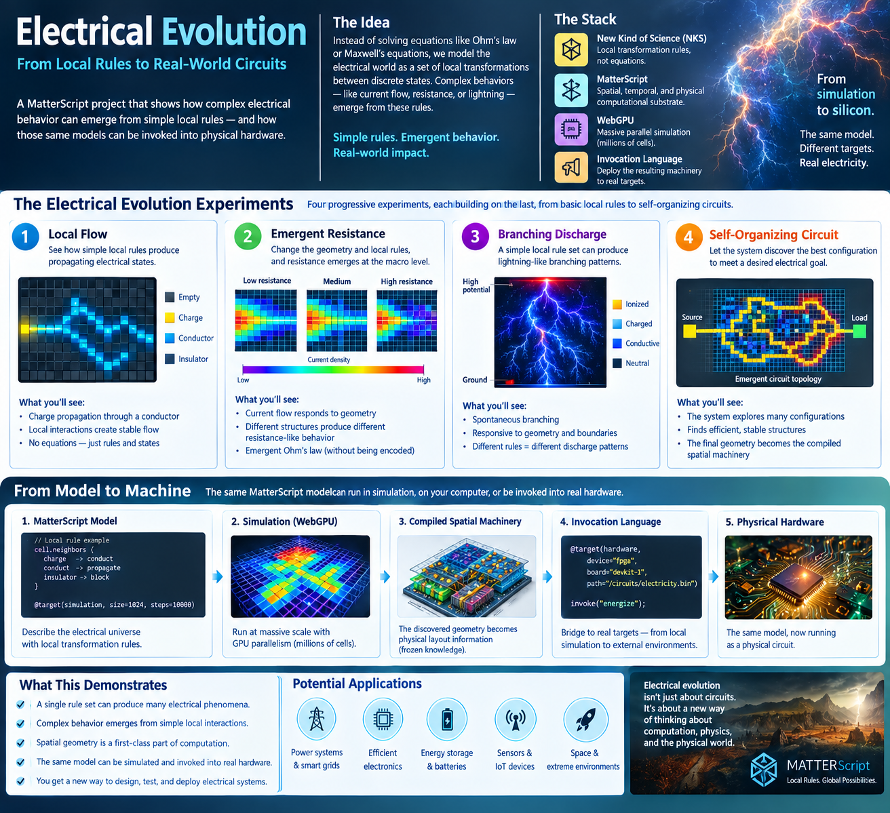

# Electrical Evolution



## From Local Rules to Real-World Circuits

Electricity is one of the places where conventional computation and physical reality have become deeply entangled.

We normally describe electrical systems through equations: Ohm's law, Kirchhoff's laws, Maxwell's equations, circuit models, differential equations, and numerical solvers. These descriptions are extraordinarily useful, but they begin with the behavior we want to describe and construct an abstract mathematical model of it.

MatterScript suggests another approach:

> **Don't begin with the equations. Begin with the local transformations.**

Instead of explicitly programming voltage, current, resistance, or electromagnetic fields, construct a computational universe in which small discrete elements interact according to simple neighborhood rules. Then observe what larger-scale electrical behavior emerges.

This makes electricity an ideal experimental domain for combining **New Kind of Science**, **MatterScript**, **WebGPU**, and the **Invocation Language**.

---

## The Electrical Universe

Imagine an electrical substrate composed of discrete places. Each place has a small state and interacts only with its local neighborhood.

A simplified universe might contain states such as:

```text
EMPTY
CHARGE
CONDUCTOR
INSULATOR
FIELD
DISCHARGING
```

The behavior of the system is determined not by a global equation, but by local transformations.

Conceptually:

```text
             neighborhood
                  │
                  ▼
        ┌──────────────────┐
        │  local rule      │
        │                  │
        │ state + neighbors│
        └────────┬─────────┘
                 │
                 ▼
             next state
```

The important property is locality.

A place does not need to know the state of the entire electrical system. It only needs to respond to the nearby places with which it can interact.

This is the same fundamental idea used throughout MatterScript: **global behavior is allowed to emerge from local causality.**

---

## 1. Local Flow

The first experiment is deliberately simple.

Place a source at one boundary and a sink at another. Populate the space with conductive and insulating regions and establish local rules governing propagation.

```text
SOURCE
  │
  ▼
┌───┬───┬───┬───┬───┐
│   │ → │ → │   │   │
├───┼───┼───┼───┼───┤
│   │ → │ → │ → │   │
├───┼───┼───┼───┼───┤
│   │   │ → │ → │   │
└───┴───┴───┴───┴───┘
                  │
                  ▼
                LOAD
```

No instruction says:

```text
current = voltage / resistance
```

Instead, the local rules determine how an electrical state propagates from place to place.

The first question is simply:

> **Can stable electrical flow emerge from local transformations?**

If it can, we have created the beginnings of an electrical computational universe without directly encoding the conventional abstraction of a circuit.

---

## 2. Emergent Resistance

The next experiment changes the geometry.

Introduce different arrangements of conductive and insulating places. Measure the resulting flow between the same source and sink.

For example:

```text
Low resistance

SOURCE ───────────────── LOAD


Medium resistance

SOURCE ────────┐
               └───────── LOAD


High resistance

SOURCE ────┐
           │
           └───┐
               └──────── LOAD
```

The local rules have not necessarily changed.

The **geometry** has.

If the resulting macroscopic behavior exhibits a stable relationship between the imposed conditions and the observed flow, we have something very interesting:

> **Resistance has emerged from local interactions and spatial structure.**

We did not need to encode Ohm's law as the governing rule.

Ohm-like behavior becomes something we **observe** in the larger-scale system.

This is a fundamental distinction.

Traditional modeling often starts with:

```text
equation → simulation → behavior
```

The MatterScript experiment starts with:

```text
local rules → spatial evolution → behavior → measurement
```

The equation, if one appears, becomes a description of the observed behavior rather than the thing that generated it.

---

## 3. Branching Discharge

The third experiment moves from ordinary circuit behavior into phenomena that are naturally spatial.

Consider a highly charged region separated from ground:

```text
             HIGH POTENTIAL
                   │
                   │
                   ?
                   │
                   │
                 GROUND
```

Give each place simple rules describing charging, ionization, conduction, and discharge.

Now let the system evolve.

We do not specify the shape of the discharge.

We do not tell the system to draw a lightning bolt.

We provide the local transformations and the boundary conditions.

If branching occurs, the familiar structure of lightning becomes an **emergent spatial pattern**.

```text
                 /
                /
        ───────●
              / \
             /   \
            /     ───
           /
      ────●
```

Change the local rule and the branching morphology may change.

Change the geometry and the preferred paths may change.

Change the boundary conditions and the entire pattern may reorganize.

This is precisely the kind of experiment associated with a **New Kind of Science** approach:

> **A complex natural phenomenon may be the large-scale consequence of remarkably simple local rules.**

The objective is not necessarily to reproduce every detail of physical lightning immediately. The objective is to discover what kinds of electrical structures can emerge from small computational rules.

---

## 4. Self-Organizing Circuits

The fourth experiment reverses the normal circuit-design process.

Instead of designing a circuit and then simulating it, give the system a desired electrical behavior and allow the spatial system to search for configurations that produce it.

For example:

```text
SOURCE ───────────────── LOAD
```

is the requirement.

The internal geometry is unknown.

The system explores possible arrangements of conductive, insulating, and stateful regions:

```text
┌───────────────────────────────┐
│ ███   ··· ████   ···         │
│   ████      ███   ███        │
│ ···   ███      █████          │
│      ███████        ███       │
│ ███       ███████████         │
└───────────────────────────────┘
```

The resulting topology might look nothing like a conventional circuit diagram.

That is not a failure.

It is the point.

The system is not being asked to reproduce a human-designed circuit. It is being asked to discover a spatial organization capable of producing the desired behavior.

This raises a deeper question:

> **Can computation discover electrical machinery rather than merely calculate its behavior?**

---

# WebGPU: Scaling the Electrical Universe

A major advantage of this approach is that local rules are naturally parallel.

A conventional numerical simulation may ask a processor to repeatedly solve large systems of equations.

A MatterScript electrical universe can instead be represented as a large collection of places:

```text
┌───┬───┬───┬───┬───┬───┐
│   │   │   │   │   │   │
├───┼───┼───┼───┼───┼───┤
│   │   │   │   │   │   │
├───┼───┼───┼───┼───┼───┤
│   │   │   │   │   │   │
├───┼───┼───┼───┼───┼───┤
│   │   │   │   │   │   │
└───┴───┴───┴───┴───┴───┘
```

Each place can apply the same neighborhood transformation independently.

This maps naturally onto the grid and texture architecture of a GPU.

Instead of thinking:

> **Solve one enormous equation.**

we can think:

> **Apply one local transformation to millions of places simultaneously.**

WebGPU therefore provides a practical computational substrate for exploring large MatterScript universes.

The scale is important because many interesting physical phenomena are not visible in a tiny system. Large-scale structures emerge only after many local interactions have had an opportunity to interact.

---

# From Model to Machine

This is where the experiment becomes specifically **MatterScript**, rather than merely another cellular-automata simulation.

The computational model can progress through several representations:

```text
       Local rules
            │
            ▼
       MatterScript
            │
            ▼
     WebGPU simulation
            │
            ▼
   Emergent spatial structure
            │
            ▼
   Compiled spatial machinery
            │
            ▼
     Invocation Language
            │
            ▼
       Physical target
```

The crucial idea is that the simulation and the deployed machinery do not have to be unrelated programs.

The same description can have different targets.

A simulation target can be used to explore the behavior.

A computational target can be used to execute the resulting machinery.

A hardware target can potentially turn the spatial organization into a physical implementation.

The model therefore does not merely describe a circuit.

**It can become the machinery from which the circuit is constructed.**

---

# Invocation: From Simulation to Silicon

The Invocation Language provides the boundary between the MatterScript computational universe and an external target.

Conceptually:

```text
@target(...)
```

does not simply mean:

> "Run this program somewhere else."

It establishes a relationship between the spatial machinery described by MatterScript and another computational environment.

This opens the possibility of a progression such as:

```text
MatterScript model
       ↓
simulation
       ↓
discover behavior
       ↓
freeze spatial organization
       ↓
compile machinery
       ↓
invoke target
       ↓
physical electrical system
```

The important concept here is **placement**.

When a spatial arrangement has been discovered and compiled, its geometry can become a form of frozen knowledge.

Instead of repeatedly calculating the same relationships at runtime, the relationships themselves become part of the machinery.

This is one reason electrical systems are such an interesting target for MatterScript: **electrical behavior is inherently spatial.**

---

# Simulation and Reality as Different Targets

The same computational description can therefore be viewed through different targets:

```text
                 MATTERSCRIPT
                      │
             local transformations
                      │
          ┌───────────┴───────────┐
          │                       │
      SIMULATION               HARDWARE
          │                       │
      observe                  operate
      measure                  physically
          │                       │
          └───────────┬───────────┘
                      │
                 same machinery
```

The simulation is not necessarily the final product.

It is one environment in which the machinery can be explored.

The hardware is another environment in which that machinery can exist.

This suggests a different relationship between simulation and engineering:

> **Simulation can become a stage in the compilation of physical machinery.**

---

# What This Demonstrates

The Electrical Evolution project is valuable not because it replaces electrical engineering overnight, but because it demonstrates a different way of asking electrical questions.

### A single local rule set may produce many macroscopic phenomena.

Rather than creating a separate mathematical abstraction for every phenomenon, we can search for simple transformations capable of producing families of behaviors.

### Complex electrical behavior can emerge from simple interactions.

Flow, resistance, breakdown, oscillation, branching, and other structures can become things we observe rather than things we explicitly prescribe.

### Geometry becomes part of computation.

A circuit is not merely a collection of equations. Its physical arrangement affects what it can do.

MatterScript makes that arrangement computationally explicit.

### Massive parallelism becomes natural.

A neighborhood rule can be applied simultaneously across millions of places, making GPU architectures particularly appropriate for these experiments.

### Discovery and deployment can become connected.

The spatial organization discovered during computation can potentially become compiled machinery rather than merely a visualization of a solution.

### Invocation provides the bridge.

The computational universe does not have to end at the simulation boundary.

The same machinery can be directed toward different computational and physical targets.

---

# Beyond Circuits

Once this framework exists, the electrical experiments can expand considerably.

The same approach can investigate:

```text
Ohm-like behavior
       ↓
Kirchhoff-like conservation
       ↓
RC dynamics
       ↓
Inductive behavior
       ↓
Directional conduction
       ↓
Transistor-like interaction
       ↓
Oscillation
       ↓
Transmission phenomena
       ↓
Electrical breakdown
       ↓
Branching discharge
       ↓
Network dynamics
       ↓
Self-organizing circuits
```

The objective is not to encode each phenomenon independently.

The more interesting objective is to discover whether **families of electrical behavior can emerge from a comparatively small computational universe.**

That is the New Kind of Science question applied to electricity.

---

# The Larger Experiment

Electrical Evolution ultimately asks a question that extends beyond electrical engineering:

> **Can a physical system be understood as a computational universe of local transformations, and can the resulting computational machinery be invoked back into the physical world?**

If the answer is yes, then the boundary between simulation, programming, and physical construction begins to change.

Traditional engineering often follows:

```text
physical phenomenon
        ↓
mathematical model
        ↓
numerical simulation
        ↓
engineering design
        ↓
physical implementation
```

MatterScript proposes an alternative path:

```text
physical phenomenon
        ↓
local transformations
        ↓
spatial computational universe
        ↓
emergent behavior
        ↓
compiled spatial machinery
        ↓
invocation
        ↓
physical implementation
```

The difference is subtle but fundamental.

**The equations describe the behavior.**

**The rules generate the behavior.**

And in MatterScript, the spatial organization generated by those rules can itself become a form of computation.

> **Local rules. Global behavior. Physical machinery.**

*Drafting in progress...*
