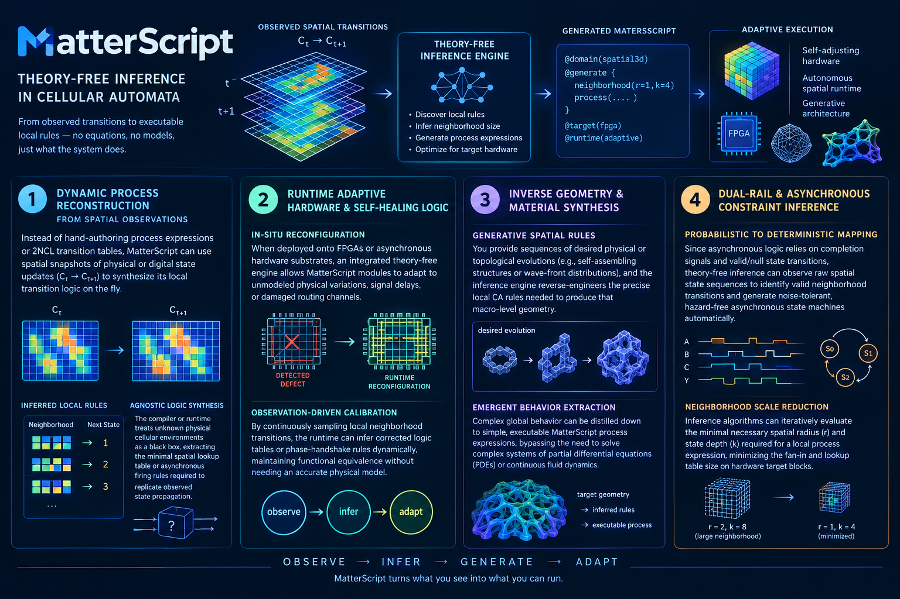

# Model-Free Inference

Theory-free (or model-free) inference in Cellular Automata (CA) involves discovering local update rules directly from observed spatial transitions, without assuming pre-existing equations, continuous physics, or domain models. Integrating this directly into **MatterScript**—where asynchronous computation, process expressions, and physical geometry merge—opens up powerful paradigms for self-adjusting hardware, autonomous spatial runtime, and generative architecture.

**1. Dynamic Process Reconstruction from Spatial Observations**

* **Observed State to Invocation Syntax:** Instead of hand-authoring process expressions or 2NCL (Null Convention Logic) transition tables, MatterScript can use spatial snapshots of physical/digital state updates ($C_t \rightarrow C_{t+1}$) to synthesize its local transition logic on the fly.
* **Agnostic Logic Synthesis:** The compiler or runtime can treat unknown physical cellular environments as a black box, extracting the minimal spatial lookup table or asynchronous firing rules required to replicate observed state propagation.

**2. Runtime Adaptive Hardware & Self-Healing Logic**

* **In-Situ Reconfiguration:** When deployed onto FPGAs or asynchronous hardware substrates, an integrated theory-free engine allows MatterScript modules to adapt to unmodeled physical variations, signal delays, or damaged routing channels.
* **Observation-Driven Calibration:** By continuously sampling local neighborhood transitions, the runtime can infer corrected logic tables or phase-handshake rules dynamically, maintaining functional equivalence without needing an accurate physical model of the underlying hardware defect.

**3. Inverse Geometry & Material Synthesis**

* **Generative Spatial Rules:** In MatterScript, where spatial geometry directly drives computational processes, theory-free inference enables "target-driven" design. You provide sequences of desired physical or topological evolutions (e.g., self-assembling structures or wave-front distributions), and the inference engine reverse-engineers the precise local CA rules needed to produce that macro-level geometry.
* **Emergent Behavior Extraction:** Complex global behavior can be distilled down to simple, executable MatterScript process expressions, bypassing the need to solve complex systems of partial differential equations (PDEs) or continuous fluid dynamics.

**4. Dual-Rail & Asynchronous Constraint Inference**

* **Probabilistic to Deterministic Mapping:** Since asynchronous logic relies on completion signals and valid/null state transitions, theory-free inference can observe raw spatial state sequences to identify valid neighborhood transitions and generate noise-tolerant, hazard-free asynchronous state machines automatically.
* **Neighborhood Scale Reduction:** Inference algorithms can iteratively evaluate the minimal necessary spatial radius ($r$) and state depth ($k$) required for a local process expression, minimizing the fan-in and lookup table size on hardware target blocks.

*Drafting in progress...*
