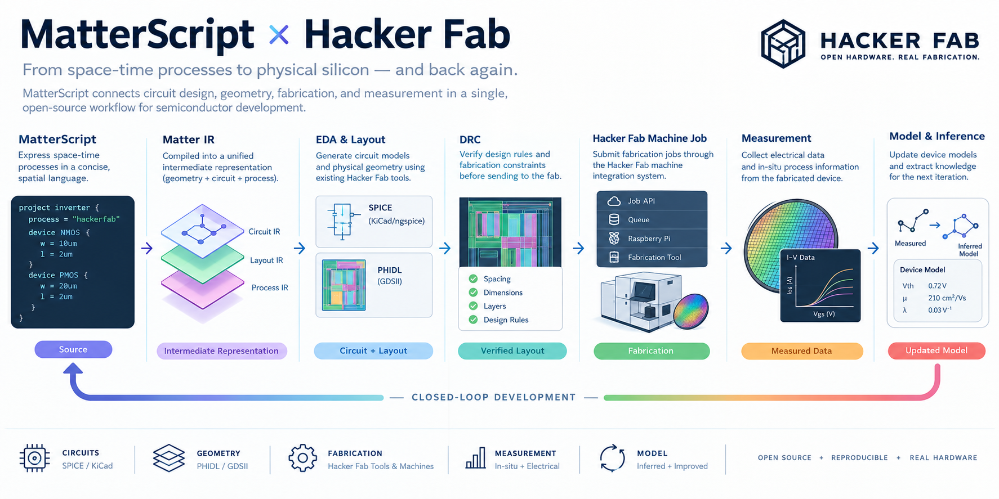

# MatterScript and the Hacker Fab: Spatial Hardware Synthesis and Fabrication Integration



MatterScript is designed around a premise that becomes especially powerful when applied to the Hacker Fab:

> **Physical structure is part of computation.**

The Hacker Fab is an open-source semiconductor fabrication ecosystem whose goal is to make semiconductor fabrication accessible, reproducible, inexpensive, and understandable from first principles. Its workflow already spans electronic design automation, mask generation, fabrication tools, process development, device modeling, packaging, and electrical characterization. The project explicitly emphasizes rapid iteration, documentation, simple designs, in-situ sensing, and eventually a closed-loop process from wafer fabrication through measurement.

MatterScript provides a natural computational language for this environment because its fundamental abstraction is neither the conventional software function nor the conventional circuit schematic.

It is the **space-time process**.

A MatterScript description can represent:

* where computational elements exist,
* how they are connected,
* how events propagate,
* how physical geometry constrains behavior,
* how local state changes,
* how measurements become inputs,
* and how a physical process can be represented as a computation.

The Hacker Fab integration therefore does not treat MatterScript as another FPGA programming language.

Instead, MatterScript becomes a **spatial intermediate language connecting semiconductor design, fabrication, machine automation, and measurement.**

```text
                         MatterScript
                              │
                    Space-Time Model
                              │
          ┌───────────────────┼───────────────────┐
          │                   │                   │
          ▼                   ▼                   ▼
      Circuit IR          Geometry IR        Process IR
          │                   │                   │
          ▼                   ▼                   ▼
      SPICE/KiCad       PHIDL / GDSII       Fab Jobs
          │                   │                   │
          └──────────────┬────┴───────────────────┘
                         ▼
                  Hacker Fab Process
                         │
              ┌──────────┴──────────┐
              ▼                     ▼
        Fabricated Device       Metrology
              │                     │
              └──────────┬──────────┘
                         ▼
                  Measured Data
                         │
                         ▼
                  Model / Inference
                         │
                         └──────────────↺
```

This creates the possibility of treating the entire fab as a programmable computational system.

---

# 1. The Hacker Fab as a Computational Substrate

The Hacker Fab's stated objective is not simply to reproduce conventional semiconductor manufacturing.

Its design philosophy emphasizes inexpensive tools, simple designs, reproducibility, first-principles understanding, and rapid iteration. The documentation explicitly identifies fast hardware development and closed-loop operation as important design goals.

That philosophy closely matches MatterScript.

Traditional semiconductor design separates the workflow into specialized tools:

```text
Schematic
   ↓
Simulation
   ↓
Layout
   ↓
DRC
   ↓
Mask
   ↓
Fabrication
   ↓
Measurement
```

Each stage has its own representation.

MatterScript proposes a different architecture:

```text
                 MatterScript
                      │
              spatial process model
                      │
        ┌─────────────┼─────────────┐
        ▼             ▼             ▼
     circuit       geometry       process
        │             │             │
        ▼             ▼             ▼
      SPICE         GDSII        machine job
        │             │             │
        └─────────────┼─────────────┘
                      ▼
                  fabricated
                    device
                      │
                      ▼
                   measured
                      │
                      ▼
                  new state
```

The representations still exist.

MatterScript simply establishes a common semantic layer between them.

---

# 2. The Correct Integration Boundary

MatterScript should not replace PHIDL, KiCad, ngspice, the Hacker Fab mask-generation software, or the machine-control infrastructure.

Instead, each existing tool remains responsible for the domain it already handles.

The integration boundary should look like this:

```text
MatterScript
     │
     ▼
MatterScript Intermediate Representation
     │
     ├──────────────► Circuit Backend
     │                    │
     │                    ▼
     │                 SPICE
     │
     ├──────────────► Layout Backend
     │                    │
     │                    ▼
     │              PHIDL / GDSII
     │
     ├──────────────► Fabrication Backend
     │                    │
     │                    ▼
     │             Hacker Fab Jobs API
     │
     └──────────────► Analysis Backend
                          │
                          ▼
                    Measurement Data
```

This follows the Hacker Fab's existing philosophy of using simple, composable tools rather than introducing unnecessary infrastructure.

---

# 3. MatterScript as a Spatial Intermediate Representation

The most important component of the integration is the MatterScript intermediate representation, or **Matter IR**.

A MatterScript source program describes processes:

```text
<>source
    |
    ▼
<>transform
    |
    ▼
$output
```

The compiler converts these into explicit objects:

```text
Place
Process
Token
Event
Connection
Geometry
Material
Device
Measurement
```

A simplified internal representation might look like:

```json
Cell {
    name: "inverter"
    position: (100um, 200um)
    dimensions: (40um, 20um)

    inputs:
        A

    outputs:
        Y

    devices:
        NMOS
        PMOS

    processes:
        evaluate
        discharge
        charge
}
```

The important property is that the geometry is not added later.

It exists in the intermediate representation from the beginning.

That allows the same object to be interpreted as:

* a computational process,
* a circuit,
* a physical layout,
* a fabrication structure,
* and a measurable device.

---

# 4. Mapping MatterScript to Hacker Fab EDA

The Hacker Fab already has an EDA effort divided into areas including device modeling and DRC/mask design. The mask automation work uses PHIDL and produces GDSII layouts, while the device-modeling work has explored KiCad and its embedded ngspice simulation environment.

These become the first two major MatterScript compiler targets.

```text
MatterScript
      │
      ▼
   Matter IR
      │
      ├──────────────┐
      │              │
      ▼              ▼
 Circuit IR       Layout IR
      │              │
      ▼              ▼
 KiCad/SPICE      PHIDL
      │              │
      ▼              ▼
  simulation       GDSII
```

This means that a MatterScript program could eventually describe a physical circuit once and derive both:

1. the electrical model used for simulation, and
2. the physical geometry used to fabricate it.

---

# 5. The `matter-spice` Backend

The first circuit-oriented backend should target SPICE.

The purpose of `matter-spice` is to lower MatterScript processes into a conventional electrical simulation representation.

For example:

```text
  input
    |
    ▼
 inverter
    |
    ▼
  output
```

could produce a SPICE-level representation containing:

```text
VIN
 |
 ├── PMOS
 │
 └── NMOS
 |
GND
```

The backend should generate a standard netlist rather than inventing a new simulator.

This allows Hacker Fab developers to continue using existing SPICE infrastructure.

The resulting pipeline becomes:

```text
main.ms
   │
   ▼
matter-spice
   │
   ▼
circuit.spice
   │
   ▼
ngspice
   │
   ▼
waveforms
```

The Hacker Fab device-modeling work already uses KiCad and ngspice for circuit simulation, making this a particularly natural integration point.

---

# 6. Device Models as MatterScript Components

A physical MOSFET is more than a symbol.

It has:

* geometry,
* material properties,
* process-dependent parameters,
* electrical behavior,
* fabrication constraints,
* and measured characteristics.

MatterScript can represent this as a component whose behavioral and physical descriptions are connected.

For example:

```text
device NMOS {
    geometry {
        channel_length = 10um
        channel_width  = 10um
    }

    terminals {
        gate
        source
        drain
        body
    }

    behavior {
        model = mosfet
    }
}
```

The SPICE backend can interpret `behavior`.

The layout backend can interpret `geometry`.

The fabrication backend can interpret the process requirements.

The measurement system can associate measured device data back with the same device identifier.

This produces a much stronger connection than the traditional separation between schematic symbols and physical layout cells.

---

# 7. The `matter-phidl` Backend

The second major backend should target PHIDL.

This is particularly appropriate because the Hacker Fab's mask-generation work already uses PHIDL for programmable mask design. The project has explicitly explored automated component instances, parameterized dimensions, DRC rules, and GDSII export.

MatterScript geometry can therefore map directly into PHIDL objects.

For example:

```text
device inverter {
    position = (100um, 200um)

    nmos {
        width = 10um
        length = 2um
    }

    pmos {
        width = 20um
        length = 2um
    }
}
```

could produce a PHIDL cell containing the required polygons.

Conceptually:

```text
MatterScript
      │
      ▼
   Layout IR
      │
      ▼
 matter-phidl
      │
      ▼
 PHIDL geometry
      │
      ▼
    GDSII
```

The resulting GDSII file becomes the artifact handed to the existing Hacker Fab mask workflow.

---

# 8. Geometry as a First-Class Compiler Output

This is where MatterScript differs most strongly from conventional programming languages.

Suppose the source contains:

```text
A @ (0,0)
B @ (20um,0)
C @ (40um,0)
```

A conventional compiler may regard these positions as irrelevant.

MatterScript cannot.

The positions can determine:

* transistor placement,
* routing,
* device spacing,
* proximity,
* mask geometry,
* fabrication constraints,
* process timing,
* and visualization.

The compiler should therefore preserve them:

```text
Matter IR
    │
    ├── logical graph
    │
    ├── physical coordinates
    │
    ├── device dimensions
    │
    └── layer assignments
```

The PHIDL backend can then construct the corresponding geometry.

---

# 9. DRC as a Compiler Phase

The Hacker Fab's mask automation work specifically identifies DRC as a future component of the automated layout workflow.

MatterScript should treat DRC not merely as an external post-processing step, but as a compilation phase.

The pipeline becomes:

```text
MatterScript
      │
      ▼
Layout IR
      │
      ▼
Geometry generation
      │
      ▼
DRC
      │
 ┌────┴────┐
 │         │
pass      fail
 │         │
 ▼         ▼
GDSII     compiler error
```

For example:

```text
error: NMOS source/drain spacing violation

device: M14
layer: diffusion
required: >= 4.0um
actual:    2.7um

source:
    src/amplifier.ms:184
```

This is much more useful than reporting an anonymous polygon violation.

The compiler knows **why the geometry exists**.

---

# 10. From DRC to Process Rules

The longer-term goal should be to make fabrication rules part of the MatterScript target description.

For example:

```text
@process(hackerfab-v1)

rule diffusion_spacing >= 4um
rule metal_spacing     >= 3um
rule contact_size      = 5um
```

These constraints can affect code generation before GDSII exists.

That makes fabrication constraints analogous to type constraints in a programming language.

A MatterScript program is not simply:

> syntactically valid

It must eventually be:

> physically realizable under the selected fabrication process.

---

# 11. Process-Aware Compilation

A MatterScript design should therefore identify its fabrication process.

For example:

```text
project amplifier {
    process = "hackerfab"
}
```

The compiler loads the corresponding process description:

```text
process/
├── layers
├── dimensions
├── materials
├── spacing
├── device_templates
├── fabrication_steps
└── measurement_requirements
```

The exact process schema can evolve as Hacker Fab's process documentation evolves.

This creates a clean separation:

```text
MatterScript design
        │
        ▼
process-independent model
        │
        ▼
Hacker Fab process definition
        │
        ▼
fabricatable layout
```

The same design could eventually be retargeted to different process variants.

---

# 12. Fabrication as a Build

A particularly powerful consequence is that **fabrication itself can become part of the build graph**.

Today, a software build might look like:

```text
source
  ↓
compile
  ↓
link
  ↓
binary
```

A Hacker Fab MatterScript build could look like:

```text
MatterScript
      ↓
simulate
      ↓
generate layout
      ↓
     DRC
      ↓
    GDSII
      ↓
mask artifact
      ↓
fabrication job
      ↓
fabricated wafer
      ↓
measurement
```

This does not mean that `matter build` should automatically turn on a machine.

Instead, fabrication should become an explicit artifact and job boundary:

```bash
matter build --target gds
matter verify
matter package
matter submit
```

The final `submit` operation can create a Hacker Fab machine job.

---

# 13. Integration With Hacker Fab Machine Integration

This is where the Hacker Fab's existing infrastructure becomes especially valuable.

The Hacker Fab machine-integration project already defines a generalized communication system between the web application and individual fabrication tools. The architecture uses a centralized job queue, APIs, file storage, and local Raspberry Pi controllers.

The existing model is essentially:

```text
Web Application
       │
       ▼
    Job API
       │
       ▼
   Jobs Queue
       │
       ▼
 Raspberry Pi
       │
       ▼
    Machine
```

MatterScript can become a producer of those jobs.

```text
MatterScript
       │
       ▼
Fabrication Artifact
       │
       ▼
MatterScript Job Adapter
       │
       ▼
Hacker Fab Jobs API
       │
       ▼
Machine Queue
       │
       ▼
Tool Controller
       │
       ▼
Fabrication Tool
```

This is much more aligned with the actual Hacker Fab ecosystem than attempting to introduce a completely separate hardware-runtime architecture.

---

# 14. Job Artifacts

A MatterScript fabrication job should contain both parameters and files.

For example:

```json
{
    "machine": "stepper",
    "input_parameters": {
        "design": "inverter_v3",
        "process": "hackerfab-v1",
        "wafer_id": "wafer-042",
        "orientation": "default"
    },
    "artifacts": {
        "gds": "uploads/abc123",
        "manifest": "uploads/def456"
    }
}
```

This matches the Hacker Fab machine-integration architecture, where jobs contain machine-specific input parameters and larger files can be stored externally and referenced through an object-storage key. The documented stepper workflow already uses this general pattern for transferring image files to the machine.

MatterScript should therefore reuse the same mechanism.

It should **not invent another file-transfer system**.

---

# 15. The `matter-fab` Adapter

A `matter-fab` backend can translate a MatterScript build into a Hacker Fab job.

For example:

```bash
matter fab submit \
    --machine stepper \
    --design inverter_v3
```

The adapter would:

1. validate the MatterScript project,
2. generate the required layout,
3. run DRC,
4. generate GDSII,
5. generate a fabrication manifest,
6. upload large artifacts,
7. create a machine job,
8. receive the job ID,
9. track completion.

Conceptually:

```text
matter fab submit
       │
       ├── compile
       ├── DRC
       ├── generate GDSII
       ├── upload
       └── POST /jobs
                    │
                    ▼
                 job_id
```

The Hacker Fab job system already defines concepts such as machine, status, input parameters, output parameters, timestamp, and priority.

MatterScript can preserve those concepts rather than creating parallel infrastructure.

---

# 16. Human-in-the-Loop Is a Feature

The Hacker Fab machine-integration documentation explicitly describes a deliberate human-in-the-loop design, including local GUI approval, physical controls, and offline operation.

MatterScript should preserve this property.

A submitted fabrication job should therefore have states such as:

```text
GENERATED
    ↓
VERIFIED
    ↓
QUEUED
    ↓
AWAITING_APPROVAL
    ↓
RUNNING
    ↓
COMPLETED
```

The compiler should never assume that:

```text
GDSII exists
```

means:

```text
chip is being fabricated
```

There is an important physical boundary between software intent and physical action.

MatterScript can automate the former while leaving the latter explicitly controlled.

---

# 17. The Stepper as the First Demonstration

The Hacker Fab lithography stepper is an especially useful first integration target because the existing machine-integration architecture already demonstrates file-based job submission to a patterning machine.

The first MatterScript/Hacker Fab demonstration could therefore be extremely concrete:

```text
MatterScript
     │
     ▼
simple transistor layout
     │
     ▼
   PHIDL
     │
     ▼
   GDSII
     │
     ▼
    DRC
     │
     ▼
stepper job
     │
     ▼
physical pattern
```

This establishes the complete chain without requiring MatterScript to control the fabrication machine directly.

---

# 18. MatterScript and the Fab Toolchain

The larger architecture becomes:

```text
                     MatterScript
                          │
                     Matter IR
                          │
        ┌─────────────────┼──────────────────┐
        │                 │                  │
        ▼                 ▼                  ▼
    matter-spice     matter-phidl       matter-fab
        │                 │                  │
        ▼                 ▼                  ▼
    KiCad/SPICE        GDSII             Job API
        │                 │                  │
        ▼                 ▼                  ▼
   Device model        Mask data       Fab machine
        │                 │                  │
        └─────────────────┼──────────────────┘
                          ▼
                    Physical device
                          │
                          ▼
                      Metrology
                          │
                          ▼
                     Measurement
```

This is the central Hacker Fab integration architecture.

---

# 19. Measurement as an Input Language

The final part of the loop is measurement.

A fabricated transistor might produce:

```text
VGS
VDS
IDS
```

A conventional workflow exports those measurements as CSV files and analyzes them separately.

MatterScript can instead treat them as a spatial state transition.

For example:

```text
measurement {
    device = M14

    sweep {
        VGS = 0..5V
        VDS = 0..5V
    }

    outputs {
        IDS
    }
}
```

The result can be represented as a MatterScript data structure:

```text
M14:
    state_0 → state_1
    state_1 → state_2
    ...
```

This creates a direct connection between physical measurement and model inference.

---

# 20. Closing the Loop With Device Modeling

The Hacker Fab device-modeling work already investigates extracting transistor parameters from electrical data and feeding those parameters back into SPICE models.

MatterScript can formalize that loop.

```text
Fabricated transistor
        │
        ▼
Electrical measurement
        │
        ▼
Measurement dataset
        │
        ▼
Parameter extraction
        │
        ▼
MatterScript device model
        │
        ▼
SPICE simulation
        │
        ▼
New circuit design
        │
        ▼
New layout
        │
        ▼
New fabrication
```

This is precisely the sort of iterative, closed-loop hardware development that the Hacker Fab's design philosophy encourages.

---

# 21. Model-Free Inference

MatterScript adds another possibility beyond conventional parameter fitting.

Instead of assuming that the device behavior must conform to a predetermined mathematical model, measured transitions can be treated as observations of a physical state machine.

For example:

```text
Input State
     │
     ▼
Physical Device
     │
     ▼
Measured State
```

Repeated observations produce:

```text
A → B
A → B
A → C
A → B
```

The system can determine:

```text
A → B
```

as the dominant observed transition while retaining uncertainty around the exceptional transition.

This provides a bridge between MatterScript's cellular-automata/model-free inference work and Hacker Fab's empirical device characterization.

The physical chip becomes a source of computational rules.

---

# 22. Fabrication Tools as Spatial Computers

This perspective can be extended beyond the chip itself.

The Hacker Fab consists of physical machines:

```text
Stepper
Spin Coater
Evaporator
Sputtering System
Furnace
Etcher
Probe Station
```

Each machine has:

* state,
* geometry,
* timing,
* inputs,
* outputs,
* sensors,
* and processes.

The Hacker Fab's machine-integration system already treats these tools as programmable devices with jobs and state transitions.

MatterScript can provide a common representation for those transitions.

For example:

```text
  wafer_loaded
       ↓
      spin
       ↓
  coat_complete
       ↓
      bake
       ↓
    pattern
       ↓
   wafer_ready
```

The same language that describes a computational circuit can therefore describe the workflow that creates that circuit.

---

# 23. From Machine Jobs to Process Expressions

A machine job can be viewed as a MatterScript process.

For example:

```text
process spin_coat {
    input:
        wafer

    parameters:
        rpm
        duration

    output:
        coated_wafer
}
```

The Hacker Fab adapter can lower this to:

```text
POST /jobs
```

with:

```json
{
    "machine": "spincoater",
    "input_parameters": {
        "rpm": 3000,
        "duration": 30
    }
}
```

The machine controller performs the physical operation and reports:

```text
COMPLETED
```

The MatterScript runtime then converts that completion into an event.

```text
machine completion
        │
        ▼
  coat_complete
        │
        ▼
  next process
```

This creates a unified language for both computation and fabrication workflow.

---

# 24. The Fabrication Graph

At this point, the entire semiconductor-development process can be represented as a graph.

```text
              Device Design
                   │
                   ▼
              Simulation
                   │
                   ▼
                Layout
                   │
                   ▼
                  DRC
                   │
                   ▼
                 Mask
                   │
                   ▼
             Lithography
                   │
                   ▼
               Deposition
                   │
                   ▼
                 Etch
                   │
                   ▼
                Doping
                   │
                   ▼
               Packaging
                   │
                   ▼
              Measurement
                   │
                   ▼
             Device Model
                   │
                   └──────────↺
```

MatterScript's process model is naturally suited to expressing this graph.

The difference is that the graph is not merely documentation.

It becomes executable infrastructure.

---

# 25. Repository Structure

A MatterScript project integrated into Hacker Fab should remain compatible with the organization's existing open-source development practices.

A proposed project structure is:

```text
project/
│
├── src/
│   ├── devices.ms
│   ├── circuits.ms
│   ├── geometry.ms
│   └── process.ms
│
├── process/
│   ├── hackerfab-v1.toml
│   ├── layers.toml
│   └── rules.toml
│
├── layout/
│   ├── generated/
│   └── gds/
│
├── simulation/
│   ├── spice/
│   └── data/
│
├── fabrication/
│   ├── manifests/
│   └── jobs/
│
├── measurements/
│   ├── raw/
│   └── processed/
│
├── build.zig
└── matter.toml
```

The generated artifacts should be distinguishable from source artifacts.

For example:

```text
src/       ← human-authored MatterScript
process/   ← fabrication knowledge
layout/    ← generated physical design
simulation/← generated/experimental electrical models
fabrication/← machine-job artifacts
measurements/← empirical results
```

---

# 26. Reproducibility

Reproducibility is especially important in semiconductor fabrication.

Every MatterScript build should record:

```text
source revision
compiler version
process version
DRC rules
device models
layout generator version
GDSII checksum
simulation parameters
fabrication job ID
wafer/device identifiers
measurement dataset
```

A build manifest could therefore connect software and physical artifacts:

```json
{
    "design": "inverter-v3",
    "source_revision": "abc123",
    "process": "hackerfab-v1",
    "layout": "sha256:...",
    "simulation": "sha256:...",
    "fabrication_job": "HF-004281",
    "wafer": "W12",
    "devices": ["M14", "M15"],
    "measurement_dataset": "measurements/W12.csv"
}
```

This is important because the physical artifact cannot be reproduced merely from the source code if the process version and layout rules have changed.

---

# 27. Open-Source Compatibility

The Hacker Fab uses a deliberately open licensing structure: hardware contributions default to CERN-OHL-W, software to MPL-2.0, and documentation to CC BY-SA 4.0, subject to the project's contribution and provenance rules.

MatterScript integration should respect that structure.

The compiler itself can remain a software project.

Generated hardware can carry appropriate attribution and licensing metadata.

Documentation can reference the corresponding MatterScript source and generated artifacts.

A generated design manifest could therefore contain:

```text
source_license
hardware_license
documentation_license
upstream_components
```

This is especially important when MatterScript begins generating reusable physical components.

---

# 28. The First Practical Prototype

The complete architecture is deliberately larger than the first implementation.

The first Hacker Fab/MatterScript prototype should be much smaller.

The recommended milestone is:

```text
MatterScript
      │
      ▼
simple NMOS/inverter model
      │
      ├──────────────► SPICE
      │                  │
      │                  ▼
      │              simulation
      │
      └──────────────► PHIDL
                         │
                         ▼
                       GDSII
                         │
                         ▼
                        DRC
```

Once this works, add:

```text
Phase 1
    MatterScript → SPICE

Phase 2
    MatterScript → PHIDL → GDSII

Phase 3
    MatterScript → DRC-aware GDSII

Phase 4
    GDSII → Hacker Fab machine job

Phase 5
    Machine completion → MatterScript event

Phase 6
    Physical measurement → MatterScript dataset

Phase 7
    Measurement → model inference

Phase 8
    Model → next design iteration
```

The important thing is that every phase reuses the same semantic model.

---

# 29. The Complete Hacker Fab/MatterScript Loop

The finished architecture looks like this:

```text
                         MatterScript
                              │
                              ▼
                    Space-Time Model
                              │
                              ▼
                    Matter Intermediate
                       Representation
                              │
          ┌───────────────────┼───────────────────┐
          │                   │                   │
          ▼                   ▼                   ▼
      Circuit IR          Layout IR          Process IR
          │                   │                   │
          ▼                   ▼                   ▼
       SPICE              PHIDL/GDSII        Fab Jobs
          │                   │                   │
          ▼                   ▼                   ▼
     Simulation             DRC             Hacker Fab
                                                  │
                                                  ▼
                                             Fabrication
                                                  │
                                                  ▼
                                              Metrology
                                                  │
                                                  ▼
                                            Measurement
                                                  │
                                                  ▼
                                         Model Inference
                                                  │
                                                  ▼
                                           Device Model
                                                  │
                                                  └──────↺
```

This is the deeper purpose of the integration.

MatterScript does not merely provide another way to draw a circuit.

It provides a **computational representation of the relationship between the circuit, its geometry, its fabrication process, and its observed physical behavior.**

The Hacker Fab already supplies the physical infrastructure necessary to close that loop: programmable mask generation, simulation and device modeling, fabrication tools, machine integration, measurement, and a documentation culture centered around reproducible open hardware.

MatterScript can provide the missing connective tissue.

> **The design is a process.
> The process has geometry.
> The geometry becomes a device.
> The device becomes a measurement.
> The measurement becomes knowledge.
> And the knowledge becomes the next design.**

That is the Hacker Fab integration target for MatterScript.


*Drafting in progress...*
